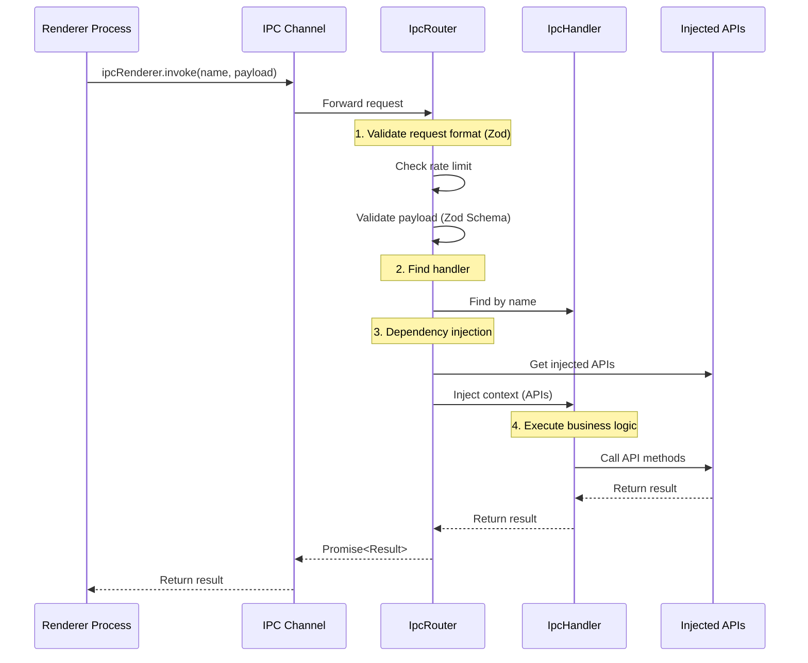
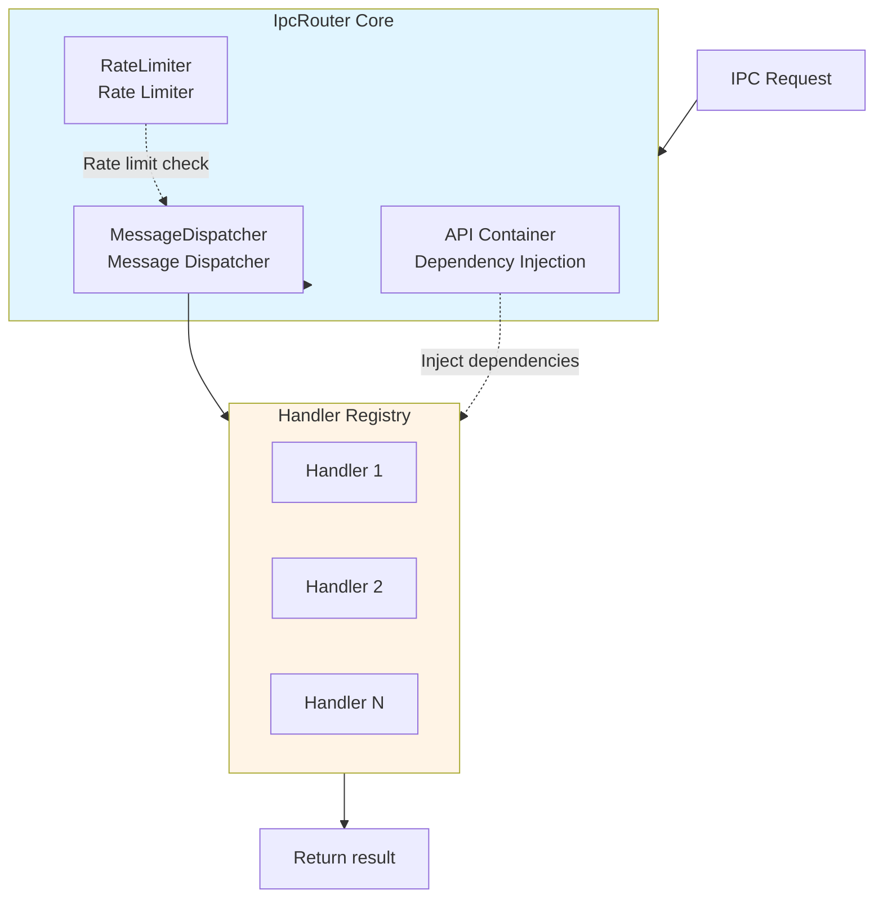

# IPC Router

## Overview

`IpcRouter` is one of the core modules of electron-infra-kit, providing a lightweight and highly scalable IPC (Inter-Process Communication) management solution for Electron applications. Traditional IPC communication often suffers from scattered logic, high coupling, and maintenance difficulties. IpcRouter addresses these issues by adopting **Dependency Injection** and **Single Channel Multiplexing** design patterns, transforming IPC communication into a pluggable "handler" mode that completely decouples business logic from infrastructure.

### Core Advantages

- **🔌 Dependency Injection**: Inject dependencies (like `app`, `windowManager`, `fs`) at runtime. Handlers focus on "using APIs" without worrying about "where APIs come from"
- **🔒 Type Safety**: Supports TypeScript generics (`IpcHandler<Context, Payload, Result>`), ensuring compile-time safety for injected dependencies, request payloads, and return types
- **🎯 Single Channel Multiplexing**: Only **one** IPC listener is needed in the main process. `IpcRouter` handles all dispatching logic internally, keeping `main.ts` clean
- **✅ Runtime Validation**: Built-in `Zod` schema validation support ensures data safety and type consistency for IPC payloads
- **🔓 Open-Closed Principle**: Add new features by simply adding new `IpcHandler`s without modifying initialization code
- **⚡ Performance Monitoring**: Automatically records performance metrics for IPC calls, facilitating debugging and optimization
- **🛡️ Rate Limiting**: Built-in rate limiting mechanism to prevent malicious or abnormal high-frequency requests

### Use Cases

IpcRouter is particularly suitable for the following scenarios:

- **Complex Multi-Window Applications**: Frequent data interaction between multiple windows
- **Modular Architecture**: Splitting business logic into independent handler modules
- **High Type Safety Requirements**: Ensuring type safety at both compile-time and runtime
- **Rate Limiting Needs**: Preventing malicious or abnormal requests from renderer processes
- **Performance Monitoring Requirements**: Tracking and analyzing IPC call performance


## Architecture Design

### Communication Flow

The diagram below shows the complete IPC communication flow from renderer process to main process:



### Internal Architecture

IpcRouter consists of three core components:



**Component Description**:

1. **MessageDispatcher (Message Dispatcher)**
   - Maintains handler registry and metadata (Zod Schema)
   - Finds corresponding handler based on request name
   - Executes payload validation and callback functions

2. **RateLimiter (Rate Limiter)**
   - Implements time-window counter algorithm
   - Maintains counter for each `senderId:handlerName`
   - Automatically cleans up expired rate limit states

3. **API Container (Dependency Injection)**
   - Stores global dependencies (like `app`, `windowManager`, `db`, etc.)
   - Injects dependencies into handler's context at runtime
   - Supports batch injection and dynamic updates


## Defining Handlers

### Basic Concepts

`IpcHandler` is the basic unit of IPC communication, encapsulating a specific business logic handler function. Each handler contains the following elements:

- **name**: Unique identifier for routing requests
- **event**: Event category for classification and metadata
- **callback**: Business logic function that receives context and payload
- **schema**: Optional Zod validation schema for runtime type checking

### Creating Handlers

#### 1. Define Context Type

First, define your application context type containing all APIs to be injected:

```typescript
import { App } from 'electron';
import { Types } from 'electron-infra-kit';

export interface AppContext {
  app: App;                    // Electron App instance
  logger: Types.ILogger;       // Logger
  windowManager: any;          // Window Manager
  db: any;                     // Database instance
  config: any;                 // Config service
}
```

#### 2. Create Simple Handler

The simplest handler doesn't require payload validation:

```typescript
import { IpcHandler } from 'electron-infra-kit';
import { AppContext } from '../types';

// Get app version
export const getAppVersionHandler = new IpcHandler<
  AppContext,           // Context type
  void,                 // No payload
  string                // Returns string
>(
  'getAppVersion',      // Handler name
  'app',                // Event category
  async (context) => {
    // Use injected app API
    return context.app.getVersion();
  }
);
```

#### 3. Handler with Parameter Validation

Use Zod for runtime type validation:

```typescript
import { IpcHandler } from 'electron-infra-kit';
import { z } from 'zod';
import { AppContext } from '../types';

// Define payload schema
const GetUserSchema = z.object({
  id: z.string().min(1, 'User ID cannot be empty'),
});

type GetUserPayload = z.infer<typeof GetUserSchema>;

interface UserResult {
  id: string;
  name: string;
  email: string;
}

// Get user information
export const getUserHandler = new IpcHandler<
  AppContext,
  GetUserPayload,
  UserResult
>(
  'getUser',
  'user',
  async (context, payload) => {
    // payload is already validated by Zod
    context.logger.info(`Getting user info: ${payload.id}`);
    
    // Call database API
    const user = await context.db.users.findById(payload.id);
    
    if (!user) {
      throw new Error(`User not found: ${payload.id}`);
    }
    
    return {
      id: user.id,
      name: user.name,
      email: user.email,
    };
  },
  GetUserSchema  // Pass validation schema
);
```

#### 4. Complex Business Logic Handler

Handle more complex business scenarios:

```typescript
import { IpcHandler } from 'electron-infra-kit';
import { z } from 'zod';
import { AppContext } from '../types';

// Update user schema
const UpdateUserSchema = z.object({
  id: z.string(),
  updateData: z.object({
    name: z.string().min(2).optional(),
    email: z.string().email().optional(),
    age: z.number().min(0).max(150).optional(),
  }),
});

type UpdateUserPayload = z.infer<typeof UpdateUserSchema>;

interface UpdateUserResult {
  success: boolean;
  user: {
    id: string;
    name: string;
    email: string;
    updatedAt: string;
  };
}

export const updateUserHandler = new IpcHandler<
  AppContext,
  UpdateUserPayload,
  UpdateUserResult
>(
  'updateUser',
  'user',
  async (context, payload) => {
    const { id, updateData } = payload;
    
    // Log operation
    context.logger.info(`Updating user ${id}:`, updateData);
    
    // Check if user exists
    const existingUser = await context.db.users.findById(id);
    if (!existingUser) {
      throw new Error(`User not found: ${id}`);
    }
    
    // Update user
    const updatedUser = await context.db.users.update(id, updateData);
    
    // Broadcast to other windows
    context.windowManager.broadcast('user-updated', {
      userId: id,
      changes: updateData,
    });
    
    return {
      success: true,
      user: {
        id: updatedUser.id,
        name: updatedUser.name,
        email: updatedUser.email,
        updatedAt: new Date().toISOString(),
      },
    };
  },
  UpdateUserSchema
);
```

### Best Practices

1. **Use Zod Validation**: Always provide Zod schema for handlers with payloads to ensure type safety
2. **Clear Type Definitions**: Use TypeScript generics to explicitly specify Context, Payload, and Result types
3. **Error Handling**: Errors thrown in handlers are automatically wrapped as `IpcHandlerError`
4. **Logging**: Use injected logger to record key operations
5. **Single Responsibility**: Each handler should only handle one specific business function
6. **Naming Convention**: Use clear naming like `getUser`, `updateUser`, `deleteUser`


## Registering Handlers

### Initialize IpcRouter

Create an IpcRouter instance in the main process:

```typescript
import { app, ipcMain } from 'electron';
import { IpcRouter } from 'electron-infra-kit';
import { Logger } from './logger';

// Create IpcRouter instance
const logger = new Logger('main');
const ipcRouter = new IpcRouter({ 
  logger,
  defaultRateLimit: {
    window: 60000,  // 60 second time window
    max: 100,       // Maximum 100 requests
  }
});
```

### Register Single Handler

Use the `addHandler` method to register a handler:

```typescript
import { getUserHandler, updateUserHandler } from './handlers/user-handlers';

// Register single handler
ipcRouter.addHandler(getUserHandler);
ipcRouter.addHandler(updateUserHandler);
```

### Batch Register Handlers

Use the `addHandlers` method for batch registration:

```typescript
import { 
  getUserHandler, 
  updateUserHandler, 
  deleteUserHandler 
} from './handlers/user-handlers';

import {
  getConfigHandler,
  setConfigHandler,
} from './handlers/config-handlers';

// Batch registration
ipcRouter.addHandlers([
  getUserHandler,
  updateUserHandler,
  deleteUserHandler,
  getConfigHandler,
  setConfigHandler,
]);
```

### Setup IPC Listener

Set up a single IPC listener in the main process:

```typescript
import { ipcMain } from 'electron';

// Setup single IPC channel
ipcMain.handle('renderer-to-main', async (event, data) => {
  try {
    // Get sender ID (for rate limiting)
    const senderId = event.sender.id;
    
    // Handle request through IpcRouter
    const result = await ipcRouter.handle(data, senderId);
    
    return { success: true, data: result };
  } catch (error: any) {
    logger.error('IPC handling error:', error);
    
    return {
      success: false,
      error: {
        message: error.message,
        code: error.code || 'UNKNOWN_ERROR',
      },
    };
  }
});
```

### Dynamic Handler Management

#### Remove Handler

```typescript
// Remove specific handler
ipcRouter.removeHandler('getUser');
```

#### Replace Handler

```typescript
// Remove old handler first
ipcRouter.removeHandler('getUser');

// Register new handler
ipcRouter.addHandler(newGetUserHandler);
```

### Complete Example

```typescript
// main.ts
import { app, ipcMain } from 'electron';
import { createElectronToolkit } from 'electron-infra-kit';
import { Logger } from './infrastructure/logger';
import { Database } from './infrastructure/database';
import { ConfigService } from './infrastructure/config';

// Import all handlers
import * as userHandlers from './handlers/user-handlers';
import * as configHandlers from './handlers/config-handlers';
import * as windowHandlers from './handlers/window-handlers';

app.whenReady().then(async () => {
  // Initialize toolkit
  const { windowManager, ipcRouter, messageBus } = createElectronToolkit({
    isDevelopment: process.env.NODE_ENV === 'development',
  });

  // Initialize infrastructure
  const logger = new Logger('main');
  const db = new Database();
  const config = new ConfigService();

  await db.connect();
  await windowManager.ready();

  // Inject dependencies
  ipcRouter.addApis({
    app,
    logger,
    windowManager,
    messageBus,
    db,
    config,
  });

  // Batch register handlers
  ipcRouter.addHandlers([
    ...Object.values(userHandlers),
    ...Object.values(configHandlers),
    ...Object.values(windowHandlers),
  ]);

  // Setup IPC listener
  ipcMain.handle('renderer-to-main', async (event, data) => {
    try {
      const result = await ipcRouter.handle(data, event.sender.id);
      return { success: true, data: result };
    } catch (error: any) {
      logger.error('IPC Error:', error);
      return {
        success: false,
        error: {
          message: error.message,
          code: error.code || 'UNKNOWN_ERROR',
        },
      };
    }
  });

  // Create main window
  await windowManager.create({
    name: 'main',
    title: 'My App',
    width: 1024,
    height: 768,
  });
});

// Cleanup resources
app.on('before-quit', () => {
  ipcRouter.dispose();
});
```


## Dependency Injection

### What is Dependency Injection

Dependency Injection (DI) is a design pattern that allows us to inject dependencies into objects at runtime rather than creating them inside the object. In IpcRouter, dependency injection enables handlers to access various APIs and services without worrying about how these APIs are created and managed.

### Inject Single API

Use the `addApi` method to inject a single dependency:

```typescript
import { app } from 'electron';
import { IpcRouter } from 'electron-infra-kit';

const ipcRouter = new IpcRouter();

// Inject Electron app instance
ipcRouter.addApi('app', app);

// Inject custom services
ipcRouter.addApi('logger', new Logger());
ipcRouter.addApi('db', new Database());
ipcRouter.addApi('config', new ConfigService());
```

### Batch Inject APIs

Use the `addApis` method to batch inject multiple dependencies:

```typescript
import { app } from 'electron';
import { IpcRouter } from 'electron-infra-kit';
import { Logger } from './logger';
import { Database } from './database';
import { ConfigService } from './config';
import { FileSystem } from './filesystem';

const ipcRouter = new IpcRouter();

// Batch injection
ipcRouter.addApis({
  app: app,
  logger: new Logger(),
  db: new Database(),
  config: new ConfigService(),
  fs: new FileSystem(),
});
```

### Using Injected APIs in Handlers

Injected APIs are passed as the context parameter to the handler's callback function:

```typescript
import { IpcHandler } from 'electron-infra-kit';
import { z } from 'zod';

// Define Context type (containing all injected APIs)
interface AppContext {
  app: Electron.App;
  logger: Logger;
  db: Database;
  config: ConfigService;
  fs: FileSystem;
}

const SaveFileSchema = z.object({
  path: z.string(),
  content: z.string(),
});

export const saveFileHandler = new IpcHandler<
  AppContext,
  z.infer<typeof SaveFileSchema>,
  { success: boolean; path: string }
>(
  'saveFile',
  'file',
  async (context, payload) => {
    // Use injected logger
    context.logger.info(`Saving file: ${payload.path}`);
    
    // Use injected fs
    await context.fs.writeFile(payload.path, payload.content);
    
    // Use injected config to get configuration
    const encoding = context.config.get('file.encoding', 'utf-8');
    
    // Use injected db to record operation
    await context.db.logs.create({
      action: 'file_saved',
      path: payload.path,
      timestamp: Date.now(),
    });
    
    return {
      success: true,
      path: payload.path,
    };
  },
  SaveFileSchema
);
```

### Integration with createElectronToolkit

When using `createElectronToolkit`, core modules are automatically injected:

```typescript
import { app } from 'electron';
import { createElectronToolkit } from 'electron-infra-kit';

app.whenReady().then(async () => {
  const { windowManager, ipcRouter, messageBus } = createElectronToolkit({
    isDevelopment: process.env.NODE_ENV === 'development',
  });

  // windowManager and messageBus are already automatically injected into ipcRouter
  // You can use them directly in handlers
  
  // Inject additional custom APIs
  ipcRouter.addApis({
    db: new Database(),
    config: new ConfigService(),
  });
});
```

### Dynamically Update Dependencies

You can update injected dependencies at runtime:

```typescript
// Initial injection
ipcRouter.addApi('db', oldDatabase);

// Update later
ipcRouter.addApi('db', newDatabase);

// Subsequent handler calls will use the new database instance
```

### Advantages of Dependency Injection

1. **Decoupling**: Handlers don't need to know how dependencies are created
2. **Testability**: Easy to inject mock objects for unit testing
3. **Flexibility**: Dependencies can be dynamically replaced at runtime
4. **Type Safety**: TypeScript generics ensure type correctness
5. **Centralized Management**: All dependencies managed in one place for easy maintenance

### Testing Example

Dependency injection makes unit testing simple:

```typescript
import { IpcRouter } from 'electron-infra-kit';
import { saveFileHandler } from './handlers/file-handlers';

describe('saveFileHandler', () => {
  it('should save file and log operation', async () => {
    // Create mock objects
    const mockLogger = {
      info: jest.fn(),
      error: jest.fn(),
    };
    
    const mockFs = {
      writeFile: jest.fn().mockResolvedValue(undefined),
    };
    
    const mockDb = {
      logs: {
        create: jest.fn().mockResolvedValue({ id: 1 }),
      },
    };
    
    const mockConfig = {
      get: jest.fn().mockReturnValue('utf-8'),
    };
    
    // Create test IpcRouter
    const ipcRouter = new IpcRouter();
    
    // Inject mock objects
    ipcRouter.addApis({
      logger: mockLogger,
      fs: mockFs,
      db: mockDb,
      config: mockConfig,
    });
    
    // Register handler
    ipcRouter.addHandler(saveFileHandler);
    
    // Execute test
    const result = await ipcRouter.handle({
      name: 'saveFile',
      payload: {
        path: '/test/file.txt',
        content: 'Hello World',
      },
    });
    
    // Verify results
    expect(result.success).toBe(true);
    expect(mockLogger.info).toHaveBeenCalledWith('Saving file: /test/file.txt');
    expect(mockFs.writeFile).toHaveBeenCalledWith('/test/file.txt', 'Hello World');
    expect(mockDb.logs.create).toHaveBeenCalled();
  });
});
```


## Renderer Process Invocation

### Preload Script Configuration

First, expose the IPC invocation interface in the preload script:

```typescript
// preload.ts
import { contextBridge, ipcRenderer } from 'electron';

// Expose type-safe IPC API
contextBridge.exposeInMainWorld('ipcApi', {
  invoke: async (name: string, payload?: any) => {
    return await ipcRenderer.invoke('renderer-to-main', {
      name,
      payload,
    });
  },
});
```

### TypeScript Type Definitions

Define types for the renderer process:

```typescript
// preload.d.ts
export interface IpcApi {
  invoke<T = any>(name: string, payload?: any): Promise<{
    success: boolean;
    data?: T;
    error?: {
      message: string;
      code: string;
    };
  }>;
}

declare global {
  interface Window {
    ipcApi: IpcApi;
  }
}
```

### Basic Invocation

Call IPC handlers in the renderer process:

```typescript
// renderer.ts

// Call handler without parameters
async function getAppVersion() {
  const response = await window.ipcApi.invoke('getAppVersion');
  
  if (response.success) {
    console.log('App version:', response.data);
    return response.data;
  } else {
    console.error('Failed to get version:', response.error);
    throw new Error(response.error?.message);
  }
}

// Call handler with parameters
async function getUser(userId: string) {
  const response = await window.ipcApi.invoke('getUser', {
    id: userId,
  });
  
  if (response.success) {
    console.log('User info:', response.data);
    return response.data;
  } else {
    console.error('Failed to get user:', response.error);
    throw new Error(response.error?.message);
  }
}

// Call update operation
async function updateUser(userId: string, updates: any) {
  const response = await window.ipcApi.invoke('updateUser', {
    id: userId,
    updateData: updates,
  });
  
  if (response.success) {
    console.log('Update successful:', response.data);
    return response.data;
  } else {
    console.error('Update failed:', response.error);
    throw new Error(response.error?.message);
  }
}
```

### Encapsulate IPC Client

Create a type-safe IPC client wrapper:

```typescript
// ipc-client.ts

export class IpcClient {
  /**
   * Invoke IPC handler
   */
  private async invoke<T>(name: string, payload?: any): Promise<T> {
    const response = await window.ipcApi.invoke(name, payload);
    
    if (response.success) {
      return response.data as T;
    } else {
      throw new Error(response.error?.message || 'Unknown error');
    }
  }

  // App related
  async getAppVersion(): Promise<string> {
    return this.invoke<string>('getAppVersion');
  }

  // User related
  async getUser(id: string): Promise<User> {
    return this.invoke<User>('getUser', { id });
  }

  async updateUser(id: string, updateData: Partial<User>): Promise<UpdateUserResult> {
    return this.invoke<UpdateUserResult>('updateUser', { id, updateData });
  }

  async deleteUser(id: string): Promise<{ success: boolean }> {
    return this.invoke<{ success: boolean }>('deleteUser', { id });
  }

  // Config related
  async getConfig(key: string): Promise<any> {
    return this.invoke('getConfig', { key });
  }

  async setConfig(key: string, value: any): Promise<void> {
    return this.invoke('setConfig', { key, value });
  }

  // File related
  async saveFile(path: string, content: string): Promise<{ success: boolean; path: string }> {
    return this.invoke('saveFile', { path, content });
  }

  async readFile(path: string): Promise<{ content: string }> {
    return this.invoke('readFile', { path });
  }
}

// Export singleton
export const ipcClient = new IpcClient();
```

### Using in React

```typescript
// UserProfile.tsx
import React, { useEffect, useState } from 'react';
import { ipcClient } from './ipc-client';

interface User {
  id: string;
  name: string;
  email: string;
}

export function UserProfile({ userId }: { userId: string }) {
  const [user, setUser] = useState<User | null>(null);
  const [loading, setLoading] = useState(true);
  const [error, setError] = useState<string | null>(null);

  useEffect(() => {
    loadUser();
  }, [userId]);

  async function loadUser() {
    try {
      setLoading(true);
      setError(null);
      const userData = await ipcClient.getUser(userId);
      setUser(userData);
    } catch (err: any) {
      setError(err.message);
    } finally {
      setLoading(false);
    }
  }

  async function handleUpdate(updates: Partial<User>) {
    try {
      const result = await ipcClient.updateUser(userId, updates);
      setUser(result.user);
      alert('Update successful!');
    } catch (err: any) {
      alert(`Update failed: ${err.message}`);
    }
  }

  if (loading) return <div>Loading...</div>;
  if (error) return <div>Error: {error}</div>;
  if (!user) return <div>User not found</div>;

  return (
    <div>
      <h2>{user.name}</h2>
      <p>Email: {user.email}</p>
      <button onClick={() => handleUpdate({ name: 'New Name' })}>
        Update Name
      </button>
    </div>
  );
}
```

### Using in Vue

```vue
<!-- UserProfile.vue -->
<template>
  <div>
    <div v-if="loading">Loading...</div>
    <div v-else-if="error">Error: {{ error }}</div>
    <div v-else-if="user">
      <h2>{{ user.name }}</h2>
      <p>Email: {{ user.email }}</p>
      <button @click="handleUpdate">Update Name</button>
    </div>
  </div>
</template>

<script setup lang="ts">
import { ref, onMounted } from 'vue';
import { ipcClient } from './ipc-client';

interface User {
  id: string;
  name: string;
  email: string;
}

const props = defineProps<{
  userId: string;
}>();

const user = ref<User | null>(null);
const loading = ref(true);
const error = ref<string | null>(null);

onMounted(() => {
  loadUser();
});

async function loadUser() {
  try {
    loading.value = true;
    error.value = null;
    user.value = await ipcClient.getUser(props.userId);
  } catch (err: any) {
    error.value = err.message;
  } finally {
    loading.value = false;
  }
}

async function handleUpdate() {
  try {
    const result = await ipcClient.updateUser(props.userId, {
      name: 'New Name',
    });
    user.value = result.user;
    alert('Update successful!');
  } catch (err: any) {
    alert(`Update failed: ${err.message}`);
  }
}
</script>
```

### Error Handling

Handle errors gracefully in the renderer process:

```typescript
// error-handler.ts

export class IpcError extends Error {
  constructor(
    message: string,
    public code: string,
    public details?: any
  ) {
    super(message);
    this.name = 'IpcError';
  }
}

export async function safeInvoke<T>(
  name: string,
  payload?: any
): Promise<T> {
  try {
    const response = await window.ipcApi.invoke(name, payload);
    
    if (response.success) {
      return response.data as T;
    } else {
      throw new IpcError(
        response.error?.message || 'Unknown error',
        response.error?.code || 'UNKNOWN_ERROR',
        response.error
      );
    }
  } catch (err: any) {
    if (err instanceof IpcError) {
      throw err;
    }
    
    // Network or other errors
    throw new IpcError(
      err.message || 'Communication failed',
      'COMMUNICATION_ERROR',
      err
    );
  }
}

// Usage example
try {
  const user = await safeInvoke<User>('getUser', { id: '123' });
  console.log(user);
} catch (err) {
  if (err instanceof IpcError) {
    console.error(`IPC Error [${err.code}]:`, err.message);
    
    // Handle based on error code
    switch (err.code) {
      case 'VALIDATION_ERROR':
        alert('Invalid input data');
        break;
      case 'NOT_FOUND':
        alert('Resource not found');
        break;
      case 'RATE_LIMIT_EXCEEDED':
        alert('Too many requests, please try again later');
        break;
      default:
        alert('Operation failed, please retry');
    }
  }
}
```

### Best Practices

1. **Type Safety**: Use TypeScript to define clear request and response types
2. **Error Handling**: Always handle possible error cases
3. **Loading States**: Display loading states in the UI
4. **Encapsulate Calls**: Use client classes to encapsulate IPC calls for better code reuse
5. **Avoid Frequent Calls**: Be mindful of rate limits and avoid excessive requests in a short time
6. **Logging**: Log IPC calls in development environment for debugging

