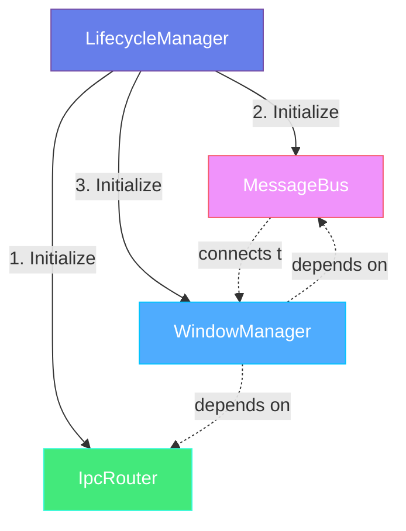
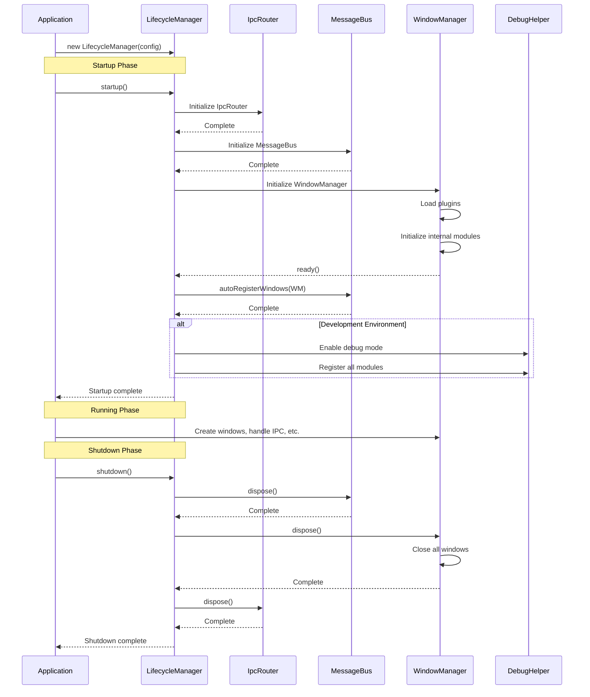

# Lifecycle Manager

## Overview

`LifecycleManager` is the core orchestration module of electron-infra-kit, responsible for coordinating and managing the startup and shutdown processes of the entire toolkit. It provides a unified entry point to initialize and manage core modules such as `WindowManager`, `IpcRouter`, and `MessageBus`, ensuring they start and shut down in the correct order while handling dependencies between modules.

### Core Features

- **Unified Initialization** - Provides a single entry point to initialize all core modules
- **Dependency Management** - Automatically handles dependencies and initialization order between modules
- **Graceful Shutdown** - Shuts down all services in the correct order, ensuring proper resource cleanup
- **Error Recovery** - Automatically cleans up initialized modules when startup fails
- **Debug Support** - Automatically enables debug mode in development environment
- **Flexible Configuration** - Supports using existing instances or creating new ones

### Why Do You Need LifecycleManager?

In complex Electron applications, manually managing the initialization and shutdown of multiple modules can lead to the following problems:

1. **Incorrect Initialization Order** - Dependencies between modules mean wrong initialization order causes runtime errors
2. **Resource Leaks** - Resources not properly cleaned up on application exit, leading to memory leaks or unclosed file handles
3. **Code Duplication** - Every application needs to write similar initialization and cleanup code
4. **Complex Error Handling** - Need to handle partial initialization failures
5. **Difficult Debugging** - Lack of unified debugging entry point

`LifecycleManager` elegantly solves these problems by providing standardized lifecycle management.


## Architecture Design

### Module Dependencies

The core modules managed by `LifecycleManager` have clear dependencies:



**Initialization Order**:

1. **IpcRouter** - Initialized first, serves as the foundation for inter-process communication
2. **MessageBus** - Initialized second, provides cross-window communication capabilities
3. **WindowManager** - Initialized last, depends on the previous two for complete window management functionality

**Shutdown Order**:

Shut down in reverse order of initialization to properly handle dependencies:

1. **MessageBus** - Shut down first, stops message passing
2. **WindowManager** - Shut down second, closes all windows
3. **IpcRouter** - Shut down last, cleans up IPC listeners

### Lifecycle Flow




## Basic Usage

### Quick Start

The simplest way to use it is through the `createElectronToolkit` helper function:

```typescript
import { app } from 'electron';
import { createElectronToolkit } from 'electron-infra-kit';

app.whenReady().then(async () => {
  // Create and initialize all modules
  const { windowManager, ipcRouter, messageBus } = createElectronToolkit({
    isDevelopment: process.env.NODE_ENV === 'development',
  });

  // All modules are initialized and ready to use
  await windowManager.create({
    name: 'main',
    title: 'My Application',
    width: 1024,
    height: 768,
  });
});
```

`createElectronToolkit` internally uses `LifecycleManager` to manage module lifecycles.

### Manual LifecycleManager Usage

For more control, you can use `LifecycleManager` directly:

```typescript
import { app } from 'electron';
import { LifecycleManager } from 'electron-infra-kit';

app.whenReady().then(async () => {
  // Create LifecycleManager instance
  const lifecycleManager = new LifecycleManager({
    isDevelopment: process.env.NODE_ENV === 'development',
  });

  // Start all services
  await lifecycleManager.startup();

  // Access initialized modules
  const { windowManager, ipcRouter, messageBus } = lifecycleManager;

  // Use modules
  await windowManager.create({
    name: 'main',
    title: 'My Application',
    width: 1024,
    height: 768,
  });
});

// Clean up resources on application exit
app.on('before-quit', async () => {
  await lifecycleManager.shutdown();
});
```

### Auto-Start Mode

You can configure `LifecycleManager` to automatically start on instantiation:

```typescript
import { LifecycleManager } from 'electron-infra-kit';

const lifecycleManager = new LifecycleManager({
  autoStart: true,  // Auto-start
  isDevelopment: process.env.NODE_ENV === 'development',
});

// Modules will initialize automatically in the background
// Check status via the started property
if (lifecycleManager.started) {
  console.log('All services started');
}
```

**Note**: In auto-start mode, if startup fails, the error will be logged but not thrown. It's recommended to use manual startup mode in production for better error handling.


## Configuration Options

### Basic Configuration

`LifecycleManager` accepts the following configuration options:

```typescript
interface LifecycleConfig {
  // Auto-start on instantiation (default: false)
  autoStart?: boolean;

  // Development environment flag (affects debug mode)
  isDevelopment?: boolean;

  // Logger instance
  logger?: ILogger;

  // Logger options
  loggerOptions?: LoggerOptions;

  // Existing IpcRouter instance (optional)
  ipcRouter?: IpcRouter;

  // Existing WindowManager instance (optional)
  windowManager?: WindowManager;

  // Existing MessageBus instance (optional)
  messageBus?: MessageBus;

  // WindowManager configuration options
  plugins?: WindowManagerPlugin[];
  hooks?: LifecycleHooks;
  // ... other WindowManager config
}
```

### Using Existing Instances

If you've already created instances of certain modules, you can pass them to `LifecycleManager`:

```typescript
import { IpcRouter, MessageBus, LifecycleManager } from 'electron-infra-kit';

// Create custom configured IpcRouter
const customIpcRouter = new IpcRouter({
  defaultRateLimit: {
    window: 30000,
    max: 50,
  },
});

// Create custom configured MessageBus
const customMessageBus = new MessageBus({
  enableLogging: true,
});

// Use existing instances
const lifecycleManager = new LifecycleManager({
  ipcRouter: customIpcRouter,
  messageBus: customMessageBus,
  // WindowManager will be created automatically and use these instances
});

await lifecycleManager.startup();
```

### Configuring WindowManager

You can pass WindowManager configuration through `LifecycleConfig`:

```typescript
const lifecycleManager = new LifecycleManager({
  isDevelopment: true,
  
  // WindowManager plugins
  plugins: [
    LoggerPlugin,
    WindowLimitPlugin,
  ],
  
  // WindowManager lifecycle hooks
  hooks: {
    onWillCreate: (config) => {
      console.log('About to create window:', config.name);
      return config;
    },
    onDidCreate: ({ id, name }) => {
      console.log('Window created:', name, id);
    },
  },
});

await lifecycleManager.startup();
```


## Startup and Shutdown

### Starting Services

Use the `startup()` method to start all services:

```typescript
const lifecycleManager = new LifecycleManager({
  isDevelopment: process.env.NODE_ENV === 'development',
});

try {
  await lifecycleManager.startup();
  console.log('All services started');
  
  // Now you can use the modules
  const { windowManager, ipcRouter, messageBus } = lifecycleManager;
} catch (error) {
  console.error('Startup failed:', error);
  // On startup failure, initialized modules are automatically cleaned up
}
```

**Startup Process**:

1. Check if already started (prevent duplicate startup)
2. Initialize IpcRouter
3. Initialize MessageBus
4. Initialize WindowManager and wait for ready
5. Connect MessageBus to WindowManager
6. Enable debug mode if in development environment
7. Mark as started

### Shutting Down Services

Use the `shutdown()` method to gracefully shut down all services:

```typescript
import { app } from 'electron';

app.on('before-quit', async () => {
  console.log('Shutting down services...');
  
  try {
    await lifecycleManager.shutdown();
    console.log('All services shut down');
  } catch (error) {
    console.error('Error during shutdown:', error);
  }
});
```

**Shutdown Process**:

1. Shut down modules in reverse order of initialization
2. First dispose MessageBus
3. Then dispose WindowManager (closes all windows)
4. Finally dispose IpcRouter
5. Clean up all references
6. Mark as not started

### Checking Startup Status

Use the `started` property to check if services are running:

```typescript
if (lifecycleManager.started) {
  console.log('Services are running');
  
  // Safe to use modules
  await lifecycleManager.windowManager?.create({
    name: 'settings',
    width: 600,
    height: 400,
  });
} else {
  console.log('Services not started');
  await lifecycleManager.startup();
}
```


## Error Handling

### Handling Startup Failures

If an error occurs during startup, `LifecycleManager` automatically cleans up initialized modules:

```typescript
const lifecycleManager = new LifecycleManager({
  isDevelopment: true,
});

try {
  await lifecycleManager.startup();
} catch (error) {
  console.error('Startup failed:', error);
  
  // Initialized modules have been automatically cleaned up
  // Safe to retry or exit the application
  
  if (error.message.includes('IpcRouter')) {
    console.error('IPC Router initialization failed');
  } else if (error.message.includes('WindowManager')) {
    console.error('Window Manager initialization failed');
  }
  
  // Exit application
  app.quit();
}
```

### Handling Shutdown Errors

Errors during shutdown are logged but don't interrupt the shutdown process:

```typescript
app.on('before-quit', async () => {
  try {
    await lifecycleManager.shutdown();
  } catch (error) {
    // Even if shutdown fails, should continue exiting
    console.error('Error during shutdown:', error);
  }
  
  // Application will continue to exit
});
```

### Partial Initialization Failure

If a module fails to initialize, `LifecycleManager` automatically cleans up successfully initialized modules:

```typescript
// Assume WindowManager initialization fails
try {
  await lifecycleManager.startup();
} catch (error) {
  // IpcRouter and MessageBus have been automatically cleaned up
  // No partial initialization state left behind
  console.error('Startup failed, all resources cleaned up');
}
```


## Debug Support

### Development Environment Debugging

In development environment, `LifecycleManager` automatically enables debug mode:

```typescript
const lifecycleManager = new LifecycleManager({
  isDevelopment: true,  // or process.env.NODE_ENV === 'development'
});

await lifecycleManager.startup();

// Debug mode is automatically enabled
// All modules are registered with DebugHelper
```

### Accessing Debug Information

In development environment, you can access all modules through the global `__ELECTRON_TOOLKIT_DEBUG__` object:

```typescript
// In main process or renderer process console
console.log(__ELECTRON_TOOLKIT_DEBUG__);

// Output:
// {
//   windowManager: WindowManager { ... },
//   ipcRouter: IpcRouter { ... },
//   messageBus: MessageBus { ... },
//   lifecycleManager: LifecycleManager { ... }
// }

// Access specific modules
const wm = __ELECTRON_TOOLKIT_DEBUG__.windowManager;
console.log('All windows:', wm.getAllWindows());

const ipc = __ELECTRON_TOOLKIT_DEBUG__.ipcRouter;
console.log('IPC handlers:', ipc.getHandlers());
```

### Manually Enabling Debug

You can also manually enable debug mode:

```typescript
import { DebugHelper } from 'electron-infra-kit';

// Enable debug mode
DebugHelper.enableDebugMode();

// Register custom objects
DebugHelper.register('myService', myServiceInstance);

// Access in console
console.log(__ELECTRON_TOOLKIT_DEBUG__.myService);
```


## Complete Examples

### Basic Application

```typescript
// main.ts
import { app, BrowserWindow } from 'electron';
import { LifecycleManager } from 'electron-infra-kit';
import path from 'path';

let lifecycleManager: LifecycleManager;

app.whenReady().then(async () => {
  try {
    // Create and start LifecycleManager
    lifecycleManager = new LifecycleManager({
      isDevelopment: process.env.NODE_ENV === 'development',
    });

    await lifecycleManager.startup();
    console.log('Electron Toolkit started');

    // Create main window
    const mainWindowId = await lifecycleManager.windowManager!.create({
      name: 'main',
      title: 'My Application',
      width: 1200,
      height: 800,
      defaultConfig: {
        webPreferences: {
          preload: path.join(__dirname, 'preload.js'),
        },
      },
    });

    console.log('Main window created:', mainWindowId);
  } catch (error) {
    console.error('Application startup failed:', error);
    app.quit();
  }
});

// Quit when all windows are closed
app.on('window-all-closed', () => {
  if (process.platform !== 'darwin') {
    app.quit();
  }
});

// Recreate window on macOS activation
app.on('activate', async () => {
  if (lifecycleManager?.windowManager?.getAllWindows().length === 0) {
    await lifecycleManager.windowManager.create({
      name: 'main',
      title: 'My Application',
      width: 1200,
      height: 800,
    });
  }
});

// Clean up before quit
app.on('before-quit', async () => {
  console.log('Shutting down application...');
  
  if (lifecycleManager) {
    await lifecycleManager.shutdown();
  }
  
  console.log('Application shut down');
});
```

### Application with Custom Configuration

```typescript
// main.ts
import { app } from 'electron';
import { LifecycleManager, IpcRouter, MessageBus } from 'electron-infra-kit';
import { MyLoggerPlugin, MyWindowPlugin } from './plugins';
import { setupIpcHandlers } from './ipc-handlers';

let lifecycleManager: LifecycleManager;

app.whenReady().then(async () => {
  try {
    // Create custom configured modules
    const customIpcRouter = new IpcRouter({
      defaultRateLimit: {
        window: 60000,
        max: 100,
      },
    });

    const customMessageBus = new MessageBus({
      enableLogging: true,
    });

    // Create LifecycleManager
    lifecycleManager = new LifecycleManager({
      isDevelopment: process.env.NODE_ENV === 'development',
      ipcRouter: customIpcRouter,
      messageBus: customMessageBus,
      
      // WindowManager configuration
      plugins: [
        MyLoggerPlugin,
        MyWindowPlugin,
      ],
      
      hooks: {
        onWillCreate: (config) => {
          console.log(`About to create window: ${config.name}`);
          return config;
        },
        onDidCreate: ({ id, name }) => {
          console.log(`Window created: ${name} (${id})`);
        },
      },
    });

    // Start all services
    await lifecycleManager.startup();

    // Setup IPC handlers
    setupIpcHandlers(lifecycleManager.ipcRouter!);

    // Create main window
    await lifecycleManager.windowManager!.create({
      name: 'main',
      title: 'My Application',
      width: 1200,
      height: 800,
    });

    console.log('Application startup complete');
  } catch (error) {
    console.error('Application startup failed:', error);
    app.quit();
  }
});

// Clean up resources
app.on('before-quit', async () => {
  if (lifecycleManager) {
    await lifecycleManager.shutdown();
  }
});
```


## Best Practices

### 1. Always Wait for Startup Completion

Ensure you wait for `startup()` to complete before using modules:

```typescript
// ✅ Correct
await lifecycleManager.startup();
await lifecycleManager.windowManager.create({ name: 'main' });

// ❌ Wrong
lifecycleManager.startup(); // No await
lifecycleManager.windowManager.create({ name: 'main' }); // May fail
```

### 2. Properly Handle Startup Errors

Always use try-catch to handle startup errors:

```typescript
try {
  await lifecycleManager.startup();
} catch (error) {
  console.error('Startup failed:', error);
  app.quit();
}
```

### 3. Shutdown Before Application Exit

Ensure you call `shutdown()` before application exit:

```typescript
app.on('before-quit', async () => {
  await lifecycleManager.shutdown();
});
```

### 4. Avoid Duplicate Startup

Check startup status to avoid duplicate startup:

```typescript
if (!lifecycleManager.started) {
  await lifecycleManager.startup();
}
```

### 5. Use Helper Function to Simplify Code

For simple applications, use the `createElectronToolkit` helper function:

```typescript
// Simple and recommended
const { windowManager, ipcRouter, messageBus } = createElectronToolkit({
  isDevelopment: process.env.NODE_ENV === 'development',
});
```

### 6. Enable Debug in Development

Always enable debug mode in development environment:

```typescript
const lifecycleManager = new LifecycleManager({
  isDevelopment: process.env.NODE_ENV === 'development',
});
```

### 7. Centralize Configuration Management

Keep all configuration in one place:

```typescript
// config.ts
export const lifecycleConfig = {
  isDevelopment: process.env.NODE_ENV === 'development',
  plugins: [/* ... */],
  hooks: {/* ... */},
};

// main.ts
import { lifecycleConfig } from './config';

const lifecycleManager = new LifecycleManager(lifecycleConfig);
```


## FAQ

### Q: What's the difference between LifecycleManager and createElectronToolkit?

A: `createElectronToolkit` is a helper function that internally uses `LifecycleManager` to manage module lifecycles. It provides a more concise API suitable for most applications. If you need more control (such as using existing instances or custom startup flow), you can use `LifecycleManager` directly.

### Q: Can I call startup() multiple times?

A: Not recommended. `startup()` checks if already started and will log a warning and return immediately if so. If you need to restart, you should call `shutdown()` first.

### Q: How to retry after startup failure?

A: After startup failure, initialized modules are automatically cleaned up. You can create a new `LifecycleManager` instance and retry:

```typescript
try {
  await lifecycleManager.startup();
} catch (error) {
  console.error('First startup failed, retrying...');
  lifecycleManager = new LifecycleManager(config);
  await lifecycleManager.startup();
}
```

### Q: How to use different configurations in different environments?

A: Use environment variables or configuration files:

```typescript
const config = {
  isDevelopment: process.env.NODE_ENV === 'development',
  plugins: process.env.NODE_ENV === 'development' 
    ? [DebugPlugin, LoggerPlugin]
    : [LoggerPlugin],
};

const lifecycleManager = new LifecycleManager(config);
```

### Q: Can I access module instances after startup?

A: Yes. After startup, you can access them through `lifecycleManager` properties:

```typescript
await lifecycleManager.startup();

const wm = lifecycleManager.windowManager;
const ipc = lifecycleManager.ipcRouter;
const mb = lifecycleManager.messageBus;
```
