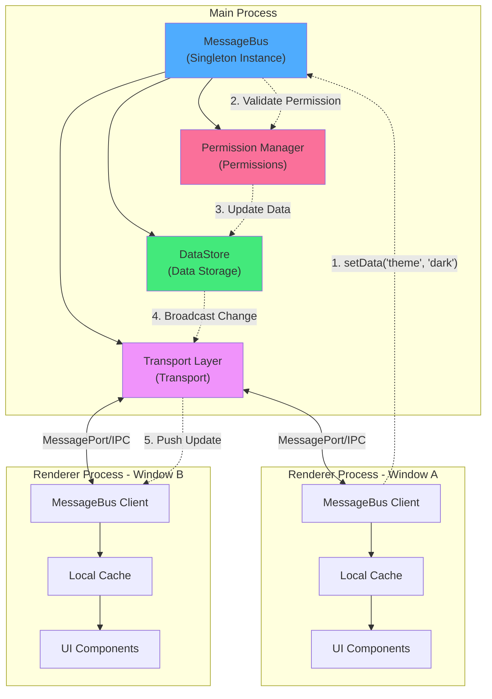

# Message Bus

## Overview

The Message Bus is a core module in electron-infra-kit designed for cross-window state synchronization and communication. In multi-window Electron applications, maintaining data consistency across windows is a significant challenge. MessageBus elegantly solves this problem by implementing a "Single Source of Truth" model.

### Key Advantages

- **Real-time State Broadcasting**: When any window modifies data, MessageBus automatically broadcasts the changes to all other registered windows, ensuring state consistency
- **High-Performance Communication**: Supports zero-copy message passing based on MessageChannel, with fallback to traditional IPC mode
- **Fine-grained Permission Control**: Supports field-level permission settings, allowing read-only fields or restricting modification rights to specific windows
- **Unified Communication Interface**: Provides a clean and consistent API regardless of the underlying transport mechanism
- **Transaction Support**: Supports atomic batch data update operations

### How It Works

MessageBus adopts a hybrid architecture of Pub/Sub (Publish-Subscribe) and Single Source of Truth:

1. **Main Process Maintains Single Source**: All shared state is stored in the MessageBus instance in the main process
2. **Renderer Process Local Cache**: Each window maintains a local copy of the data it cares about
3. **Automatic Sync Mechanism**: When any window modifies data, the main process validates permissions, updates the data source, and automatically broadcasts changes to all relevant windows
4. **Reactive Updates**: Renderer processes receive broadcasts, update their local cache, and trigger UI reactive updates

This architecture ensures data consistency while providing excellent read performance through local caching.


## Architecture Design

The following diagram illustrates the overall architecture and data flow of MessageBus:



### Data Flow Explanation

1. **Data Modification Request**: Window A calls `setData()` through MessageBus Client to modify data
2. **Permission Validation**: The main process MessageBus checks if the window has permission to modify this field
3. **Update Data Source**: After validation passes, updates the data store in the main process
4. **Broadcast Changes**: Broadcasts the changes to all registered windows through the transport layer
5. **Local Update**: Each window's Client receives the broadcast, updates local cache, and triggers UI updates

### Transport Layer

MessageBus supports two transport modes:

- **MessagePort Mode** (Recommended): Based on `MessageChannelMain`, implements zero-copy high-performance message passing
- **IPC Mode** (Compatibility): Uses standard `ipcMain`/`ipcRenderer`, suitable for environments where MessageChannel is not available

The system defaults to `auto` mode, which automatically selects the best transport method and falls back when necessary.


## Setting Data

### Setting Data in Main Process

In the main process, you can directly use the MessageBus instance to set shared data:

```typescript
import { MessageBus } from 'electron-infra-kit';

const messageBus = new MessageBus({ transportMode: 'auto' });

// Set a single value
messageBus.setData('theme', 'dark');

// Set nested objects
messageBus.setData('user', {
  name: 'Alice',
  role: 'admin',
  preferences: {
    language: 'en-US',
    notifications: true
  }
});

// Set arrays
messageBus.setData('recentFiles', [
  '/path/to/file1.txt',
  '/path/to/file2.txt'
]);
```

### Setting Data in Renderer Process

In the renderer process, set data through the MessageBus Client:

```typescript
// Using the API exposed in the preload script
window.messageBus.setData('theme', 'light');

// Or use async/await
await window.messageBus.setData('user.name', 'Bob');
```

### Batch Updates (Transactions)

When you need to atomically update multiple fields, use transactions:

```typescript
// Main process
const windowId = win.id.toString();

messageBus.startTransaction(windowId);

try {
  messageBus.setData('user.name', 'Charlie', windowId);
  messageBus.setData('user.role', 'editor', windowId);
  messageBus.setData('user.lastLogin', new Date().toISOString(), windowId);
  
  // Commit transaction - all changes are broadcasted at once
  messageBus.commitTransaction(windowId);
} catch (error) {
  // Rollback all changes on error
  messageBus.rollbackTransaction(windowId);
  console.error('Update failed:', error);
}
```

### Using Update Functions

For scenarios where you need to update based on the current value, use `updateData`:

```typescript
// Increment counter
messageBus.updateData('counter', (oldValue) => (oldValue || 0) + 1);

// Add array element
messageBus.updateData('items', (oldValue) => {
  const items = oldValue || [];
  return [...items, newItem];
});

// Update object property
messageBus.updateData('settings', (oldValue) => ({
  ...oldValue,
  darkMode: true
}));
```


## Getting Data

### Getting Data in Main Process

In the main process, you can synchronously retrieve data:

```typescript
// Get a single value
const theme = messageBus.getData('theme');
console.log('Current theme:', theme); // 'dark'

// Get nested properties
const userName = messageBus.getData('user.name');
console.log('User name:', userName); // 'Alice'

// Get the entire data store
const allData = messageBus.getData();
console.log('All data:', allData);
// {
//   theme: 'dark',
//   user: { name: 'Alice', role: 'admin', ... },
//   recentFiles: [...]
// }
```

### Getting Data in Renderer Process

In the renderer process, asynchronously retrieve data through the MessageBus Client:

```typescript
// Get a single value
const theme = await window.messageBus.getData('theme');
console.log('Current theme:', theme);

// Get nested properties
const language = await window.messageBus.getData('user.preferences.language');
console.log('Language setting:', language); // 'en-US'

// Get arrays
const files = await window.messageBus.getData('recentFiles');
console.log('Recent files:', files);
```

### Local Cache

The MessageBus Client in the renderer process automatically maintains a local cache to improve read performance:

```typescript
// First access requests from main process
const theme1 = await window.messageBus.getData('theme'); // Network request

// Subsequent accesses read from local cache
const theme2 = await window.messageBus.getData('theme'); // From cache

// When data is modified in other windows, local cache is automatically updated
```

### Handling Non-existent Keys

When retrieving a non-existent key, it returns `undefined`:

```typescript
const nonExistent = messageBus.getData('nonExistent');
console.log(nonExistent); // undefined

// You can provide a default value
const value = messageBus.getData('someKey') ?? 'default value';
```


## Watching Data Changes

### Watching Data in Main Process

Use the `watch` method to listen for data changes in the main process:

```typescript
// Watch a single field
const unsubscribe = messageBus.watch('theme', (newValue, oldValue) => {
  console.log(`Theme changed from ${oldValue} to ${newValue}`);
});

// Watch nested fields
messageBus.watch('user.name', (newValue, oldValue) => {
  console.log(`User name changed from ${oldValue} to ${newValue}`);
});

// Watch object changes
messageBus.watch('settings', (newValue, oldValue) => {
  console.log('Settings updated:', newValue);
});
```

### Watching Data in Renderer Process

Use the `subscribe` method to listen for data changes in the renderer process:

```typescript
// Subscribe to theme changes
const unsubscribe = window.messageBus.subscribe('theme', (newValue) => {
  console.log('Theme updated:', newValue);
  // Update UI
  document.body.className = newValue === 'dark' ? 'dark-theme' : 'light-theme';
});

// Subscribe to user info changes
window.messageBus.subscribe('user', (newValue) => {
  console.log('User info updated:', newValue);
  updateUserProfile(newValue);
});

// Subscribe to multiple fields
window.messageBus.subscribe('settings.language', (newValue) => {
  console.log('Language setting updated:', newValue);
  i18n.changeLanguage(newValue);
});
```

### Unsubscribing

**Important**: To avoid memory leaks, you must unsubscribe when the component unmounts or when you no longer need to listen:

```typescript
// Save the unsubscribe function
const unsubscribe = messageBus.watch('theme', (newValue) => {
  console.log('Theme changed:', newValue);
});

// Unsubscribe at the appropriate time
unsubscribe();
```

### Using with React

```typescript
import { useEffect, useState } from 'react';

function ThemeToggle() {
  const [theme, setTheme] = useState('light');
  
  useEffect(() => {
    // Subscribe to theme changes
    const unsubscribe = window.messageBus.subscribe('theme', (newTheme) => {
      setTheme(newTheme);
    });
    
    // Get initial value
    window.messageBus.getData('theme').then(setTheme);
    
    // Cleanup function - unsubscribe when component unmounts
    return () => {
      unsubscribe();
    };
  }, []);
  
  const toggleTheme = async () => {
    const newTheme = theme === 'light' ? 'dark' : 'light';
    await window.messageBus.setData('theme', newTheme);
  };
  
  return (
    <button onClick={toggleTheme}>
      Current theme: {theme}
    </button>
  );
}
```

### Using with Vue

```vue
<template>
  <button @click="toggleTheme">
    Current theme: {{ theme }}
  </button>
</template>

<script setup>
import { ref, onMounted, onUnmounted } from 'vue';

const theme = ref('light');
let unsubscribe = null;

onMounted(async () => {
  // Subscribe to theme changes
  unsubscribe = window.messageBus.subscribe('theme', (newTheme) => {
    theme.value = newTheme;
  });
  
  // Get initial value
  theme.value = await window.messageBus.getData('theme');
});

onUnmounted(() => {
  // Unsubscribe when component unmounts
  if (unsubscribe) {
    unsubscribe();
  }
});

const toggleTheme = async () => {
  const newTheme = theme.value === 'light' ? 'dark' : 'light';
  await window.messageBus.setData('theme', newTheme);
};
</script>
```

### Subscription Optimization

MessageBus automatically optimizes subscriptions, only sending relevant updates to windows that have subscribed to specific fields:

```typescript
// Window A only subscribes to theme
window.messageBus.subscribe('theme', callback);

// Window B only subscribes to user
window.messageBus.subscribe('user', callback);

// When theme changes, only Window A receives notification
// When user changes, only Window B receives notification
```


## Permission Control

MessageBus provides fine-grained permission control mechanisms, allowing you to set access permissions at the field level to prevent unauthorized modifications.

### Read-only Fields

Set a field as read-only so no window can modify it:

```typescript
// Set app config as read-only
messageBus.setData('appConfig', {
  version: '1.0.0',
  apiEndpoint: 'https://api.example.com'
});

messageBus.setFieldPermission('appConfig', {
  readonly: true
});

// Attempting to modify a read-only field will fail
const result = messageBus.setData('appConfig', { version: '2.0.0' });
console.log(result);
// { success: false, error: 'Field "appConfig" is readonly' }
```

### Restricting to Specific Windows

Allow only specific windows to modify a field:

```typescript
// Only allow main window to modify user settings
const mainWindowId = mainWindow.id.toString();

messageBus.setFieldPermission('userSettings', {
  allowedWindows: [mainWindowId]
});

// Main window can modify
messageBus.setData('userSettings', { theme: 'dark' }, mainWindowId);
// { success: true }

// Other windows cannot modify
messageBus.setData('userSettings', { theme: 'light' }, otherWindowId);
// { success: false, error: 'Window "xxx" is not allowed to modify "userSettings"' }
```

### Combined Permissions

You can set different permission policies for different fields:

```typescript
// System config - completely read-only
messageBus.setFieldPermission('systemConfig', {
  readonly: true
});

// User config - only settings window can modify
messageBus.setFieldPermission('userConfig', {
  allowedWindows: [settingsWindowId]
});

// Shared data - all windows can modify
messageBus.setData('sharedData', {});
// No permission set, all windows can modify by default
```

### Dynamic Permission Management

You can dynamically adjust permissions at runtime:

```typescript
// Initially allow all windows to modify
messageBus.setData('editableContent', 'Initial content');

// When entering read-only mode, set as read-only
function enterReadOnlyMode() {
  messageBus.setFieldPermission('editableContent', {
    readonly: true
  });
}

// When exiting read-only mode, remove restriction
function exitReadOnlyMode() {
  messageBus.setFieldPermission('editableContent', {
    readonly: false
  });
}
```

### Permission Checking

You can check permissions before setting data:

```typescript
// Attempt to set data
const result = messageBus.setData('protectedField', newValue, windowId);

if (!result.success) {
  console.error('Permission denied:', result.error);
  // Show error notification to user
  showErrorNotification(result.error);
} else {
  console.log('Data updated successfully');
}
```

### Best Practices

1. **Use read-only for sensitive config**: For app version, API endpoints, and other configs that shouldn't be modified, set as read-only
2. **Restrict critical operations to specific windows**: For user settings, permission management, and other critical operations, restrict to specific windows
3. **Keep shared data open by default**: For data that requires multi-window collaboration, maintain default open permissions
4. **Dynamically adjust permissions**: Adjust permissions based on application state, such as switching between edit mode and read-only mode

### Permission Error Handling

```typescript
// Handle permission errors in renderer process
try {
  await window.messageBus.setData('protectedField', newValue);
} catch (error) {
  if (error.message.includes('readonly')) {
    showNotification('This field is read-only and cannot be modified');
  } else if (error.message.includes('not allowed')) {
    showNotification('You do not have permission to modify this field');
  } else {
    showNotification('Update failed: ' + error.message);
  }
}
```

## Complete Example

Here's a complete multi-window application example demonstrating various MessageBus features:

### Main Process

```typescript
import { app, BrowserWindow } from 'electron';
import { MessageBus } from 'electron-infra-kit';

const messageBus = new MessageBus({ transportMode: 'auto' });

// Initialize app state
messageBus.setData('app', {
  theme: 'light',
  language: 'en-US',
  version: '1.0.0'
});

// Set read-only field
messageBus.setFieldPermission('app.version', { readonly: true });

// Watch theme changes
messageBus.watch('app.theme', (newTheme, oldTheme) => {
  console.log(`Theme changed from ${oldTheme} to ${newTheme}`);
});

function createMainWindow() {
  const mainWin = new BrowserWindow({
    width: 1200,
    height: 800,
    webPreferences: {
      contextIsolation: true,
      preload: path.join(__dirname, 'preload.js')
    }
  });
  
  messageBus.registerWindow(mainWin.id.toString(), mainWin);
  mainWin.loadFile('index.html');
  
  return mainWin;
}

function createSettingsWindow() {
  const settingsWin = new BrowserWindow({
    width: 600,
    height: 400,
    webPreferences: {
      contextIsolation: true,
      preload: path.join(__dirname, 'preload.js')
    }
  });
  
  messageBus.registerWindow(settingsWin.id.toString(), settingsWin);
  settingsWin.loadFile('settings.html');
  
  return settingsWin;
}

app.whenReady().then(() => {
  createMainWindow();
});
```

### Preload Script

```typescript
import { contextBridge, ipcRenderer } from 'electron';

// Receive MessagePort
ipcRenderer.on('message-bus-port', (event) => {
  const port = event.ports[0];
  
  // Create MessageBus Client
  const client = new MessageBusClient(port);
  
  // Expose API to renderer process
  contextBridge.exposeInMainWorld('messageBus', {
    getData: (key: string) => client.get(key),
    setData: (key: string, value: any) => client.set(key, value),
    subscribe: (key: string, callback: Function) => client.subscribe(key, callback)
  });
});
```

### Renderer Process (Main Window)

```typescript
// Get current theme
const theme = await window.messageBus.getData('app.theme');
console.log('Current theme:', theme);

// Subscribe to theme changes
window.messageBus.subscribe('app.theme', (newTheme) => {
  document.body.className = newTheme === 'dark' ? 'dark-theme' : 'light-theme';
});

// Toggle theme
document.getElementById('theme-toggle').addEventListener('click', async () => {
  const currentTheme = await window.messageBus.getData('app.theme');
  const newTheme = currentTheme === 'light' ? 'dark' : 'light';
  await window.messageBus.setData('app.theme', newTheme);
});
```

### Renderer Process (Settings Window)

```typescript
// Load settings
async function loadSettings() {
  const theme = await window.messageBus.getData('app.theme');
  const language = await window.messageBus.getData('app.language');
  
  document.getElementById('theme-select').value = theme;
  document.getElementById('language-select').value = language;
}

// Save settings
document.getElementById('save-btn').addEventListener('click', async () => {
  const theme = document.getElementById('theme-select').value;
  const language = document.getElementById('language-select').value;
  
  await window.messageBus.setData('app.theme', theme);
  await window.messageBus.setData('app.language', language);
  
  alert('Settings saved');
});

loadSettings();
```

## Summary

MessageBus is the core module in electron-infra-kit for implementing cross-window state synchronization, providing:

- ✅ Simple and easy-to-use API
- ✅ Automatic state synchronization
- ✅ High-performance message passing
- ✅ Flexible permission control
- ✅ Comprehensive error handling

With MessageBus, you can easily build complex multi-window Electron applications without worrying about state consistency issues.

## Related Links

- [Window Manager](./window-manager.md) - Window lifecycle management
- [IPC Router](./ipc-router.md) - Type-safe inter-process communication
- [API Reference](/en/api/message-bus.md) - Complete API documentation
