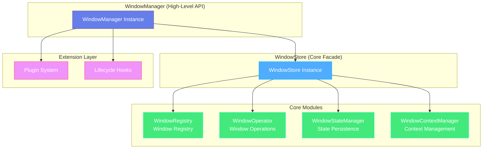
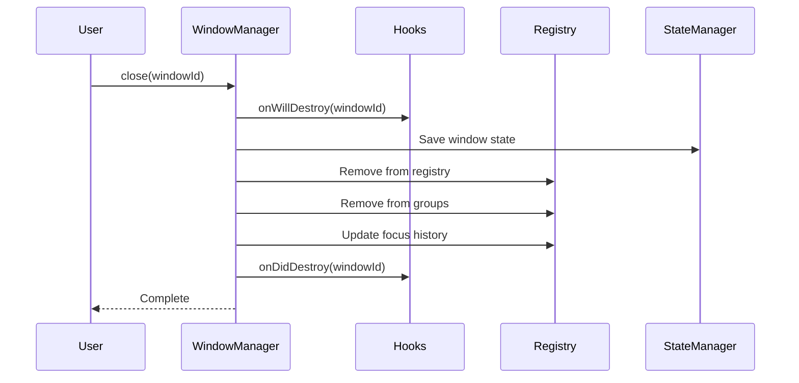

# Window Manager

## Overview

`WindowManager` is one of the core modules of electron-infra-kit, providing a complete window lifecycle management solution. It solves the problem that the native `BrowserWindow` API is too low-level and lacks a unified management mechanism, offering powerful and flexible window management capabilities for Electron applications.

### Core Features

- **Global Window Registry** - Unified management of all window instances with quick lookup by ID or name
- **Smart Duplicate Prevention** - Automatically detects duplicate creation and executes "Find & Focus" strategy
- **State Persistence** - Automatically saves and restores window position, size, maximization state, etc.
- **Lifecycle Management** - Complete window lifecycle hooks with support for custom extensions
- **Plugin System** - Standardized plugin interface for easy extension of window management features
- **Window Grouping** - Support for grouping related windows for batch operations
- **Focus Management** - Intelligent focus history tracking with support for restoring previous active window
- **Crash Recovery** - Automatically handles window crashes and unresponsiveness

### Why Do You Need WindowManager?

When developing complex Electron applications, you may encounter the following problems:

1. **Chaotic Window Management** - Need to manually maintain window instance arrays, prone to errors
2. **Duplicate Creation** - Users clicking multiple times may create multiple identical windows
3. **State Loss** - Window position and size cannot be restored after closing
4. **Code Coupling** - Window creation logic mixed with business logic
5. **Difficult to Extend** - Adding new features requires modifying core code

`WindowManager` elegantly solves these problems by providing high-level abstractions and standardized interfaces.


## Architecture Design

`WindowManager` adopts a **Composition** and **Modular** design pattern, ensuring separation of concerns and maintainability.

### Overall Architecture



### Layer Responsibilities

#### WindowStore (Core Facade)

Acts as the central coordinator for all window management operations, delegating specific tasks to specialized core modules:

- **WindowRegistry** - Manages window storage mapping (`Map<ID, Window>`), handles ID/name indexing and window grouping
- **WindowOperator** - Encapsulates all window operations (show, hide, close, etc.) with safety checks
- **WindowStateManager** - Handles persistence of window UI state (position, size, maximization state)
- **WindowContextManager** - Manages custom context data associated with windows

#### WindowManager (High-Level Control)

Composes `WindowStore` to provide a unified high-level API and adds application-level features:

- Plugin System - Supports dynamic plugin registration via `use()` method
- Lifecycle Hooks - Provides hooks like `onWillCreate`, `onDidCreate`, etc.
- IPC Integration - Optional IPC router integration
- Environment Awareness - Automatically identifies development/production environment

#### Extension Layer

Allows external code to hook into window creation and destruction events, supporting modular extensions.


## Window Creation

### Basic Usage

Creating a window with the `create()` method is simple:

```typescript
import { app } from 'electron';
import { createElectronToolkit } from 'electron-infra-kit';

app.whenReady().then(async () => {
  const { windowManager } = createElectronToolkit({
    isDevelopment: process.env.NODE_ENV === 'development',
  });

  // Wait for initialization
  await windowManager.ready();

  // Create main window
  const windowId = await windowManager.create({
    name: 'main',
    title: 'My Application',
    width: 1024,
    height: 768,
  });

  console.log('Window created:', windowId);
});
```

### Configuration Options

The `create()` method accepts a configuration object with the following options:

```typescript
interface WindowCreationOptions {
  // Unique window name (required)
  name: string;
  
  // Window title
  title?: string;
  
  // Window dimensions
  width?: number;
  height?: number;
  
  // Window position
  x?: number;
  y?: number;
  
  // URL to load
  url?: string;
  
  // Local file path to load
  file?: string;
  
  // Custom window ID
  windowId?: string;
  
  // Enable state persistence
  enablePersistence?: boolean;
  
  // BrowserWindow configuration options
  defaultConfig?: BrowserWindowConstructorOptions;
}
```

### Smart Duplicate Prevention

When you try to create an existing window, `WindowManager` automatically executes a "Find & Focus" strategy:

```typescript
// First creation
await windowManager.create({ name: 'settings', width: 600, height: 400 });

// Try to create the same window again
// Won't create a new window, but focuses the existing one
await windowManager.create({ name: 'settings' });
```

This mechanism will:
1. Check if the window already exists
2. Automatically restore if minimized
3. Bring the window to front and focus it
4. Return the existing window's ID

### Environment-Aware Configuration

`WindowManager` automatically adjusts behavior based on the runtime environment:

**Development Environment:**
- Automatically opens DevTools
- Allows unsafe link navigation
- Enables verbose logging

**Production Environment:**
- Disables DevTools
- Intercepts `new-window` events and opens links in external browser
- Enables security policies

```typescript
const { windowManager } = createElectronToolkit({
  isDevelopment: process.env.NODE_ENV === 'development',
});
```

### Advanced Example

Creating a window with custom configuration:

```typescript
await windowManager.create({
  name: 'editor',
  title: 'Code Editor',
  width: 1200,
  height: 800,
  defaultConfig: {
    minWidth: 800,
    minHeight: 600,
    frame: false,
    transparent: true,
    webPreferences: {
      nodeIntegration: false,
      contextIsolation: true,
      preload: path.join(__dirname, 'preload.js'),
    },
  },
  enablePersistence: true,
});
```


## Window Management

### Getting Windows

`WindowManager` provides multiple ways to retrieve window instances:

```typescript
// Get window by name
const mainWindow = windowManager.getWindowByName('main');

// Get window by ID
const window = windowManager.get(windowId);

// Get currently focused window
const currentWindow = windowManager.getCurrentWindow();

// Get all windows
const allWindows = windowManager.getAllWindows();
```

### Finding Windows

Check if a window exists:

```typescript
// Check by name
if (windowManager.hasByName('settings')) {
  console.log('Settings window exists');
}

// Check by ID
if (windowManager.has(windowId)) {
  console.log('Window exists');
}
```

### Window State Management

Control window display state:

```typescript
// Show window
windowManager.show(windowId);

// Hide window
windowManager.hide(windowId);

// Minimize window
windowManager.minimize(windowId);

// Maximize window
windowManager.maximize(windowId);

// Restore window
windowManager.restore(windowId);

// Focus window
windowManager.focus(windowId);
```

### Window Grouping

Group related windows for batch operations:

```typescript
// Add window to a group
windowManager.joinGroup(windowId, 'editor-windows');

// Get all windows in a group
const editorWindows = windowManager.getGroup('editor-windows');

// Send message to all windows in a group
windowManager.sendToGroup('editor-windows', 'theme-changed', {
  theme: 'dark',
});

// Batch operations
windowManager.hideGroup('editor-windows');  // Hide all editor windows
windowManager.showGroup('editor-windows');  // Show all editor windows
await windowManager.closeGroup('editor-windows');  // Close all editor windows
```

### Focus Management

`WindowManager` maintains a focus history stack for intelligent focus restoration:

```typescript
// Focus a specific window
windowManager.focus(windowId);

// Focus the previously active window (useful for tool windows)
windowManager.focusPrevious();

// Get focus history
const history = windowManager.getFocusHistory();
console.log('Focus history:', history);
```

**Use Case:**

When closing a modal or tool window, automatically restore to the previous window:

```typescript
// Record current focus before closing
const currentFocus = windowManager.getCurrentWindow();

// Close window
await windowManager.close(toolWindowId);

// Restore to previous window
windowManager.focusPrevious();
```

### Context Data Management

Save and restore custom context data for windows:

```typescript
// Save window context
await windowManager.saveWindowContext('main', {
  lastView: 'dashboard',
  scrollPosition: 100,
  openTabs: ['file1.js', 'file2.ts'],
});

// Load window context
const context = await windowManager.loadWindowContext('main');
if (context) {
  console.log('Last view:', context.lastView);
  console.log('Scroll position:', context.scrollPosition);
}

// Clear context
await windowManager.clearWindowContext('temp-window');
```


## Window Closing

### Basic Closing

There are multiple ways to close a window:

```typescript
// Close by ID
windowManager.close(windowId);

// Close by name
windowManager.deleteByName('settings');

// Close all windows
windowManager.closeAll();
```

### Window Destruction Flow

When a window closes, `WindowManager` automatically performs the following cleanup operations:

1. **Trigger Lifecycle Hooks** - Calls `onWillDestroy` hook
2. **Save Window State** - Saves window position and size if persistence is enabled
3. **Clean Registry** - Removes window from global registry
4. **Clean Groups** - Removes window from all groups
5. **Update Focus History** - Removes window from focus stack
6. **Trigger Destruction Complete Hook** - Calls `onDidDestroy` hook



### Graceful Closing

Perform cleanup operations before closing a window:

```typescript
// Listen for window about to close event
windowManager.on('window-will-close', async ({ windowId, name }) => {
  console.log(`Window ${name} is about to close`);
  
  // Save unsaved data
  await saveUnsavedData(windowId);
  
  // Clean up resources
  cleanupResources(windowId);
});

// Close window
await windowManager.close(windowId);
```

### Prevent Accidental Closing

Use lifecycle hooks to prevent window closing:

```typescript
const windowManager = new WindowManager({
  hooks: {
    onWillDestroy: (windowId) => {
      const window = windowManager.get(windowId);
      if (window && hasUnsavedChanges(windowId)) {
        // Show confirmation dialog
        const choice = dialog.showMessageBoxSync(window, {
          type: 'question',
          buttons: ['Cancel', 'Don\'t Save', 'Save'],
          title: 'Confirm Close',
          message: 'There are unsaved changes. Do you want to save?',
        });
        
        if (choice === 0) {
          // Cancel closing
          return false;
        } else if (choice === 2) {
          // Save then close
          saveChanges(windowId);
        }
      }
    },
  },
});
```

### Crash Recovery

`WindowManager` automatically handles window crashes and unresponsiveness:

```typescript
// Listen for window crash events
windowManager.on('window-crash', ({ windowId, reason, exitCode, name, willReload }) => {
  console.error(`Window ${name} crashed:`, reason, exitCode);
  
  if (willReload) {
    console.log('Attempting to reload window...');
  } else {
    // Show error dialog
    dialog.showErrorBox('Window Crashed', `Window ${name} has crashed. Please restart the application.`);
  }
});

// Listen for window unresponsive events
windowManager.on('window-unresponsive', ({ windowId, name }) => {
  console.warn(`Window ${name} is unresponsive`);
  
  // Option to force reload
  const choice = dialog.showMessageBoxSync({
    type: 'warning',
    buttons: ['Wait', 'Reload'],
    title: 'Window Unresponsive',
    message: `Window ${name} is unresponsive. Do you want to reload it?`,
  });
  
  if (choice === 1) {
    const window = windowManager.get(windowId);
    window?.reload();
  }
});
```

### Cleanup on Application Exit

Properly clean up all resources before application exit:

```typescript
import { app } from 'electron';

app.on('before-quit', () => {
  // Release all resources
  // - Close all windows
  // - Clean registry
  // - Stop cleanup protection timer
  windowManager.dispose();
});
```


## Plugin System

`WindowManager` provides a standardized plugin interface that allows you to easily extend window management functionality.

### Plugin Interface

A plugin is an object that implements the `WindowManagerPlugin` interface:

```typescript
interface WindowManagerPlugin {
  // Plugin name (required)
  name: string;
  
  // Initialization hook (optional)
  // Called when plugin is registered, can access WindowManager instance
  init?(manager: WindowManager): void;
  
  // Before window creation hook (optional)
  // Can modify config or cancel creation
  onWillCreate?(config: WindowCreationOptions): WindowCreationOptions | false;
  
  // After window creation hook (optional)
  onDidCreate?(data: { id: string; name: string; window: BrowserWindow }): void;
  
  // Before window destruction hook (optional)
  // Return false to cancel destruction
  onWillDestroy?(windowId: string): boolean | void;
  
  // After window destruction hook (optional)
  onDidDestroy?(windowId: string): void;
}
```

### Creating Plugins

#### Example 1: Logger Plugin

Log all window creation and destruction:

```typescript
const LoggerPlugin: WindowManagerPlugin = {
  name: 'Logger',
  
  onWillCreate(config) {
    console.log(`[Logger] About to create window: ${config.name}`);
    return config;
  },
  
  onDidCreate({ id, name }) {
    console.log(`[Logger] Window created: ${name} (${id})`);
  },
  
  onWillDestroy(windowId) {
    console.log(`[Logger] About to destroy window: ${windowId}`);
  },
  
  onDidDestroy(windowId) {
    console.log(`[Logger] Window destroyed: ${windowId}`);
  },
};
```

#### Example 2: Window Limit Plugin

Limit the number of simultaneously open windows:

```typescript
const WindowLimitPlugin: WindowManagerPlugin = {
  name: 'WindowLimit',
  maxWindows: 5,
  
  onWillCreate(config) {
    const currentCount = this.manager?.getAllWindows().length || 0;
    
    if (currentCount >= this.maxWindows) {
      console.warn(`Maximum window limit reached (${this.maxWindows})`);
      return false; // Cancel creation
    }
    
    return config;
  },
  
  init(manager) {
    this.manager = manager;
  },
};
```

#### Example 3: Window Position Plugin

Automatically adjust window position to avoid overlap:

```typescript
const WindowPositionPlugin: WindowManagerPlugin = {
  name: 'WindowPosition',
  offset: 30,
  
  onWillCreate(config) {
    const windows = this.manager?.getAllWindows() || [];
    
    if (windows.length > 0 && !config.x && !config.y) {
      // Calculate new window position
      const lastWindow = windows[windows.length - 1];
      const [x, y] = lastWindow.getPosition();
      
      config.x = x + this.offset;
      config.y = y + this.offset;
    }
    
    return config;
  },
  
  init(manager) {
    this.manager = manager;
  },
};
```

### Registering Plugins

There are two ways to register plugins:

#### Method 1: Register During Configuration

```typescript
const windowManager = new WindowManager({
  plugins: [
    LoggerPlugin,
    WindowLimitPlugin,
    WindowPositionPlugin,
  ],
});
```

#### Method 2: Dynamic Registration

```typescript
// Create WindowManager
const windowManager = new WindowManager();

// Dynamically register plugins
windowManager.use(LoggerPlugin);
windowManager.use(WindowLimitPlugin);
windowManager.use(WindowPositionPlugin);
```

### Plugin Execution Order

Plugins execute in registration order:

```typescript
const windowManager = new WindowManager({
  plugins: [
    PluginA,  // Executes first
    PluginB,  // Executes second
    PluginC,  // Executes third
  ],
});
```

For `onWillCreate` hooks:
- If any plugin returns `false`, window creation will be cancelled
- Each plugin can modify the config, and modifications are passed to the next plugin

### Advanced Plugin Example

#### Window Analytics Plugin

Monitor window state changes and send analytics data:

```typescript
const WindowAnalyticsPlugin: WindowManagerPlugin = {
  name: 'WindowAnalytics',
  stats: {
    created: 0,
    destroyed: 0,
    activeTime: new Map<string, number>(),
  },
  
  init(manager) {
    this.manager = manager;
    console.log('[Analytics] Plugin initialized');
  },
  
  onDidCreate({ id, name }) {
    this.stats.created++;
    this.stats.activeTime.set(id, Date.now());
    
    // Send analytics data
    this.sendAnalytics('window_created', { id, name });
  },
  
  onDidDestroy(windowId) {
    this.stats.destroyed++;
    
    const startTime = this.stats.activeTime.get(windowId);
    if (startTime) {
      const duration = Date.now() - startTime;
      this.sendAnalytics('window_destroyed', {
        id: windowId,
        duration,
      });
      this.stats.activeTime.delete(windowId);
    }
  },
  
  sendAnalytics(event: string, data: any) {
    // Send to analytics service
    console.log(`[Analytics] ${event}:`, data);
  },
  
  getStats() {
    return {
      ...this.stats,
      active: this.stats.activeTime.size,
    };
  },
};
```

### Best Practices

1. **Single Responsibility** - Each plugin should do one thing
2. **Avoid Side Effects** - Plugins should not modify global state
3. **Error Handling** - Plugins should catch and handle errors internally
4. **Performance Considerations** - Avoid time-consuming operations in hooks
5. **Complete Documentation** - Provide clear documentation and examples for plugins

