# Introduction

Welcome to Electron Infra Kit! This is a comprehensive infrastructure toolkit designed for Electron applications, aimed at simplifying the development of complex Electron apps by providing out-of-the-box window management, inter-process communication, and state synchronization capabilities.


## Background

### Why Electron Infra Kit?

When developing complex Electron applications, developers often face the following challenges:

**Window Management Complexity**

When an application needs to manage multiple windows, manually tracking window creation, destruction, state saving, and restoration becomes very tedious. You need to:
- Maintain references to window instances
- Handle cleanup when windows close
- Save and restore window position, size, and other states
- Manage parent-child relationships between windows

**IPC Communication Pain Points**

While Electron's IPC mechanism is powerful, it has some issues when used in large projects:
- Lack of type safety, prone to runtime errors
- Channel name management is chaotic and difficult to maintain
- Parameter validation needs to be implemented manually
- Lack of unified error handling mechanism

**Cross-Window State Synchronization Difficulties**

In multi-window applications, keeping state synchronized between different windows is a common requirement, but it's not simple to implement:
- Need to manually implement publish-subscribe patterns
- Performance optimization of state updates is difficult
- Easy to encounter state inconsistency issues
- Lack of permission control mechanisms

### Problems Solved by Electron Infra Kit

Electron Infra Kit helps developers address these challenges by providing a complete infrastructure solution:

1. **Simplified Window Management** - Provides unified window lifecycle management API, automatically handles state persistence and window cleanup
2. **Type-Safe IPC** - Type-safe communication mechanism based on TypeScript and Zod, reducing runtime errors
3. **Efficient State Synchronization** - MessageChannel-based cross-window state synchronization with excellent performance and ease of use
4. **Ready to Use** - Provides reasonable default configurations while maintaining high customizability
5. **Production Ready** - Validated in real projects, includes complete error handling and debugging tools


## Core Features

### 🪟 Window Manager

The Window Manager provides complete window lifecycle management capabilities, allowing you to focus on business logic rather than low-level window operations.

**Key Features:**

- **Unified Window Creation API** - Create windows through simple configuration objects with rich configuration options
- **Automatic State Persistence** - Window position, size, maximized state, etc. are automatically saved and restored
- **Lifecycle Hooks** - Execute custom logic at key moments like window creation, display, and closure
- **Plugin System** - Extend window manager functionality through plugins to implement custom behaviors
- **Window Finding and Management** - Quickly find and manage windows by name, ID, or custom criteria

**Usage Example:**

```typescript
// Create window
const windowId = await windowManager.create({
  name: 'editor',
  title: 'Code Editor',
  width: 1200,
  height: 800,
  // State is automatically saved and restored
  saveState: true,
});

// Find window
const window = windowManager.get(windowId);
const editorWindow = windowManager.findByName('editor');

// Close window (automatically cleans up resources)
windowManager.close(windowId);
```

### 🔌 IPC Router

The IPC Router provides a type-safe inter-process communication mechanism, making communication between main and renderer processes more reliable and maintainable.

**Key Features:**

- **Type Safety** - Complete type inference based on TypeScript, catching errors at compile time
- **Parameter Validation** - Integrated Zod for runtime parameter validation, ensuring data correctness
- **Dependency Injection** - Built-in DI container for easy injection of required services and APIs in handlers
- **Unified Error Handling** - Automatically catches and handles errors, providing consistent error response format
- **Route Management** - Organize IPC handlers through namespaces to avoid channel name conflicts

**Usage Example:**

```typescript
// Main process: Define handler
import { IpcHandler } from 'electron-infra-kit';
import { z } from 'zod';

const getUserHandler = new IpcHandler(
  'getUser',
  'user',
  async (context, payload: { id: string }) => {
    // Can access injected APIs
    const db = context.api.database;
    return await db.users.findById(payload.id);
  },
  // Zod validation
  z.object({ id: z.string() })
);

ipcRouter.addHandler(getUserHandler);

// Renderer process: Call handler
const user = await window.electron.ipc.invoke('user:getUser', { id: '123' });
```

### 🌉 Message Bus

The Message Bus implements efficient cross-window state synchronization based on MessageChannel, making data sharing between multiple windows simple.

**Key Features:**

- **Real-time Synchronization** - Data changes are immediately synchronized to all subscribed windows
- **High Performance** - MessageChannel-based communication mechanism avoids serialization overhead
- **Reactive Updates** - Supports watching data changes for reactive UI updates
- **Permission Control** - Can configure read/write permissions for data to protect sensitive information
- **Local Cache** - Each window maintains a local cache to reduce cross-process communication

**Usage Example:**

```typescript
// Main process: Set data
messageBus.setData('theme', 'dark');
messageBus.setData('user', { name: 'John', role: 'admin' });

// Renderer process: Get and watch data
// Get current value
const theme = await window.electron.messageBus.getData('theme');

// Watch for changes
const unsubscribe = window.electron.messageBus.watch('theme', (newTheme) => {
  console.log('Theme changed:', newTheme);
  // Update UI
  document.body.className = newTheme;
});

// Unsubscribe
unsubscribe();
```

### ⚙️ Config Manager

The Config Manager provides type-safe configuration persistence with Zod validation and default values.

**Key Features:**

- **Type Safety** - Complete TypeScript type support
- **Data Validation** - Uses Zod to validate configuration data correctness
- **Persistent Storage** - Configuration is automatically saved to local files
- **Default Values** - Supports configuration defaults to simplify initialization
- **Hot Reload** - Automatically notifies subscribers when configuration changes

### 🐛 Debug Tools

Built-in debugging tools help developers quickly identify and resolve issues, improving development efficiency.

**Key Features:**

- **Performance Monitoring** - Monitor performance of operations like window creation and IPC calls
- **Logging** - Structured log output with different log levels
- **Development Mode** - Automatically enables additional debugging information in development environment
- **Error Tracking** - Detailed error stacks and context information

### 📋 Type Safety

Electron Infra Kit has made type safety a primary goal from the beginning of its design.

**Features:**

- **Complete TypeScript Support** - All APIs have complete type definitions
- **Runtime Validation** - Uses Zod for runtime type validation
- **Type Inference** - Fully leverages TypeScript's type inference capabilities
- **Generic Support** - Supports generics for more flexible type definitions


## Overall Architecture

Electron Infra Kit adopts a modular architecture design with clear responsibilities and mutual collaboration between modules.

### Architecture Diagram

```mermaid
%%{init: {'theme':'base','flowchart':{'curve':'basis','nodeSpacing':70,'rankSpacing':120,'diagramPadding':20,'htmlLabels':true}, 'themeVariables': { 'primaryColor':'#667eea','primaryTextColor':'#fff','primaryBorderColor':'#764ba2','lineColor':'#a78bfa','secondaryColor':'#4facfe','tertiaryColor':'#43e97b'}}}%%
graph TB
    classDef userNode fill:#667eea,stroke:#764ba2,stroke-width:3px,color:#fff,rx:12,ry:12
    classDef entryNode fill:#f093fb,stroke:#f5576c,stroke-width:3px,color:#fff,rx:12,ry:12
    classDef coreNode fill:#4facfe,stroke:#00c2fe,stroke-width:2px,color:#fff,rx:10,ry:10
    classDef supportNode fill:#43e97b,stroke:#38f9d7,stroke-width:2px,color:#fff,rx:10,ry:10
    classDef infraNode fill:#fa709a,stroke:#fee140,stroke-width:2px,color:#fff,rx:10,ry:10

    Dev["👨‍💻 Developer"]:::userNode
    Entry["🛠️ createElectronToolkit<br/>(Entry Function)"]:::entryNode

    subgraph Core["Core Layer"]
        WM["🪟 WindowManager<br/>(Window Manager)"]:::coreNode
        IR["🔌 IpcRouter<br/>(IPC Router)"]:::coreNode
        MB["🌉 MessageBus<br/>(Message Bus)"]:::coreNode
        LM["♻️ LifecycleManager<br/>(Lifecycle Manager)"]:::coreNode
    end

    subgraph Support["Support Layer"]
        WS["💾 WindowStore<br/>(Window Store)"]:::supportNode
        PE["🧩 PluginExecutor<br/>(Plugin Executor)"]:::supportNode
        DI["💉 DI Container<br/>(Dependency Injection)"]:::supportNode
    end

    subgraph Infra["Infrastructure Layer"]
        Config["⚙️ ConfigManager<br/>(Config Manager)"]:::infraNode
        Logger["📝 Logger<br/>(Logger)"]:::infraNode
        Debug["🐛 DebugHelper<br/>(Debug Helper)"]:::infraNode
        Error["⚠️ ErrorHandler<br/>(Error Handler)"]:::infraNode
    end

    Dev --> Entry
    Entry --> LM
    
    LM --> WM
    LM --> IR
    LM --> MB
    
    WM --> WS
    WM --> PE
    WM --> Config
    
    IR --> DI
    IR --> Logger
    
    MB --> WM
    MB --> Logger
    
    WM --> Error
    IR --> Error
    MB --> Error
    
    LM --> Debug
```



### Module Relationships

**Entry Layer**
- `createElectronToolkit` is the entry function for the entire toolkit, responsible for initializing all modules and returning core APIs

**Core Layer**
- `WindowManager` - Manages window creation, destruction, and state
- `IpcRouter` - Handles routing and dispatching of inter-process communication
- `MessageBus` - Implements cross-window state synchronization
- `LifecycleManager` - Coordinates the lifecycle of all modules

**Support Layer**
- `WindowStore` - Stores and manages window instances
- `PluginExecutor` - Executes window lifecycle plugins
- `DI Container` - Manages dependency injection

**Infrastructure Layer**
- `ConfigManager` - Manages application configuration
- `Logger` - Provides logging functionality
- `DebugHelper` - Provides debugging and performance monitoring
- `ErrorHandler` - Unified error handling

### Data Flow

1. **Window Creation Flow**
   ```
   Developer calls windowManager.create()
   → WindowManager validates configuration
   → WindowStore creates and stores window instance
   → PluginExecutor executes lifecycle plugins
   → Returns window ID
   ```

2. **IPC Communication Flow**
   ```
   Renderer process calls ipc.invoke()
   → IpcRouter receives request
   → Validates parameters (Zod)
   → DI Container injects dependencies
   → Executes handler
   → Returns result
   ```

3. **State Synchronization Flow**
   ```
   Main process calls messageBus.setData()
   → MessageBus updates data store
   → Broadcasts to all windows via MessageChannel
   → Renderer process receives update
   → Triggers watch callbacks
   ```


## Design Principles

Electron Infra Kit's design follows these core principles to ensure code quality, maintainability, and extensibility.

### 🎯 Separation of Concerns

Each module has clear responsibility boundaries, avoiding functional coupling.

**Implementation:**

- **Modular Design** - Separate window management, IPC communication, state synchronization, and other functions into independent modules
- **Single Responsibility** - Each class and function is responsible for only one clear function
- **Interface Isolation** - Define interactions between modules through interfaces to reduce coupling
- **Layered Architecture** - Core layer, support layer, and infrastructure layer each have their own responsibilities

**Benefits:**

- Code is easier to understand and maintain
- Each module can be tested independently
- Easy to replace or upgrade a module
- More efficient team collaboration

### 🔒 Type Safety First

Fully leverage TypeScript's type system to discover potential issues at compile time.

**Implementation:**

- **Complete Type Definitions** - All public APIs have detailed type definitions
- **Generic Support** - Use generics to provide flexible and type-safe APIs
- **Runtime Validation** - Use Zod for runtime type validation as a double guarantee
- **Type Inference** - Fully leverage TypeScript's type inference to reduce manual type annotations

**Benefits:**

- Most errors can be found at compile time
- IDE provides better code hints and auto-completion
- Refactoring is safer and easier
- Code is more self-documenting

**Example:**

```typescript
// Type-safe IPC call
interface GetUserPayload {
  id: string;
}

interface User {
  id: string;
  name: string;
  email: string;
}

// Compile-time type checking
const user: User = await ipc.invoke<User>('user:getUser', { id: '123' });

// Runtime validation
const schema = z.object({
  id: z.string(),
});
```

### ⚡ Performance Optimization

Pursue optimal performance while ensuring complete functionality.

**Implementation:**

- **MessageChannel Communication** - Use MessageChannel for efficient cross-window communication, avoiding serialization overhead
- **Local Cache** - Maintain local cache in renderer process to reduce cross-process communication
- **Lazy Loading** - Load modules and resources on demand to reduce startup time
- **Event Throttling** - Throttle high-frequency events to avoid performance issues
- **Memory Management** - Clean up unused resources promptly to avoid memory leaks

**Benefits:**

- Faster application startup
- Smoother operation
- Lower resource usage
- Better user experience

**Performance Monitoring:**

```typescript
// Automatically enable performance monitoring in development mode
const { windowManager } = createElectronToolkit({
  isDevelopment: true, // Enable debug tools
});

// View performance metrics
debugHelper.getMetrics();
```

### 🔌 Extensibility

Provide flexible extension mechanisms to meet customization needs of different projects.

**Implementation:**

- **Plugin System** - Window manager supports plugins that can inject custom logic at various lifecycle stages
- **Dependency Injection** - IPC router supports dependency injection for easy integration of third-party services
- **Configuration** - Control module behavior through configuration objects without modifying source code
- **Event System** - Provide rich event hooks to listen and respond to various state changes

**Benefits:**

- Can customize functionality according to project needs
- No need to modify core code
- Easy to integrate third-party libraries and services
- Supports progressive enhancement

**Plugin Example:**

```typescript
// Custom window plugin
const analyticsPlugin: WindowPlugin = {
  name: 'analytics',
  onCreate: async (window, config) => {
    // Send analytics event when window is created
    analytics.track('window_created', {
      name: config.name,
      timestamp: Date.now(),
    });
  },
  onClose: async (window) => {
    // Send analytics event when window is closed
    analytics.track('window_closed', {
      id: window.id,
      timestamp: Date.now(),
    });
  },
};

// Register plugin
windowManager.registerPlugin(analyticsPlugin);
```

### 🛡️ Security First

Follow Electron's security best practices to protect applications and user data.

**Implementation:**

- **Context Isolation** - Enable context isolation by default (contextIsolation)
- **Preload Scripts** - Safely expose APIs through preload scripts
- **Permission Control** - MessageBus supports data permission configuration
- **Input Validation** - All external inputs are validated
- **Least Privilege** - Only expose necessary APIs to renderer process

**Benefits:**

- Prevent XSS attacks
- Protect sensitive data
- Comply with security standards
- Enhance user trust

### 📚 Developer Friendly

Provide a good development experience, reducing learning and usage costs.

**Implementation:**

- **Clear API Design** - Intuitive API naming and reasonable parameters
- **Comprehensive Documentation** - Provide detailed documentation and examples
- **Friendly Error Messages** - Clear error messages with solution suggestions
- **Debug Tools** - Built-in debugging tools for easy problem identification
- **TypeScript Support** - Complete type definitions and IDE support

**Benefits:**

- Lower learning curve
- Improve development efficiency
- Reduce debugging time
- Enhance development experience


## Use Cases

Electron Infra Kit is particularly suitable for the following types of application development, significantly improving development efficiency and code quality.

### 💻 Multi-Window IDEs and Code Editors

**Scenario:**

Code editors typically need to manage multiple windows, such as main editor window, terminal window, debug window, settings window, etc. These windows need to share state (like project configuration, theme settings) and communicate (like debug commands, file operations).

**Advantages of Electron Infra Kit:**

- **Window Management** - Easily manage multiple editor windows, automatically save and restore window layouts
- **State Synchronization** - Theme, settings, and other configurations sync in real-time across all windows
- **IPC Communication** - Type-safe command calls, such as file operations and debug control
- **Performance Optimization** - Efficient cross-window communication without affecting editor performance

**Typical Implementation:**

```typescript
// Create main editor window
const mainWindow = await windowManager.create({
  name: 'main-editor',
  title: 'Code Editor',
  width: 1400,
  height: 900,
  saveState: true,
});

// Create terminal window
const terminalWindow = await windowManager.create({
  name: 'terminal',
  title: 'Terminal',
  width: 800,
  height: 400,
  parent: mainWindow,
});

// Sync theme settings
messageBus.setData('theme', 'dark');
messageBus.setData('fontSize', 14);

// Execute file operation commands
ipcRouter.addHandler(new IpcHandler(
  'openFile',
  'file',
  async (context, { path }) => {
    return await fs.readFile(path, 'utf-8');
  }
));
```

### 🎨 Design Tools and Creative Applications

**Scenario:**

Design tools typically include multiple independent windows or panels, such as canvas window, properties panel, layers panel, toolbar, etc. These windows need to sync information like selected objects, tool state, and canvas zoom in real-time.

**Advantages of Electron Infra Kit:**

- **Flexible Window Layout** - Supports various layout methods like floating windows and docked windows
- **Real-time State Sync** - Selected objects, tool states, etc. update in real-time across all panels
- **High-Performance Communication** - MessageChannel ensures frequent state updates don't affect performance
- **Undo/Redo Support** - Implement global undo/redo through state management

**Typical Implementation:**

```typescript
// Create canvas window
const canvasWindow = await windowManager.create({
  name: 'canvas',
  title: 'Canvas',
  width: 1200,
  height: 800,
});

// Create properties panel
const propertiesWindow = await windowManager.create({
  name: 'properties',
  title: 'Properties',
  width: 300,
  height: 600,
  parent: canvasWindow,
});

// Sync selected object
messageBus.watch('selectedObject', (object) => {
  // Update properties panel display
  updatePropertiesPanel(object);
});

// Sync tool state
messageBus.setData('currentTool', 'pen');
messageBus.setData('brushSize', 10);
```

### 👥 Collaboration Apps and Real-Time Communication Tools

**Scenario:**

Collaboration apps need to sync user status, messages, document edits, and other information across multiple windows. For example, a chat app might have a main window, multiple chat windows, notification windows, etc.

**Advantages of Electron Infra Kit:**

- **Real-time State Sync** - User online status, unread messages, etc. update in real-time
- **Multi-Window Message Distribution** - New messages automatically distributed to relevant windows
- **Permission Control** - Control different windows' access to data
- **Offline Support** - Local cache ensures data access even when offline

**Typical Implementation:**

```typescript
// Create main window
const mainWindow = await windowManager.create({
  name: 'main',
  title: 'Chat App',
  width: 1000,
  height: 700,
});

// Create chat window
const chatWindow = await windowManager.create({
  name: 'chat-room-1',
  title: 'Chat Room',
  width: 600,
  height: 500,
});

// Sync user online status
messageBus.setData('onlineUsers', ['user1', 'user2', 'user3']);

// Distribute new messages
messageBus.watch('newMessage', (message) => {
  // All chat windows receive new messages
  displayMessage(message);
  showNotification(message);
});

// Permission control
messageBus.setData('privateData', sensitiveData, {
  readOnly: ['main'], // Only main window can read
});
```

### 🏢 Enterprise Applications and Management Systems

**Scenario:**

Enterprise applications are typically complex with multiple modules and windows, such as dashboard, data management, report generation, system settings, etc. They need unified state management and inter-module communication.

**Advantages of Electron Infra Kit:**

- **Modular Architecture** - Each functional module can be developed and maintained independently
- **Unified State Management** - Global state shared across all modules
- **Type-Safe APIs** - Reduce integration errors between modules
- **Permissions and Security** - Built-in permission control and security mechanisms

**Typical Implementation:**

```typescript
// Create dashboard window
const dashboardWindow = await windowManager.create({
  name: 'dashboard',
  title: 'Dashboard',
  width: 1400,
  height: 900,
});

// Create data management window
const dataWindow = await windowManager.create({
  name: 'data-management',
  title: 'Data Management',
  width: 1200,
  height: 800,
});

// Sync user permissions
messageBus.setData('userPermissions', {
  canEdit: true,
  canDelete: false,
  canExport: true,
});

// Define business API
ipcRouter.addHandler(new IpcHandler(
  'fetchData',
  'data',
  async (context, { query }) => {
    const db = context.api.database;
    return await db.query(query);
  },
  z.object({ query: z.string() })
));

// Sync data updates
messageBus.watch('dataUpdated', (data) => {
  // Refresh data display in all relevant windows
  refreshDataDisplay(data);
});
```

### 🎮 Gaming and Entertainment Applications

**Scenario:**

Gaming applications may need multiple windows, such as main game window, settings window, friends list, chat window, etc. They need high-performance state synchronization and communication.

**Advantages of Electron Infra Kit:**

- **High-Performance Communication** - MessageChannel provides low-latency cross-window communication
- **State Synchronization** - Game state, user data, etc. sync in real-time
- **Window Management** - Flexibly manage game windows and auxiliary windows
- **Performance Monitoring** - Built-in performance monitoring tools

### 📊 Data Analysis and Visualization Tools

**Scenario:**

Data analysis tools typically need multiple view windows, such as data tables, charts, filters, statistics panels, etc. These windows need to respond to data changes and update in real-time.

**Advantages of Electron Infra Kit:**

- **Reactive Updates** - All relevant views automatically update when data changes
- **High-Performance Rendering** - Optimized communication mechanism doesn't affect chart rendering performance
- **Modular Views** - Each view can be developed and optimized independently
- **Data Caching** - Local cache reduces redundant calculations

## Next Steps

Now that you understand the core concepts and use cases of Electron Infra Kit, you can:

- 📖 Read the [Getting Started Guide](/en/guide/getting-started) to get up and running in 5 minutes
- 🔍 Deep dive into [Core Concepts](/en/guide/core-concepts/window-manager)
- 💡 Check out [Example Code](/en/examples/) to see practical applications
- 📚 Browse the [API Reference](/en/api/) to find specific interfaces

If you encounter any issues, feel free to:

- 🐛 [Submit an Issue](https://github.com/chunhaofen/electron-infra-kit/issues)
- 💬 [Join the Discussion](https://github.com/chunhaofen/electron-infra-kit/discussions)
- ⭐ [Star the Project](https://github.com/chunhaofen/electron-infra-kit)
