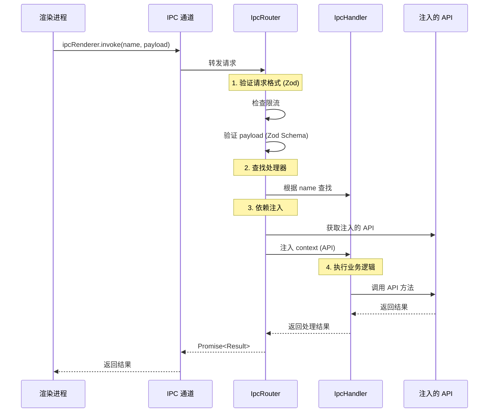
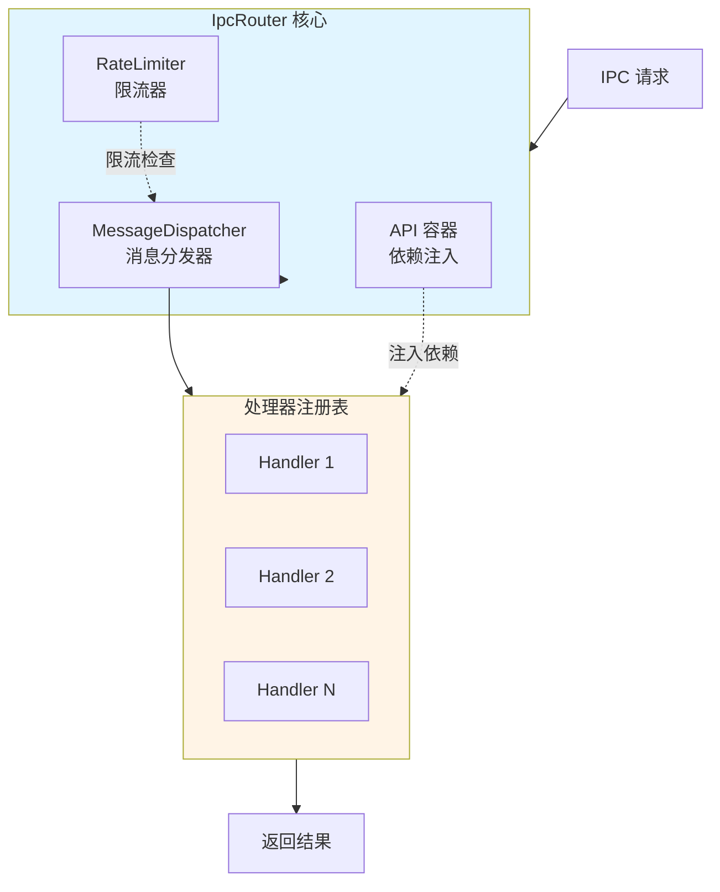

# IPC 路由

## 概述

`IpcRouter` 是 electron-infra-kit 的核心模块之一，它为 Electron 应用提供了一个轻量级、高度可扩展的 IPC（进程间通信）管理解决方案。传统的 IPC 通信往往存在逻辑分散、耦合度高、维护困难等问题，而 IpcRouter 通过采用**依赖注入**和**单通道复用**的设计模式，将 IPC 通信转变为可插拔的"处理器"模式，彻底解耦业务逻辑与基础设施。

### 核心优势

- **🔌 依赖注入**: 在运行时注入依赖（如 `app`、`windowManager`、`fs` 等），处理器只需专注于"使用 API"，无需关心"API 从哪来"
- **🔒 类型安全**: 支持 TypeScript 泛型（`IpcHandler<Context, Payload, Result>`），确保注入的依赖、请求载荷和返回类型在编译时的安全性
- **🎯 单通道复用**: 主进程只需要**一个** IPC 监听器，`IpcRouter` 内部处理所有分发逻辑，保持 `main.ts` 的简洁
- **✅ 运行时验证**: 内置 `Zod` schema 验证支持，确保 IPC 载荷的数据安全和类型一致性
- **🔓 开闭原则**: 添加新功能只需添加新的 `IpcHandler`，无需修改初始化代码
- **⚡ 性能监控**: 自动记录 IPC 调用的性能指标，便于调试和优化
- **🛡️ 限流保护**: 内置限流机制，防止恶意或异常的高频请求

### 适用场景

IpcRouter 特别适合以下场景：

- **复杂的多窗口应用**: 需要在多个窗口之间进行频繁的数据交互
- **模块化架构**: 希望将业务逻辑拆分为独立的处理器模块
- **类型安全要求高**: 需要在编译时和运行时都保证类型安全
- **需要限流控制**: 防止渲染进程的恶意或异常请求
- **性能监控需求**: 需要追踪和分析 IPC 调用的性能


## 架构设计

### 通信流程

下图展示了从渲染进程到主进程的完整 IPC 通信流程：



### 内部架构

IpcRouter 的内部由三个核心组件组成：



**组件说明**：

1. **MessageDispatcher（消息分发器）**
   - 维护处理器注册表和元数据（Zod Schema）
   - 根据请求名称查找对应的处理器
   - 执行 payload 验证和回调函数

2. **RateLimiter（限流器）**
   - 实现时间窗口计数算法
   - 为每个 `senderId:handlerName` 维护计数器
   - 自动清理过期的限流状态

3. **API 容器（依赖注入）**
   - 存储全局依赖（如 `app`、`windowManager`、`db` 等）
   - 在运行时将依赖注入到处理器的 context 中
   - 支持批量注入和动态更新


## 定义处理器

### 基本概念

`IpcHandler` 是 IPC 通信的基本单元，它封装了一个具体的业务逻辑处理函数。每个处理器包含以下要素：

- **name**: 唯一标识符，用于路由请求
- **event**: 事件类别，用于分类和元数据
- **callback**: 业务逻辑函数，接收 context 和 payload
- **schema**: 可选的 Zod 验证 schema，用于运行时类型检查

### 创建处理器

#### 1. 定义 Context 类型

首先定义你的应用上下文类型，包含所有需要注入的 API：

```typescript
import { App } from 'electron';
import { Types } from 'electron-infra-kit';

export interface AppContext {
  app: App;                    // Electron App 实例
  logger: Types.ILogger;       // 日志记录器
  windowManager: any;          // 窗口管理器
  db: any;                     // 数据库实例
  config: any;                 // 配置服务
}
```

#### 2. 创建简单处理器

最简单的处理器不需要 payload 验证：

```typescript
import { IpcHandler } from 'electron-infra-kit';
import { AppContext } from '../types';

// 获取应用版本
export const getAppVersionHandler = new IpcHandler<
  AppContext,           // Context 类型
  void,                 // 无 payload
  string                // 返回字符串
>(
  'getAppVersion',      // 处理器名称
  'app',                // 事件类别
  async (context) => {
    // 使用注入的 app API
    return context.app.getVersion();
  }
);
```

#### 3. 带参数验证的处理器

使用 Zod 进行运行时类型验证：

```typescript
import { IpcHandler } from 'electron-infra-kit';
import { z } from 'zod';
import { AppContext } from '../types';

// 定义 payload schema
const GetUserSchema = z.object({
  id: z.string().min(1, '用户 ID 不能为空'),
});

type GetUserPayload = z.infer<typeof GetUserSchema>;

interface UserResult {
  id: string;
  name: string;
  email: string;
}

// 获取用户信息
export const getUserHandler = new IpcHandler<
  AppContext,
  GetUserPayload,
  UserResult
>(
  'getUser',
  'user',
  async (context, payload) => {
    // payload 已经通过 Zod 验证
    context.logger.info(`获取用户信息: ${payload.id}`);
    
    // 调用数据库 API
    const user = await context.db.users.findById(payload.id);
    
    if (!user) {
      throw new Error(`用户不存在: ${payload.id}`);
    }
    
    return {
      id: user.id,
      name: user.name,
      email: user.email,
    };
  },
  GetUserSchema  // 传入验证 schema
);
```

#### 4. 复杂业务逻辑处理器

处理更复杂的业务场景：

```typescript
import { IpcHandler } from 'electron-infra-kit';
import { z } from 'zod';
import { AppContext } from '../types';

// 更新用户信息的 schema
const UpdateUserSchema = z.object({
  id: z.string(),
  updateData: z.object({
    name: z.string().min(2).optional(),
    email: z.string().email().optional(),
    age: z.number().min(0).max(150).optional(),
  }),
});

type UpdateUserPayload = z.infer<typeof UpdateUserSchema>;

interface UpdateUserResult {
  success: boolean;
  user: {
    id: string;
    name: string;
    email: string;
    updatedAt: string;
  };
}

export const updateUserHandler = new IpcHandler<
  AppContext,
  UpdateUserPayload,
  UpdateUserResult
>(
  'updateUser',
  'user',
  async (context, payload) => {
    const { id, updateData } = payload;
    
    // 记录日志
    context.logger.info(`更新用户 ${id}:`, updateData);
    
    // 检查用户是否存在
    const existingUser = await context.db.users.findById(id);
    if (!existingUser) {
      throw new Error(`用户不存在: ${id}`);
    }
    
    // 更新用户
    const updatedUser = await context.db.users.update(id, updateData);
    
    // 发送通知到其他窗口
    context.windowManager.broadcast('user-updated', {
      userId: id,
      changes: updateData,
    });
    
    return {
      success: true,
      user: {
        id: updatedUser.id,
        name: updatedUser.name,
        email: updatedUser.email,
        updatedAt: new Date().toISOString(),
      },
    };
  },
  UpdateUserSchema
);
```

### 最佳实践

1. **使用 Zod 验证**: 始终为有 payload 的处理器提供 Zod schema，确保类型安全
2. **明确的类型定义**: 使用 TypeScript 泛型明确指定 Context、Payload 和 Result 类型
3. **错误处理**: 在处理器中抛出的错误会被自动包装为 `IpcHandlerError`
4. **日志记录**: 利用注入的 logger 记录关键操作
5. **单一职责**: 每个处理器只负责一个具体的业务功能
6. **命名规范**: 使用清晰的命名，如 `getUser`、`updateUser`、`deleteUser`


## 注册处理器

### 初始化 IpcRouter

在主进程中创建 IpcRouter 实例：

```typescript
import { app, ipcMain } from 'electron';
import { IpcRouter } from 'electron-infra-kit';
import { Logger } from './logger';

// 创建 IpcRouter 实例
const logger = new Logger('main');
const ipcRouter = new IpcRouter({ 
  logger,
  defaultRateLimit: {
    window: 60000,  // 60秒时间窗口
    max: 100,       // 最多100个请求
  }
});
```

### 注册单个处理器

使用 `addHandler` 方法注册处理器：

```typescript
import { getUserHandler, updateUserHandler } from './handlers/user-handlers';

// 注册单个处理器
ipcRouter.addHandler(getUserHandler);
ipcRouter.addHandler(updateUserHandler);
```

### 批量注册处理器

使用 `addHandlers` 方法批量注册：

```typescript
import { 
  getUserHandler, 
  updateUserHandler, 
  deleteUserHandler 
} from './handlers/user-handlers';

import {
  getConfigHandler,
  setConfigHandler,
} from './handlers/config-handlers';

// 批量注册
ipcRouter.addHandlers([
  getUserHandler,
  updateUserHandler,
  deleteUserHandler,
  getConfigHandler,
  setConfigHandler,
]);
```

### 设置 IPC 监听器

在主进程中设置单一的 IPC 监听器：

```typescript
import { ipcMain } from 'electron';

// 设置单一的 IPC 通道
ipcMain.handle('renderer-to-main', async (event, data) => {
  try {
    // 获取发送者 ID（用于限流）
    const senderId = event.sender.id;
    
    // 通过 IpcRouter 处理请求
    const result = await ipcRouter.handle(data, senderId);
    
    return { success: true, data: result };
  } catch (error: any) {
    logger.error('IPC 处理错误:', error);
    
    return {
      success: false,
      error: {
        message: error.message,
        code: error.code || 'UNKNOWN_ERROR',
      },
    };
  }
});
```

### 动态管理处理器

#### 移除处理器

```typescript
// 移除指定的处理器
ipcRouter.removeHandler('getUser');
```

#### 替换处理器

```typescript
// 先移除旧的处理器
ipcRouter.removeHandler('getUser');

// 注册新的处理器
ipcRouter.addHandler(newGetUserHandler);
```

### 完整示例

```typescript
// main.ts
import { app, ipcMain } from 'electron';
import { createElectronToolkit } from 'electron-infra-kit';
import { Logger } from './infrastructure/logger';
import { Database } from './infrastructure/database';
import { ConfigService } from './infrastructure/config';

// 导入所有处理器
import * as userHandlers from './handlers/user-handlers';
import * as configHandlers from './handlers/config-handlers';
import * as windowHandlers from './handlers/window-handlers';

app.whenReady().then(async () => {
  // 初始化工具包
  const { windowManager, ipcRouter, messageBus } = createElectronToolkit({
    isDevelopment: process.env.NODE_ENV === 'development',
  });

  // 初始化基础设施
  const logger = new Logger('main');
  const db = new Database();
  const config = new ConfigService();

  await db.connect();
  await windowManager.ready();

  // 注入依赖
  ipcRouter.addApis({
    app,
    logger,
    windowManager,
    messageBus,
    db,
    config,
  });

  // 批量注册处理器
  ipcRouter.addHandlers([
    ...Object.values(userHandlers),
    ...Object.values(configHandlers),
    ...Object.values(windowHandlers),
  ]);

  // 设置 IPC 监听器
  ipcMain.handle('renderer-to-main', async (event, data) => {
    try {
      const result = await ipcRouter.handle(data, event.sender.id);
      return { success: true, data: result };
    } catch (error: any) {
      logger.error('IPC Error:', error);
      return {
        success: false,
        error: {
          message: error.message,
          code: error.code || 'UNKNOWN_ERROR',
        },
      };
    }
  });

  // 创建主窗口
  await windowManager.create({
    name: 'main',
    title: 'My App',
    width: 1024,
    height: 768,
  });
});

// 清理资源
app.on('before-quit', () => {
  ipcRouter.dispose();
});
```


## 依赖注入

### 什么是依赖注入

依赖注入（Dependency Injection, DI）是一种设计模式，它允许我们在运行时将依赖项注入到对象中，而不是在对象内部创建依赖。在 IpcRouter 中，依赖注入使得处理器可以访问各种 API 和服务，而无需关心这些 API 是如何创建和管理的。

### 注入单个 API

使用 `addApi` 方法注入单个依赖：

```typescript
import { app } from 'electron';
import { IpcRouter } from 'electron-infra-kit';

const ipcRouter = new IpcRouter();

// 注入 Electron app 实例
ipcRouter.addApi('app', app);

// 注入自定义服务
ipcRouter.addApi('logger', new Logger());
ipcRouter.addApi('db', new Database());
ipcRouter.addApi('config', new ConfigService());
```

### 批量注入 API

使用 `addApis` 方法批量注入多个依赖：

```typescript
import { app } from 'electron';
import { IpcRouter } from 'electron-infra-kit';
import { Logger } from './logger';
import { Database } from './database';
import { ConfigService } from './config';
import { FileSystem } from './filesystem';

const ipcRouter = new IpcRouter();

// 批量注入
ipcRouter.addApis({
  app: app,
  logger: new Logger(),
  db: new Database(),
  config: new ConfigService(),
  fs: new FileSystem(),
});
```

### 在处理器中使用注入的 API

注入的 API 会作为 context 参数传递给处理器的回调函数：

```typescript
import { IpcHandler } from 'electron-infra-kit';
import { z } from 'zod';

// 定义 Context 类型（包含所有注入的 API）
interface AppContext {
  app: Electron.App;
  logger: Logger;
  db: Database;
  config: ConfigService;
  fs: FileSystem;
}

const SaveFileSchema = z.object({
  path: z.string(),
  content: z.string(),
});

export const saveFileHandler = new IpcHandler<
  AppContext,
  z.infer<typeof SaveFileSchema>,
  { success: boolean; path: string }
>(
  'saveFile',
  'file',
  async (context, payload) => {
    // 使用注入的 logger
    context.logger.info(`保存文件: ${payload.path}`);
    
    // 使用注入的 fs
    await context.fs.writeFile(payload.path, payload.content);
    
    // 使用注入的 config 获取配置
    const encoding = context.config.get('file.encoding', 'utf-8');
    
    // 使用注入的 db 记录操作
    await context.db.logs.create({
      action: 'file_saved',
      path: payload.path,
      timestamp: Date.now(),
    });
    
    return {
      success: true,
      path: payload.path,
    };
  },
  SaveFileSchema
);
```

### 与 createElectronToolkit 集成

当使用 `createElectronToolkit` 时，核心模块会自动注入：

```typescript
import { app } from 'electron';
import { createElectronToolkit } from 'electron-infra-kit';

app.whenReady().then(async () => {
  const { windowManager, ipcRouter, messageBus } = createElectronToolkit({
    isDevelopment: process.env.NODE_ENV === 'development',
  });

  // windowManager 和 messageBus 已经自动注入到 ipcRouter
  // 你可以在处理器中直接使用它们
  
  // 注入额外的自定义 API
  ipcRouter.addApis({
    db: new Database(),
    config: new ConfigService(),
  });
});
```

### 动态更新依赖

你可以在运行时更新注入的依赖：

```typescript
// 初始注入
ipcRouter.addApi('db', oldDatabase);

// 稍后更新
ipcRouter.addApi('db', newDatabase);

// 之后的处理器调用将使用新的 database 实例
```

### 依赖注入的优势

1. **解耦**: 处理器不需要知道依赖是如何创建的
2. **可测试性**: 可以轻松注入 mock 对象进行单元测试
3. **灵活性**: 可以在运行时动态替换依赖
4. **类型安全**: TypeScript 泛型确保类型正确
5. **集中管理**: 所有依赖在一个地方管理，便于维护

### 测试示例

依赖注入使得单元测试变得简单：

```typescript
import { IpcRouter } from 'electron-infra-kit';
import { saveFileHandler } from './handlers/file-handlers';

describe('saveFileHandler', () => {
  it('应该保存文件并记录日志', async () => {
    // 创建 mock 对象
    const mockLogger = {
      info: jest.fn(),
      error: jest.fn(),
    };
    
    const mockFs = {
      writeFile: jest.fn().mockResolvedValue(undefined),
    };
    
    const mockDb = {
      logs: {
        create: jest.fn().mockResolvedValue({ id: 1 }),
      },
    };
    
    const mockConfig = {
      get: jest.fn().mockReturnValue('utf-8'),
    };
    
    // 创建测试用的 IpcRouter
    const ipcRouter = new IpcRouter();
    
    // 注入 mock 对象
    ipcRouter.addApis({
      logger: mockLogger,
      fs: mockFs,
      db: mockDb,
      config: mockConfig,
    });
    
    // 注册处理器
    ipcRouter.addHandler(saveFileHandler);
    
    // 执行测试
    const result = await ipcRouter.handle({
      name: 'saveFile',
      payload: {
        path: '/test/file.txt',
        content: 'Hello World',
      },
    });
    
    // 验证结果
    expect(result.success).toBe(true);
    expect(mockLogger.info).toHaveBeenCalledWith('保存文件: /test/file.txt');
    expect(mockFs.writeFile).toHaveBeenCalledWith('/test/file.txt', 'Hello World');
    expect(mockDb.logs.create).toHaveBeenCalled();
  });
});
```


## 渲染进程调用

### 预加载脚本配置

首先，在预加载脚本中暴露 IPC 调用接口：

```typescript
// preload.ts
import { contextBridge, ipcRenderer } from 'electron';

// 暴露类型安全的 IPC API
contextBridge.exposeInMainWorld('ipcApi', {
  invoke: async (name: string, payload?: any) => {
    return await ipcRenderer.invoke('renderer-to-main', {
      name,
      payload,
    });
  },
});
```

### TypeScript 类型定义

为渲染进程定义类型：

```typescript
// preload.d.ts
export interface IpcApi {
  invoke<T = any>(name: string, payload?: any): Promise<{
    success: boolean;
    data?: T;
    error?: {
      message: string;
      code: string;
    };
  }>;
}

declare global {
  interface Window {
    ipcApi: IpcApi;
  }
}
```

### 基本调用

在渲染进程中调用 IPC 处理器：

```typescript
// renderer.ts

// 调用无参数的处理器
async function getAppVersion() {
  const response = await window.ipcApi.invoke('getAppVersion');
  
  if (response.success) {
    console.log('应用版本:', response.data);
    return response.data;
  } else {
    console.error('获取版本失败:', response.error);
    throw new Error(response.error?.message);
  }
}

// 调用带参数的处理器
async function getUser(userId: string) {
  const response = await window.ipcApi.invoke('getUser', {
    id: userId,
  });
  
  if (response.success) {
    console.log('用户信息:', response.data);
    return response.data;
  } else {
    console.error('获取用户失败:', response.error);
    throw new Error(response.error?.message);
  }
}

// 调用更新操作
async function updateUser(userId: string, updates: any) {
  const response = await window.ipcApi.invoke('updateUser', {
    id: userId,
    updateData: updates,
  });
  
  if (response.success) {
    console.log('更新成功:', response.data);
    return response.data;
  } else {
    console.error('更新失败:', response.error);
    throw new Error(response.error?.message);
  }
}
```

### 封装 IPC 客户端

创建一个类型安全的 IPC 客户端封装：

```typescript
// ipc-client.ts

export class IpcClient {
  /**
   * 调用 IPC 处理器
   */
  private async invoke<T>(name: string, payload?: any): Promise<T> {
    const response = await window.ipcApi.invoke(name, payload);
    
    if (response.success) {
      return response.data as T;
    } else {
      throw new Error(response.error?.message || '未知错误');
    }
  }

  // 应用相关
  async getAppVersion(): Promise<string> {
    return this.invoke<string>('getAppVersion');
  }

  // 用户相关
  async getUser(id: string): Promise<User> {
    return this.invoke<User>('getUser', { id });
  }

  async updateUser(id: string, updateData: Partial<User>): Promise<UpdateUserResult> {
    return this.invoke<UpdateUserResult>('updateUser', { id, updateData });
  }

  async deleteUser(id: string): Promise<{ success: boolean }> {
    return this.invoke<{ success: boolean }>('deleteUser', { id });
  }

  // 配置相关
  async getConfig(key: string): Promise<any> {
    return this.invoke('getConfig', { key });
  }

  async setConfig(key: string, value: any): Promise<void> {
    return this.invoke('setConfig', { key, value });
  }

  // 文件相关
  async saveFile(path: string, content: string): Promise<{ success: boolean; path: string }> {
    return this.invoke('saveFile', { path, content });
  }

  async readFile(path: string): Promise<{ content: string }> {
    return this.invoke('readFile', { path });
  }
}

// 导出单例
export const ipcClient = new IpcClient();
```

### 在 React 中使用

```typescript
// UserProfile.tsx
import React, { useEffect, useState } from 'react';
import { ipcClient } from './ipc-client';

interface User {
  id: string;
  name: string;
  email: string;
}

export function UserProfile({ userId }: { userId: string }) {
  const [user, setUser] = useState<User | null>(null);
  const [loading, setLoading] = useState(true);
  const [error, setError] = useState<string | null>(null);

  useEffect(() => {
    loadUser();
  }, [userId]);

  async function loadUser() {
    try {
      setLoading(true);
      setError(null);
      const userData = await ipcClient.getUser(userId);
      setUser(userData);
    } catch (err: any) {
      setError(err.message);
    } finally {
      setLoading(false);
    }
  }

  async function handleUpdate(updates: Partial<User>) {
    try {
      const result = await ipcClient.updateUser(userId, updates);
      setUser(result.user);
      alert('更新成功！');
    } catch (err: any) {
      alert(`更新失败: ${err.message}`);
    }
  }

  if (loading) return <div>加载中...</div>;
  if (error) return <div>错误: {error}</div>;
  if (!user) return <div>用户不存在</div>;

  return (
    <div>
      <h2>{user.name}</h2>
      <p>邮箱: {user.email}</p>
      <button onClick={() => handleUpdate({ name: '新名字' })}>
        更新名字
      </button>
    </div>
  );
}
```

### 在 Vue 中使用

```vue
<!-- UserProfile.vue -->
<template>
  <div>
    <div v-if="loading">加载中...</div>
    <div v-else-if="error">错误: {{ error }}</div>
    <div v-else-if="user">
      <h2>{{ user.name }}</h2>
      <p>邮箱: {{ user.email }}</p>
      <button @click="handleUpdate">更新名字</button>
    </div>
  </div>
</template>

<script setup lang="ts">
import { ref, onMounted } from 'vue';
import { ipcClient } from './ipc-client';

interface User {
  id: string;
  name: string;
  email: string;
}

const props = defineProps<{
  userId: string;
}>();

const user = ref<User | null>(null);
const loading = ref(true);
const error = ref<string | null>(null);

onMounted(() => {
  loadUser();
});

async function loadUser() {
  try {
    loading.value = true;
    error.value = null;
    user.value = await ipcClient.getUser(props.userId);
  } catch (err: any) {
    error.value = err.message;
  } finally {
    loading.value = false;
  }
}

async function handleUpdate() {
  try {
    const result = await ipcClient.updateUser(props.userId, {
      name: '新名字',
    });
    user.value = result.user;
    alert('更新成功！');
  } catch (err: any) {
    alert(`更新失败: ${err.message}`);
  }
}
</script>
```

### 错误处理

在渲染进程中优雅地处理错误：

```typescript
// error-handler.ts

export class IpcError extends Error {
  constructor(
    message: string,
    public code: string,
    public details?: any
  ) {
    super(message);
    this.name = 'IpcError';
  }
}

export async function safeInvoke<T>(
  name: string,
  payload?: any
): Promise<T> {
  try {
    const response = await window.ipcApi.invoke(name, payload);
    
    if (response.success) {
      return response.data as T;
    } else {
      throw new IpcError(
        response.error?.message || '未知错误',
        response.error?.code || 'UNKNOWN_ERROR',
        response.error
      );
    }
  } catch (err: any) {
    if (err instanceof IpcError) {
      throw err;
    }
    
    // 网络或其他错误
    throw new IpcError(
      err.message || '通信失败',
      'COMMUNICATION_ERROR',
      err
    );
  }
}

// 使用示例
try {
  const user = await safeInvoke<User>('getUser', { id: '123' });
  console.log(user);
} catch (err) {
  if (err instanceof IpcError) {
    console.error(`IPC 错误 [${err.code}]:`, err.message);
    
    // 根据错误码处理
    switch (err.code) {
      case 'VALIDATION_ERROR':
        alert('输入数据无效');
        break;
      case 'NOT_FOUND':
        alert('资源不存在');
        break;
      case 'RATE_LIMIT_EXCEEDED':
        alert('请求过于频繁，请稍后再试');
        break;
      default:
        alert('操作失败，请重试');
    }
  }
}
```

### 最佳实践

1. **类型安全**: 使用 TypeScript 定义清晰的请求和响应类型
2. **错误处理**: 始终处理可能的错误情况
3. **加载状态**: 在 UI 中显示加载状态
4. **封装调用**: 使用客户端类封装 IPC 调用，提高代码复用性
5. **避免频繁调用**: 注意限流限制，避免短时间内大量请求
6. **日志记录**: 在开发环境记录 IPC 调用，便于调试

