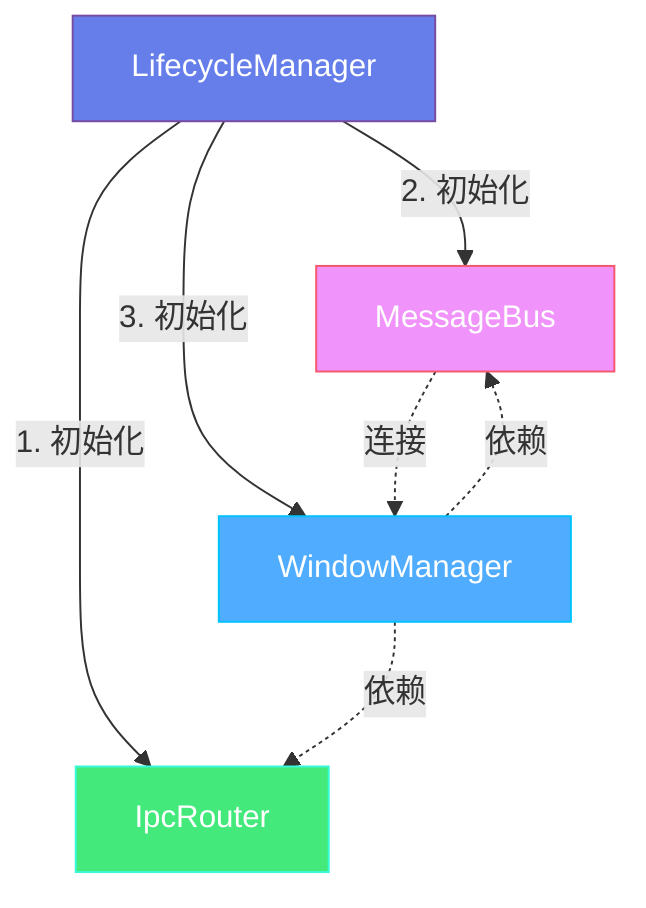
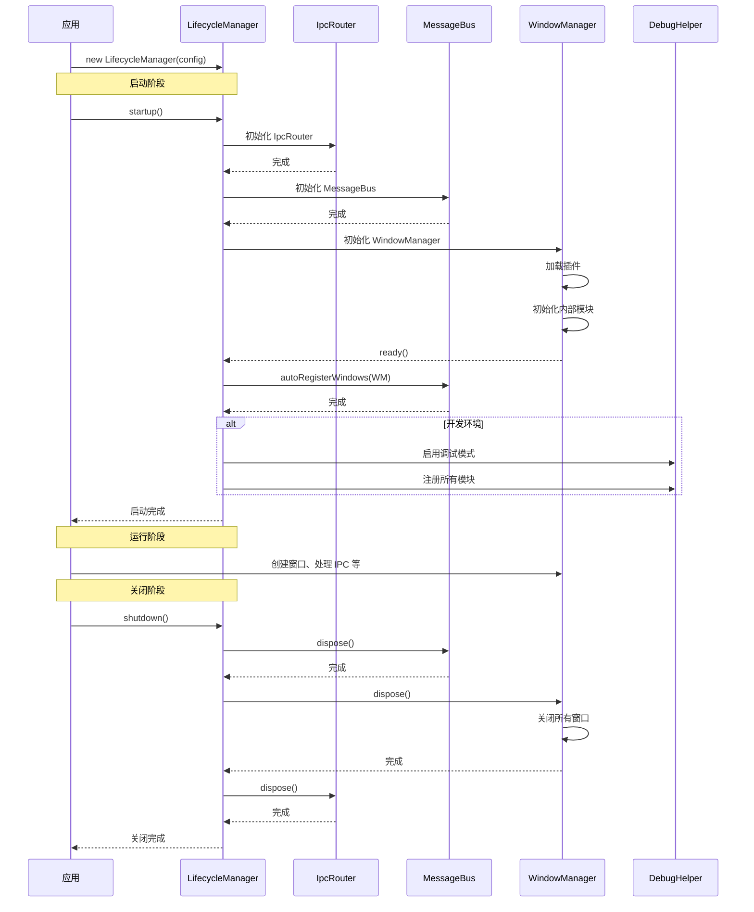

# 生命周期管理器

## 概述

`LifecycleManager` 是 electron-infra-kit 的核心编排模块，负责协调和管理整个工具包的启动和关闭流程。它提供了一个统一的入口点来初始化和管理 `WindowManager`、`IpcRouter` 和 `MessageBus` 等核心模块，确保它们按正确的顺序启动和关闭，并处理模块之间的依赖关系。

### 核心功能

- **统一初始化** - 提供单一入口点初始化所有核心模块
- **依赖管理** - 自动处理模块之间的依赖关系和初始化顺序
- **优雅关闭** - 按正确的顺序关闭所有服务，确保资源正确释放
- **错误恢复** - 启动失败时自动清理已初始化的模块
- **调试支持** - 在开发环境自动启用调试模式
- **灵活配置** - 支持使用现有实例或创建新实例

### 为什么需要 LifecycleManager?

在复杂的 Electron 应用中，手动管理多个模块的初始化和关闭可能会遇到以下问题：

1. **初始化顺序错误** - 模块之间存在依赖关系，错误的初始化顺序会导致运行时错误
2. **资源泄漏** - 应用退出时未正确清理资源，导致内存泄漏或文件句柄未关闭
3. **代码重复** - 每个应用都需要编写相似的初始化和清理代码
4. **错误处理复杂** - 需要处理部分初始化失败的情况
5. **调试困难** - 缺乏统一的调试入口

`LifecycleManager` 通过提供标准化的生命周期管理，优雅地解决了这些问题。


## 架构设计

### 模块依赖关系

`LifecycleManager` 管理的核心模块之间存在明确的依赖关系：



**初始化顺序**：

1. **IpcRouter** - 首先初始化，作为进程间通信的基础
2. **MessageBus** - 其次初始化，提供跨窗口通信能力
3. **WindowManager** - 最后初始化，依赖前两者提供完整的窗口管理功能

**关闭顺序**：

按初始化的逆序关闭，确保依赖关系正确处理：

1. **MessageBus** - 首先关闭，停止消息传递
2. **WindowManager** - 其次关闭，关闭所有窗口
3. **IpcRouter** - 最后关闭，清理 IPC 监听器

### 生命周期流程




## 基本使用

### 快速开始

最简单的使用方式是通过 `createElectronToolkit` 辅助函数：

```typescript
import { app } from 'electron';
import { createElectronToolkit } from 'electron-infra-kit';

app.whenReady().then(async () => {
  // 创建并初始化所有模块
  const { windowManager, ipcRouter, messageBus } = createElectronToolkit({
    isDevelopment: process.env.NODE_ENV === 'development',
  });

  // 所有模块已经初始化完成，可以直接使用
  await windowManager.create({
    name: 'main',
    title: '我的应用',
    width: 1024,
    height: 768,
  });
});
```

`createElectronToolkit` 内部使用 `LifecycleManager` 来管理模块的生命周期。

### 手动使用 LifecycleManager

如果需要更多控制，可以直接使用 `LifecycleManager`：

```typescript
import { app } from 'electron';
import { LifecycleManager } from 'electron-infra-kit';

app.whenReady().then(async () => {
  // 创建 LifecycleManager 实例
  const lifecycleManager = new LifecycleManager({
    isDevelopment: process.env.NODE_ENV === 'development',
  });

  // 启动所有服务
  await lifecycleManager.startup();

  // 访问初始化后的模块
  const { windowManager, ipcRouter, messageBus } = lifecycleManager;

  // 使用模块
  await windowManager.create({
    name: 'main',
    title: '我的应用',
    width: 1024,
    height: 768,
  });
});

// 应用退出时清理资源
app.on('before-quit', async () => {
  await lifecycleManager.shutdown();
});
```

### 自动启动模式

可以配置 `LifecycleManager` 在实例化时自动启动：

```typescript
import { LifecycleManager } from 'electron-infra-kit';

const lifecycleManager = new LifecycleManager({
  autoStart: true,  // 自动启动
  isDevelopment: process.env.NODE_ENV === 'development',
});

// 模块会在后台自动初始化
// 可以通过 started 属性检查状态
if (lifecycleManager.started) {
  console.log('所有服务已启动');
}
```

**注意**：自动启动模式下，如果启动失败，错误会被记录到日志，但不会抛出异常。建议在生产环境使用手动启动模式以便更好地处理错误。


## 配置选项

### 基本配置

`LifecycleManager` 接受以下配置选项：

```typescript
interface LifecycleConfig {
  // 是否在实例化时自动启动 (默认: false)
  autoStart?: boolean;

  // 是否为开发环境 (影响调试模式)
  isDevelopment?: boolean;

  // 日志记录器实例
  logger?: ILogger;

  // 日志记录器选项
  loggerOptions?: LoggerOptions;

  // 现有的 IpcRouter 实例 (可选)
  ipcRouter?: IpcRouter;

  // 现有的 WindowManager 实例 (可选)
  windowManager?: WindowManager;

  // 现有的 MessageBus 实例 (可选)
  messageBus?: MessageBus;

  // WindowManager 配置选项
  plugins?: WindowManagerPlugin[];
  hooks?: LifecycleHooks;
  // ... 其他 WindowManager 配置
}
```

### 使用现有实例

如果你已经创建了某些模块的实例，可以传递给 `LifecycleManager`：

```typescript
import { IpcRouter, MessageBus, LifecycleManager } from 'electron-infra-kit';

// 创建自定义配置的 IpcRouter
const customIpcRouter = new IpcRouter({
  defaultRateLimit: {
    window: 30000,
    max: 50,
  },
});

// 创建自定义配置的 MessageBus
const customMessageBus = new MessageBus({
  enableLogging: true,
});

// 使用现有实例
const lifecycleManager = new LifecycleManager({
  ipcRouter: customIpcRouter,
  messageBus: customMessageBus,
  // WindowManager 会自动创建并使用这些实例
});

await lifecycleManager.startup();
```

### 配置 WindowManager

可以通过 `LifecycleConfig` 传递 WindowManager 的配置：

```typescript
const lifecycleManager = new LifecycleManager({
  isDevelopment: true,
  
  // WindowManager 插件
  plugins: [
    LoggerPlugin,
    WindowLimitPlugin,
  ],
  
  // WindowManager 生命周期钩子
  hooks: {
    onWillCreate: (config) => {
      console.log('准备创建窗口:', config.name);
      return config;
    },
    onDidCreate: ({ id, name }) => {
      console.log('窗口已创建:', name, id);
    },
  },
});

await lifecycleManager.startup();
```


## 启动和关闭

### 启动服务

使用 `startup()` 方法启动所有服务：

```typescript
const lifecycleManager = new LifecycleManager({
  isDevelopment: process.env.NODE_ENV === 'development',
});

try {
  await lifecycleManager.startup();
  console.log('所有服务已启动');
  
  // 现在可以使用模块了
  const { windowManager, ipcRouter, messageBus } = lifecycleManager;
} catch (error) {
  console.error('启动失败:', error);
  // 启动失败时，已初始化的模块会自动清理
}
```

**启动流程**：

1. 检查是否已启动（防止重复启动）
2. 初始化 IpcRouter
3. 初始化 MessageBus
4. 初始化 WindowManager 并等待其 ready
5. 连接 MessageBus 到 WindowManager
6. 如果是开发环境，启用调试模式
7. 标记为已启动

### 关闭服务

使用 `shutdown()` 方法优雅地关闭所有服务：

```typescript
import { app } from 'electron';

app.on('before-quit', async () => {
  console.log('正在关闭服务...');
  
  try {
    await lifecycleManager.shutdown();
    console.log('所有服务已关闭');
  } catch (error) {
    console.error('关闭时出错:', error);
  }
});
```

**关闭流程**：

1. 按初始化的逆序关闭模块
2. 首先 dispose MessageBus
3. 然后 dispose WindowManager（关闭所有窗口）
4. 最后 dispose IpcRouter
5. 清理所有引用
6. 标记为未启动

### 检查启动状态

使用 `started` 属性检查服务是否已启动：

```typescript
if (lifecycleManager.started) {
  console.log('服务正在运行');
  
  // 可以安全地使用模块
  await lifecycleManager.windowManager?.create({
    name: 'settings',
    width: 600,
    height: 400,
  });
} else {
  console.log('服务未启动');
  await lifecycleManager.startup();
}
```


## 错误处理

### 启动失败处理

如果启动过程中发生错误，`LifecycleManager` 会自动清理已初始化的模块：

```typescript
const lifecycleManager = new LifecycleManager({
  isDevelopment: true,
});

try {
  await lifecycleManager.startup();
} catch (error) {
  console.error('启动失败:', error);
  
  // 已初始化的模块已经被自动清理
  // 可以安全地重试或退出应用
  
  if (error.message.includes('IpcRouter')) {
    console.error('IPC 路由初始化失败');
  } else if (error.message.includes('WindowManager')) {
    console.error('窗口管理器初始化失败');
  }
  
  // 退出应用
  app.quit();
}
```

### 关闭错误处理

关闭过程中的错误会被记录但不会中断关闭流程：

```typescript
app.on('before-quit', async () => {
  try {
    await lifecycleManager.shutdown();
  } catch (error) {
    // 即使关闭失败，也应该继续退出
    console.error('关闭时出错:', error);
  }
  
  // 应用会继续退出
});
```

### 部分初始化失败

如果某个模块初始化失败，`LifecycleManager` 会自动清理已成功初始化的模块：

```typescript
// 假设 WindowManager 初始化失败
try {
  await lifecycleManager.startup();
} catch (error) {
  // IpcRouter 和 MessageBus 已经被自动清理
  // 不会留下部分初始化的状态
  console.error('启动失败，已清理所有资源');
}
```


## 调试支持

### 开发环境调试

在开发环境下，`LifecycleManager` 会自动启用调试模式：

```typescript
const lifecycleManager = new LifecycleManager({
  isDevelopment: true,  // 或 process.env.NODE_ENV === 'development'
});

await lifecycleManager.startup();

// 调试模式已自动启用
// 所有模块都已注册到 DebugHelper
```

### 访问调试信息

在开发环境下，可以通过全局 `__ELECTRON_TOOLKIT_DEBUG__` 对象访问所有模块：

```typescript
// 在主进程或渲染进程的控制台中
console.log(__ELECTRON_TOOLKIT_DEBUG__);

// 输出:
// {
//   windowManager: WindowManager { ... },
//   ipcRouter: IpcRouter { ... },
//   messageBus: MessageBus { ... },
//   lifecycleManager: LifecycleManager { ... }
// }

// 访问特定模块
const wm = __ELECTRON_TOOLKIT_DEBUG__.windowManager;
console.log('所有窗口:', wm.getAllWindows());

const ipc = __ELECTRON_TOOLKIT_DEBUG__.ipcRouter;
console.log('IPC 处理器:', ipc.getHandlers());
```

### 手动启用调试

也可以手动启用调试模式：

```typescript
import { DebugHelper } from 'electron-infra-kit';

// 启用调试模式
DebugHelper.enableDebugMode();

// 注册自定义对象
DebugHelper.register('myService', myServiceInstance);

// 在控制台访问
console.log(__ELECTRON_TOOLKIT_DEBUG__.myService);
```


## 完整示例

### 基础应用

```typescript
// main.ts
import { app, BrowserWindow } from 'electron';
import { LifecycleManager } from 'electron-infra-kit';
import path from 'path';

let lifecycleManager: LifecycleManager;

app.whenReady().then(async () => {
  try {
    // 创建并启动 LifecycleManager
    lifecycleManager = new LifecycleManager({
      isDevelopment: process.env.NODE_ENV === 'development',
    });

    await lifecycleManager.startup();
    console.log('Electron Toolkit 已启动');

    // 创建主窗口
    const mainWindowId = await lifecycleManager.windowManager!.create({
      name: 'main',
      title: '我的应用',
      width: 1200,
      height: 800,
      defaultConfig: {
        webPreferences: {
          preload: path.join(__dirname, 'preload.js'),
        },
      },
    });

    console.log('主窗口已创建:', mainWindowId);
  } catch (error) {
    console.error('应用启动失败:', error);
    app.quit();
  }
});

// 所有窗口关闭时退出
app.on('window-all-closed', () => {
  if (process.platform !== 'darwin') {
    app.quit();
  }
});

// macOS 激活时重新创建窗口
app.on('activate', async () => {
  if (lifecycleManager?.windowManager?.getAllWindows().length === 0) {
    await lifecycleManager.windowManager.create({
      name: 'main',
      title: '我的应用',
      width: 1200,
      height: 800,
    });
  }
});

// 应用退出前清理
app.on('before-quit', async () => {
  console.log('正在关闭应用...');
  
  if (lifecycleManager) {
    await lifecycleManager.shutdown();
  }
  
  console.log('应用已关闭');
});
```

### 带自定义配置的应用

```typescript
// main.ts
import { app } from 'electron';
import { LifecycleManager, IpcRouter, MessageBus } from 'electron-infra-kit';
import { MyLoggerPlugin, MyWindowPlugin } from './plugins';
import { setupIpcHandlers } from './ipc-handlers';

let lifecycleManager: LifecycleManager;

app.whenReady().then(async () => {
  try {
    // 创建自定义配置的模块
    const customIpcRouter = new IpcRouter({
      defaultRateLimit: {
        window: 60000,
        max: 100,
      },
    });

    const customMessageBus = new MessageBus({
      enableLogging: true,
    });

    // 创建 LifecycleManager
    lifecycleManager = new LifecycleManager({
      isDevelopment: process.env.NODE_ENV === 'development',
      ipcRouter: customIpcRouter,
      messageBus: customMessageBus,
      
      // WindowManager 配置
      plugins: [
        MyLoggerPlugin,
        MyWindowPlugin,
      ],
      
      hooks: {
        onWillCreate: (config) => {
          console.log(`准备创建窗口: ${config.name}`);
          return config;
        },
        onDidCreate: ({ id, name }) => {
          console.log(`窗口已创建: ${name} (${id})`);
        },
      },
    });

    // 启动所有服务
    await lifecycleManager.startup();

    // 设置 IPC 处理器
    setupIpcHandlers(lifecycleManager.ipcRouter!);

    // 创建主窗口
    await lifecycleManager.windowManager!.create({
      name: 'main',
      title: '我的应用',
      width: 1200,
      height: 800,
    });

    console.log('应用启动完成');
  } catch (error) {
    console.error('应用启动失败:', error);
    app.quit();
  }
});

// 清理资源
app.on('before-quit', async () => {
  if (lifecycleManager) {
    await lifecycleManager.shutdown();
  }
});
```


## 最佳实践

### 1. 始终等待启动完成

确保在使用模块之前等待 `startup()` 完成：

```typescript
// ✅ 正确
await lifecycleManager.startup();
await lifecycleManager.windowManager.create({ name: 'main' });

// ❌ 错误
lifecycleManager.startup(); // 没有 await
lifecycleManager.windowManager.create({ name: 'main' }); // 可能失败
```

### 2. 正确处理启动错误

始终使用 try-catch 处理启动错误：

```typescript
try {
  await lifecycleManager.startup();
} catch (error) {
  console.error('启动失败:', error);
  app.quit();
}
```

### 3. 在应用退出前关闭

确保在应用退出前调用 `shutdown()`：

```typescript
app.on('before-quit', async () => {
  await lifecycleManager.shutdown();
});
```

### 4. 避免重复启动

检查启动状态，避免重复启动：

```typescript
if (!lifecycleManager.started) {
  await lifecycleManager.startup();
}
```

### 5. 使用辅助函数简化代码

对于简单应用，使用 `createElectronToolkit` 辅助函数：

```typescript
// 简单且推荐
const { windowManager, ipcRouter, messageBus } = createElectronToolkit({
  isDevelopment: process.env.NODE_ENV === 'development',
});
```

### 6. 开发环境启用调试

在开发环境始终启用调试模式：

```typescript
const lifecycleManager = new LifecycleManager({
  isDevelopment: process.env.NODE_ENV === 'development',
});
```

### 7. 集中管理配置

将所有配置集中在一个地方：

```typescript
// config.ts
export const lifecycleConfig = {
  isDevelopment: process.env.NODE_ENV === 'development',
  plugins: [/* ... */],
  hooks: {/* ... */},
};

// main.ts
import { lifecycleConfig } from './config';

const lifecycleManager = new LifecycleManager(lifecycleConfig);
```


## 常见问题

### Q: LifecycleManager 和 createElectronToolkit 有什么区别？

A: `createElectronToolkit` 是一个辅助函数，内部使用 `LifecycleManager` 来管理模块生命周期。它提供了更简洁的 API，适合大多数应用。如果需要更多控制（如使用现有实例、自定义启动流程），可以直接使用 `LifecycleManager`。

### Q: 可以多次调用 startup() 吗？

A: 不建议。`startup()` 会检查是否已启动，如果已启动会记录警告并直接返回。如果需要重新启动，应该先调用 `shutdown()`。

### Q: 启动失败后如何重试？

A: 启动失败后，已初始化的模块会被自动清理。可以创建新的 `LifecycleManager` 实例并重试：

```typescript
try {
  await lifecycleManager.startup();
} catch (error) {
  console.error('首次启动失败，正在重试...');
  lifecycleManager = new LifecycleManager(config);
  await lifecycleManager.startup();
}
```

### Q: 如何在不同环境使用不同配置？

A: 使用环境变量或配置文件：

```typescript
const config = {
  isDevelopment: process.env.NODE_ENV === 'development',
  plugins: process.env.NODE_ENV === 'development' 
    ? [DebugPlugin, LoggerPlugin]
    : [LoggerPlugin],
};

const lifecycleManager = new LifecycleManager(config);
```

### Q: 可以在启动后访问模块实例吗？

A: 可以。启动后，可以通过 `lifecycleManager` 的属性访问：

```typescript
await lifecycleManager.startup();

const wm = lifecycleManager.windowManager;
const ipc = lifecycleManager.ipcRouter;
const mb = lifecycleManager.messageBus;
```
