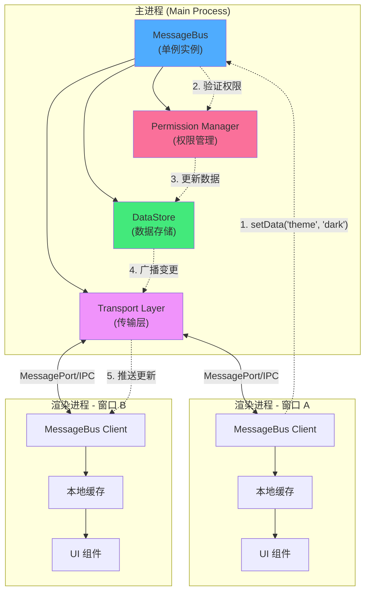

# 消息总线 (Message Bus)

## 概述

消息总线 (MessageBus) 是 electron-infra-kit 中用于实现跨窗口状态同步和通信的核心模块。在多窗口 Electron 应用中,保持各个窗口之间的数据一致性是一个重大挑战。MessageBus 通过实现"单一数据源"模型,优雅地解决了这个问题。

### 核心优势

- **实时状态广播**: 任何窗口修改数据时,MessageBus 会自动将变更广播给所有其他已注册的窗口,确保状态一致性
- **高性能通信**: 支持基于 MessageChannel 的零拷贝消息传递,也可回退到传统 IPC 模式
- **细粒度权限控制**: 支持字段级别的权限设置,可以设置只读字段或限制特定窗口的修改权限
- **统一通信接口**: 提供简洁一致的 API,无论底层使用何种传输方式
- **事务支持**: 支持原子性的批量数据更新操作

### 工作原理

MessageBus 采用发布-订阅 (Pub/Sub) 和单一数据源 (Single Source of Truth) 的混合架构:

1. **主进程维护唯一数据源**: 所有共享状态都存储在主进程的 MessageBus 实例中
2. **渲染进程本地缓存**: 每个窗口维护自己关心的数据的本地副本
3. **自动同步机制**: 当任何窗口修改数据时,主进程验证权限后更新数据源,并自动广播变更到所有相关窗口
4. **响应式更新**: 渲染进程收到广播后更新本地缓存,触发 UI 响应式更新

这种架构确保了数据的一致性,同时通过本地缓存提供了良好的读取性能。


## 架构设计

下图展示了 MessageBus 的整体架构和数据流:



### 数据流程说明

1. **数据修改请求**: 窗口 A 通过 MessageBus Client 调用 `setData()` 修改数据
2. **权限验证**: 主进程的 MessageBus 检查该窗口是否有权限修改此字段
3. **更新数据源**: 验证通过后,更新主进程中的数据存储
4. **广播变更**: 通过传输层将变更广播给所有已注册的窗口
5. **本地更新**: 各个窗口的 Client 接收到广播,更新本地缓存并触发 UI 更新

### 传输层

MessageBus 支持两种传输模式:

- **MessagePort 模式** (推荐): 基于 `MessageChannelMain`,实现零拷贝的高性能消息传递
- **IPC 模式** (兼容): 使用标准的 `ipcMain`/`ipcRenderer`,适用于不支持 MessageChannel 的环境

系统默认使用 `auto` 模式,会自动选择最佳的传输方式,并在需要时自动回退。


## 数据设置

### 主进程中设置数据

在主进程中,可以直接使用 MessageBus 实例设置共享数据:

```typescript
import { MessageBus } from 'electron-infra-kit';

const messageBus = new MessageBus({ transportMode: 'auto' });

// 设置单个值
messageBus.setData('theme', 'dark');

// 设置嵌套对象
messageBus.setData('user', {
  name: 'Alice',
  role: 'admin',
  preferences: {
    language: 'zh-CN',
    notifications: true
  }
});

// 设置数组
messageBus.setData('recentFiles', [
  '/path/to/file1.txt',
  '/path/to/file2.txt'
]);
```

### 渲染进程中设置数据

在渲染进程中,通过 MessageBus Client 设置数据:

```typescript
// 在预加载脚本中暴露的 API
window.messageBus.setData('theme', 'light');

// 或者使用 async/await
await window.messageBus.setData('user.name', 'Bob');
```

### 批量更新 (事务)

当需要原子性地更新多个字段时,可以使用事务:

```typescript
// 主进程
const windowId = win.id.toString();

messageBus.startTransaction(windowId);

try {
  messageBus.setData('user.name', 'Charlie', windowId);
  messageBus.setData('user.role', 'editor', windowId);
  messageBus.setData('user.lastLogin', new Date().toISOString(), windowId);
  
  // 提交事务 - 所有更改会一次性广播
  messageBus.commitTransaction(windowId);
} catch (error) {
  // 发生错误时回滚所有更改
  messageBus.rollbackTransaction(windowId);
  console.error('更新失败:', error);
}
```

### 使用更新函数

对于需要基于当前值进行更新的场景,可以使用 `updateData`:

```typescript
// 增加计数器
messageBus.updateData('counter', (oldValue) => (oldValue || 0) + 1);

// 添加数组元素
messageBus.updateData('items', (oldValue) => {
  const items = oldValue || [];
  return [...items, newItem];
});

// 更新对象属性
messageBus.updateData('settings', (oldValue) => ({
  ...oldValue,
  darkMode: true
}));
```


## 数据获取

### 主进程中获取数据

在主进程中,可以同步获取数据:

```typescript
// 获取单个值
const theme = messageBus.getData('theme');
console.log('当前主题:', theme); // 'dark'

// 获取嵌套属性
const userName = messageBus.getData('user.name');
console.log('用户名:', userName); // 'Alice'

// 获取整个数据存储
const allData = messageBus.getData();
console.log('所有数据:', allData);
// {
//   theme: 'dark',
//   user: { name: 'Alice', role: 'admin', ... },
//   recentFiles: [...]
// }
```

### 渲染进程中获取数据

在渲染进程中,通过 MessageBus Client 异步获取数据:

```typescript
// 获取单个值
const theme = await window.messageBus.getData('theme');
console.log('当前主题:', theme);

// 获取嵌套属性
const language = await window.messageBus.getData('user.preferences.language');
console.log('语言设置:', language); // 'zh-CN'

// 获取数组
const files = await window.messageBus.getData('recentFiles');
console.log('最近文件:', files);
```

### 本地缓存

渲染进程的 MessageBus Client 会自动维护本地缓存,提高读取性能:

```typescript
// 首次获取会从主进程请求
const theme1 = await window.messageBus.getData('theme'); // 网络请求

// 后续获取会从本地缓存读取
const theme2 = await window.messageBus.getData('theme'); // 从缓存读取

// 当数据在其他窗口被修改时,本地缓存会自动更新
```

### 处理不存在的键

当获取不存在的键时,会返回 `undefined`:

```typescript
const nonExistent = messageBus.getData('nonExistent');
console.log(nonExistent); // undefined

// 可以提供默认值
const value = messageBus.getData('someKey') ?? 'default value';
```


## 数据监听

### 主进程中监听数据变化

在主进程中使用 `watch` 方法监听数据变化:

```typescript
// 监听单个字段
const unsubscribe = messageBus.watch('theme', (newValue, oldValue) => {
  console.log(`主题从 ${oldValue} 变更为 ${newValue}`);
});

// 监听嵌套字段
messageBus.watch('user.name', (newValue, oldValue) => {
  console.log(`用户名从 ${oldValue} 变更为 ${newValue}`);
});

// 监听对象变化
messageBus.watch('settings', (newValue, oldValue) => {
  console.log('设置已更新:', newValue);
});
```

### 渲染进程中监听数据变化

在渲染进程中使用 `subscribe` 方法监听数据变化:

```typescript
// 订阅主题变化
const unsubscribe = window.messageBus.subscribe('theme', (newValue) => {
  console.log('主题已更新:', newValue);
  // 更新 UI
  document.body.className = newValue === 'dark' ? 'dark-theme' : 'light-theme';
});

// 订阅用户信息变化
window.messageBus.subscribe('user', (newValue) => {
  console.log('用户信息已更新:', newValue);
  updateUserProfile(newValue);
});

// 订阅多个字段
window.messageBus.subscribe('settings.language', (newValue) => {
  console.log('语言设置已更新:', newValue);
  i18n.changeLanguage(newValue);
});
```

### 取消订阅

**重要**: 为了避免内存泄漏,在组件卸载或不再需要监听时,必须取消订阅:

```typescript
// 保存取消订阅函数
const unsubscribe = messageBus.watch('theme', (newValue) => {
  console.log('主题变更:', newValue);
});

// 在适当的时候取消订阅
unsubscribe();
```

### 在 React 中使用

```typescript
import { useEffect, useState } from 'react';

function ThemeToggle() {
  const [theme, setTheme] = useState('light');
  
  useEffect(() => {
    // 订阅主题变化
    const unsubscribe = window.messageBus.subscribe('theme', (newTheme) => {
      setTheme(newTheme);
    });
    
    // 获取初始值
    window.messageBus.getData('theme').then(setTheme);
    
    // 清理函数 - 组件卸载时取消订阅
    return () => {
      unsubscribe();
    };
  }, []);
  
  const toggleTheme = async () => {
    const newTheme = theme === 'light' ? 'dark' : 'light';
    await window.messageBus.setData('theme', newTheme);
  };
  
  return (
    <button onClick={toggleTheme}>
      当前主题: {theme}
    </button>
  );
}
```

### 在 Vue 中使用

```vue
<template>
  <button @click="toggleTheme">
    当前主题: {{ theme }}
  </button>
</template>

<script setup>
import { ref, onMounted, onUnmounted } from 'vue';

const theme = ref('light');
let unsubscribe = null;

onMounted(async () => {
  // 订阅主题变化
  unsubscribe = window.messageBus.subscribe('theme', (newTheme) => {
    theme.value = newTheme;
  });
  
  // 获取初始值
  theme.value = await window.messageBus.getData('theme');
});

onUnmounted(() => {
  // 组件卸载时取消订阅
  if (unsubscribe) {
    unsubscribe();
  }
});

const toggleTheme = async () => {
  const newTheme = theme.value === 'light' ? 'dark' : 'light';
  await window.messageBus.setData('theme', newTheme);
};
</script>
```

### 订阅优化

MessageBus 会自动优化订阅,只向订阅了特定字段的窗口发送相关更新:

```typescript
// 窗口 A 只订阅 theme
window.messageBus.subscribe('theme', callback);

// 窗口 B 只订阅 user
window.messageBus.subscribe('user', callback);

// 当 theme 变化时,只有窗口 A 会收到通知
// 当 user 变化时,只有窗口 B 会收到通知
```


## 权限控制

MessageBus 提供了细粒度的权限控制机制,可以在字段级别设置访问权限,防止未授权的修改。

### 只读字段

将字段设置为只读,任何窗口都无法修改:

```typescript
// 设置应用配置为只读
messageBus.setData('appConfig', {
  version: '1.0.0',
  apiEndpoint: 'https://api.example.com'
});

messageBus.setFieldPermission('appConfig', {
  readonly: true
});

// 尝试修改只读字段会失败
const result = messageBus.setData('appConfig', { version: '2.0.0' });
console.log(result);
// { success: false, error: 'Field "appConfig" is readonly' }
```

### 限制特定窗口

只允许特定窗口修改某个字段:

```typescript
// 只允许主窗口修改用户设置
const mainWindowId = mainWindow.id.toString();

messageBus.setFieldPermission('userSettings', {
  allowedWindows: [mainWindowId]
});

// 主窗口可以修改
messageBus.setData('userSettings', { theme: 'dark' }, mainWindowId);
// { success: true }

// 其他窗口无法修改
messageBus.setData('userSettings', { theme: 'light' }, otherWindowId);
// { success: false, error: 'Window "xxx" is not allowed to modify "userSettings"' }
```

### 组合权限

可以为不同的字段设置不同的权限策略:

```typescript
// 系统配置 - 完全只读
messageBus.setFieldPermission('systemConfig', {
  readonly: true
});

// 用户配置 - 只有设置窗口可以修改
messageBus.setFieldPermission('userConfig', {
  allowedWindows: [settingsWindowId]
});

// 共享数据 - 所有窗口都可以修改
messageBus.setData('sharedData', {});
// 不设置权限,默认所有窗口都可以修改
```

### 动态权限管理

可以在运行时动态调整权限:

```typescript
// 初始时允许所有窗口修改
messageBus.setData('editableContent', 'Initial content');

// 当进入只读模式时,设置为只读
function enterReadOnlyMode() {
  messageBus.setFieldPermission('editableContent', {
    readonly: true
  });
}

// 退出只读模式时,移除限制
function exitReadOnlyMode() {
  messageBus.setFieldPermission('editableContent', {
    readonly: false
  });
}
```

### 权限检查

在设置数据前,可以先检查权限:

```typescript
// 尝试设置数据
const result = messageBus.setData('protectedField', newValue, windowId);

if (!result.success) {
  console.error('权限被拒绝:', result.error);
  // 显示错误提示给用户
  showErrorNotification(result.error);
} else {
  console.log('数据更新成功');
}
```

### 最佳实践

1. **敏感配置使用只读**: 对于应用版本、API 端点等不应被修改的配置,设置为只读
2. **关键操作限制窗口**: 对于用户设置、权限管理等关键操作,限制只能由特定窗口修改
3. **默认开放共享数据**: 对于需要多窗口协作的数据,保持默认的开放权限
4. **动态调整权限**: 根据应用状态动态调整权限,如编辑模式和只读模式的切换

### 权限错误处理

```typescript
// 在渲染进程中处理权限错误
try {
  await window.messageBus.setData('protectedField', newValue);
} catch (error) {
  if (error.message.includes('readonly')) {
    showNotification('此字段为只读,无法修改');
  } else if (error.message.includes('not allowed')) {
    showNotification('您没有权限修改此字段');
  } else {
    showNotification('更新失败: ' + error.message);
  }
}
```

## 完整示例

下面是一个完整的多窗口应用示例,展示了 MessageBus 的各种功能:

### 主进程

```typescript
import { app, BrowserWindow } from 'electron';
import { MessageBus } from 'electron-infra-kit';

const messageBus = new MessageBus({ transportMode: 'auto' });

// 初始化应用状态
messageBus.setData('app', {
  theme: 'light',
  language: 'zh-CN',
  version: '1.0.0'
});

// 设置只读字段
messageBus.setFieldPermission('app.version', { readonly: true });

// 监听主题变化
messageBus.watch('app.theme', (newTheme, oldTheme) => {
  console.log(`主题从 ${oldTheme} 变更为 ${newTheme}`);
});

function createMainWindow() {
  const mainWin = new BrowserWindow({
    width: 1200,
    height: 800,
    webPreferences: {
      contextIsolation: true,
      preload: path.join(__dirname, 'preload.js')
    }
  });
  
  messageBus.registerWindow(mainWin.id.toString(), mainWin);
  mainWin.loadFile('index.html');
  
  return mainWin;
}

function createSettingsWindow() {
  const settingsWin = new BrowserWindow({
    width: 600,
    height: 400,
    webPreferences: {
      contextIsolation: true,
      preload: path.join(__dirname, 'preload.js')
    }
  });
  
  messageBus.registerWindow(settingsWin.id.toString(), settingsWin);
  settingsWin.loadFile('settings.html');
  
  return settingsWin;
}

app.whenReady().then(() => {
  createMainWindow();
});
```

### 预加载脚本

```typescript
import { contextBridge, ipcRenderer } from 'electron';

// 接收 MessagePort
ipcRenderer.on('message-bus-port', (event) => {
  const port = event.ports[0];
  
  // 创建 MessageBus Client
  const client = new MessageBusClient(port);
  
  // 暴露 API 到渲染进程
  contextBridge.exposeInMainWorld('messageBus', {
    getData: (key: string) => client.get(key),
    setData: (key: string, value: any) => client.set(key, value),
    subscribe: (key: string, callback: Function) => client.subscribe(key, callback)
  });
});
```

### 渲染进程 (主窗口)

```typescript
// 获取当前主题
const theme = await window.messageBus.getData('app.theme');
console.log('当前主题:', theme);

// 订阅主题变化
window.messageBus.subscribe('app.theme', (newTheme) => {
  document.body.className = newTheme === 'dark' ? 'dark-theme' : 'light-theme';
});

// 切换主题
document.getElementById('theme-toggle').addEventListener('click', async () => {
  const currentTheme = await window.messageBus.getData('app.theme');
  const newTheme = currentTheme === 'light' ? 'dark' : 'light';
  await window.messageBus.setData('app.theme', newTheme);
});
```

### 渲染进程 (设置窗口)

```typescript
// 加载设置
async function loadSettings() {
  const theme = await window.messageBus.getData('app.theme');
  const language = await window.messageBus.getData('app.language');
  
  document.getElementById('theme-select').value = theme;
  document.getElementById('language-select').value = language;
}

// 保存设置
document.getElementById('save-btn').addEventListener('click', async () => {
  const theme = document.getElementById('theme-select').value;
  const language = document.getElementById('language-select').value;
  
  await window.messageBus.setData('app.theme', theme);
  await window.messageBus.setData('app.language', language);
  
  alert('设置已保存');
});

loadSettings();
```

## 总结

MessageBus 是 electron-infra-kit 中实现跨窗口状态同步的核心模块,它提供了:

- ✅ 简单易用的 API
- ✅ 自动的状态同步
- ✅ 高性能的消息传递
- ✅ 灵活的权限控制
- ✅ 完善的错误处理

通过 MessageBus,你可以轻松构建复杂的多窗口 Electron 应用,而无需担心状态一致性问题。

## 相关链接

- [Window Manager](./window-manager.md) - 窗口生命周期管理
- [IPC Router](./ipc-router.md) - 类型安全的进程间通信
- [API 参考](/zh/api/message-bus.md) - 完整的 API 文档
