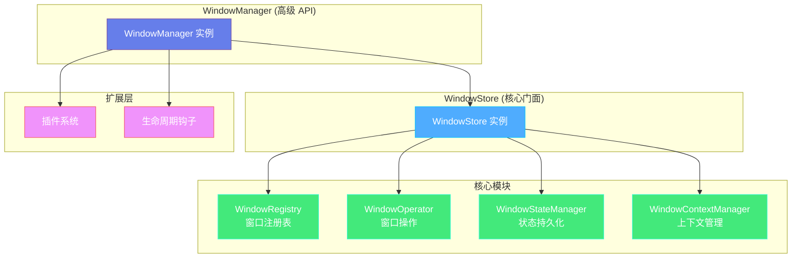
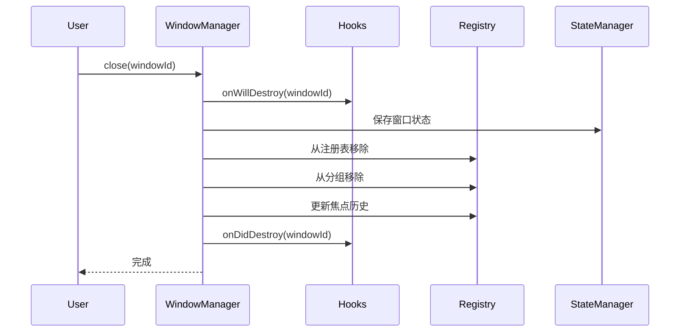

# 窗口管理器

## 概述

`WindowManager` 是 electron-infra-kit 的核心模块之一,提供了一套完整的窗口生命周期管理解决方案。它解决了原生 `BrowserWindow` API 过于底层、缺乏统一管理机制的问题,为 Electron 应用提供了强大而灵活的窗口管理能力。

### 核心功能

- **全局窗口注册表** - 统一管理所有窗口实例,支持通过 ID 或名称快速查找
- **智能防重** - 自动检测重复创建,执行"查找并聚焦"策略
- **状态持久化** - 自动保存和恢复窗口的位置、大小、最大化等状态
- **生命周期管理** - 完整的窗口生命周期钩子,支持自定义扩展
- **插件系统** - 标准化的插件接口,轻松扩展窗口管理功能
- **窗口分组** - 支持将相关窗口分组,进行批量操作
- **焦点管理** - 智能的焦点历史追踪,支持恢复上一个活动窗口
- **崩溃恢复** - 自动处理窗口崩溃和无响应情况

### 为什么需要 WindowManager?

在开发复杂的 Electron 应用时,你可能会遇到以下问题:

1. **窗口管理混乱** - 需要手动维护窗口实例数组,容易出错
2. **重复创建** - 用户多次点击可能创建多个相同窗口
3. **状态丢失** - 窗口关闭后,位置和大小等状态无法恢复
4. **代码耦合** - 窗口创建逻辑与业务逻辑混在一起
5. **难以扩展** - 添加新功能需要修改核心代码

`WindowManager` 通过提供高层次的抽象和标准化的接口,优雅地解决了这些问题。


## 架构设计

`WindowManager` 采用**组合（Composition）**和**模块化**设计模式,确保关注点分离和可维护性。

### 整体架构



### 各层职责

#### WindowStore (核心门面)

作为所有窗口管理操作的中央协调者,将具体任务委托给专门的核心模块:

- **WindowRegistry** - 管理窗口存储映射 (`Map<ID, Window>`),处理 ID/名称索引和窗口分组
- **WindowOperator** - 封装所有窗口操作 (显示、隐藏、关闭等),包含安全检查
- **WindowStateManager** - 处理窗口 UI 状态的持久化 (位置、大小、最大化状态)
- **WindowContextManager** - 管理与窗口关联的自定义上下文数据

#### WindowManager (高级控制)

组合 `WindowStore` 提供统一的高级 API,并添加应用级功能:

- 插件系统 - 支持通过 `use()` 方法动态注册插件
- 生命周期钩子 - 提供 `onWillCreate`、`onDidCreate` 等钩子
- IPC 集成 - 可选的 IPC 路由集成
- 环境感知 - 自动识别开发/生产环境

#### 扩展层

允许外部代码挂钩窗口创建和销毁事件,支持模块化扩展。


## 窗口创建

### 基本用法

使用 `create()` 方法创建窗口非常简单:

```typescript
import { app } from 'electron';
import { createElectronToolkit } from 'electron-infra-kit';

app.whenReady().then(async () => {
  const { windowManager } = createElectronToolkit({
    isDevelopment: process.env.NODE_ENV === 'development',
  });

  // 等待初始化完成
  await windowManager.ready();

  // 创建主窗口
  const windowId = await windowManager.create({
    name: 'main',
    title: '我的应用',
    width: 1024,
    height: 768,
  });

  console.log('窗口已创建:', windowId);
});
```

### 配置选项

`create()` 方法接受一个配置对象,支持以下选项:

```typescript
interface WindowCreationOptions {
  // 窗口唯一名称 (必填)
  name: string;
  
  // 窗口标题
  title?: string;
  
  // 窗口尺寸
  width?: number;
  height?: number;
  
  // 窗口位置
  x?: number;
  y?: number;
  
  // 加载的 URL
  url?: string;
  
  // 加载的本地文件路径
  file?: string;
  
  // 自定义窗口 ID
  windowId?: string;
  
  // 是否启用状态持久化
  enablePersistence?: boolean;
  
  // BrowserWindow 配置选项
  defaultConfig?: BrowserWindowConstructorOptions;
}
```

### 智能防重机制

当你尝试创建一个已存在的窗口时,`WindowManager` 会自动执行"查找并聚焦"策略:

```typescript
// 第一次创建
await windowManager.create({ name: 'settings', width: 600, height: 400 });

// 再次创建相同名称的窗口
// 不会创建新窗口,而是聚焦已存在的窗口
await windowManager.create({ name: 'settings' });
```

这个机制会:
1. 检查窗口是否已存在
2. 如果窗口被最小化,自动恢复
3. 将窗口置顶并聚焦
4. 返回已存在窗口的 ID

### 环境感知配置

`WindowManager` 会根据运行环境自动调整行为:

**开发环境:**
- 自动打开 DevTools
- 允许不安全的链接导航
- 启用详细日志

**生产环境:**
- 禁用 DevTools
- 拦截 `new-window` 事件,在外部浏览器打开链接
- 启用安全策略

```typescript
const { windowManager } = createElectronToolkit({
  isDevelopment: process.env.NODE_ENV === 'development',
});
```

### 高级示例

创建一个带有自定义配置的窗口:

```typescript
await windowManager.create({
  name: 'editor',
  title: '代码编辑器',
  width: 1200,
  height: 800,
  defaultConfig: {
    minWidth: 800,
    minHeight: 600,
    frame: false,
    transparent: true,
    webPreferences: {
      nodeIntegration: false,
      contextIsolation: true,
      preload: path.join(__dirname, 'preload.js'),
    },
  },
  enablePersistence: true,
});
```


## 窗口管理

### 获取窗口

`WindowManager` 提供了多种方式来获取窗口实例:

```typescript
// 通过名称获取窗口
const mainWindow = windowManager.getWindowByName('main');

// 通过 ID 获取窗口
const window = windowManager.get(windowId);

// 获取当前聚焦的窗口
const currentWindow = windowManager.getCurrentWindow();

// 获取所有窗口
const allWindows = windowManager.getAllWindows();
```

### 查找窗口

检查窗口是否存在:

```typescript
// 通过名称检查
if (windowManager.hasByName('settings')) {
  console.log('设置窗口已存在');
}

// 通过 ID 检查
if (windowManager.has(windowId)) {
  console.log('窗口存在');
}
```

### 窗口状态管理

控制窗口的显示状态:

```typescript
// 显示窗口
windowManager.show(windowId);

// 隐藏窗口
windowManager.hide(windowId);

// 最小化窗口
windowManager.minimize(windowId);

// 最大化窗口
windowManager.maximize(windowId);

// 恢复窗口
windowManager.restore(windowId);

// 聚焦窗口
windowManager.focus(windowId);
```

### 窗口分组

将相关窗口分组,便于批量操作:

```typescript
// 将窗口加入分组
windowManager.joinGroup(windowId, 'editor-windows');

// 获取分组中的所有窗口
const editorWindows = windowManager.getGroup('editor-windows');

// 向分组中的所有窗口发送消息
windowManager.sendToGroup('editor-windows', 'theme-changed', {
  theme: 'dark',
});

// 批量操作
windowManager.hideGroup('editor-windows');  // 隐藏所有编辑器窗口
windowManager.showGroup('editor-windows');  // 显示所有编辑器窗口
await windowManager.closeGroup('editor-windows');  // 关闭所有编辑器窗口
```

### 焦点管理

`WindowManager` 维护一个焦点历史栈,支持智能的焦点恢复:

```typescript
// 聚焦特定窗口
windowManager.focus(windowId);

// 聚焦上一个活动窗口 (对工具窗口很有用)
windowManager.focusPrevious();

// 获取焦点历史
const history = windowManager.getFocusHistory();
console.log('焦点历史:', history);
```

**使用场景:**

当你关闭一个模态窗口或工具窗口时,可以自动恢复到之前的窗口:

```typescript
// 关闭窗口前记录当前焦点
const currentFocus = windowManager.getCurrentWindow();

// 关闭窗口
await windowManager.close(toolWindowId);

// 恢复到上一个窗口
windowManager.focusPrevious();
```

### 上下文数据管理

为窗口保存和恢复自定义上下文数据:

```typescript
// 保存窗口上下文
await windowManager.saveWindowContext('main', {
  lastView: 'dashboard',
  scrollPosition: 100,
  openTabs: ['file1.js', 'file2.ts'],
});

// 加载窗口上下文
const context = await windowManager.loadWindowContext('main');
if (context) {
  console.log('上次视图:', context.lastView);
  console.log('滚动位置:', context.scrollPosition);
}

// 清除上下文
await windowManager.clearWindowContext('temp-window');
```


## 窗口关闭

### 基本关闭

关闭窗口有多种方式:

```typescript
// 通过 ID 关闭
windowManager.close(windowId);

// 通过名称关闭
windowManager.deleteByName('settings');

// 关闭所有窗口
windowManager.closeAll();
```

### 窗口销毁流程

当窗口关闭时,`WindowManager` 会自动执行以下清理操作:

1. **触发生命周期钩子** - 调用 `onWillDestroy` 钩子
2. **保存窗口状态** - 如果启用了持久化,保存窗口位置和大小
3. **清理注册表** - 从全局注册表中移除窗口
4. **清理分组** - 从所有分组中移除窗口
5. **更新焦点历史** - 从焦点栈中移除窗口
6. **触发销毁完成钩子** - 调用 `onDidDestroy` 钩子



### 优雅关闭

在关闭窗口前执行清理操作:

```typescript
// 监听窗口即将关闭事件
windowManager.on('window-will-close', async ({ windowId, name }) => {
  console.log(`窗口 ${name} 即将关闭`);
  
  // 保存未保存的数据
  await saveUnsavedData(windowId);
  
  // 清理资源
  cleanupResources(windowId);
});

// 关闭窗口
await windowManager.close(windowId);
```

### 防止意外关闭

使用生命周期钩子可以阻止窗口关闭:

```typescript
const windowManager = new WindowManager({
  hooks: {
    onWillDestroy: (windowId) => {
      const window = windowManager.get(windowId);
      if (window && hasUnsavedChanges(windowId)) {
        // 显示确认对话框
        const choice = dialog.showMessageBoxSync(window, {
          type: 'question',
          buttons: ['取消', '不保存', '保存'],
          title: '确认关闭',
          message: '有未保存的更改,是否保存?',
        });
        
        if (choice === 0) {
          // 取消关闭
          return false;
        } else if (choice === 2) {
          // 保存后关闭
          saveChanges(windowId);
        }
      }
    },
  },
});
```

### 崩溃恢复

`WindowManager` 自动处理窗口崩溃和无响应情况:

```typescript
// 监听窗口崩溃事件
windowManager.on('window-crash', ({ windowId, reason, exitCode, name, willReload }) => {
  console.error(`窗口 ${name} 崩溃:`, reason, exitCode);
  
  if (willReload) {
    console.log('正在尝试重新加载窗口...');
  } else {
    // 显示错误对话框
    dialog.showErrorBox('窗口崩溃', `窗口 ${name} 已崩溃,请重启应用`);
  }
});

// 监听窗口无响应事件
windowManager.on('window-unresponsive', ({ windowId, name }) => {
  console.warn(`窗口 ${name} 无响应`);
  
  // 可以选择强制重载
  const choice = dialog.showMessageBoxSync({
    type: 'warning',
    buttons: ['等待', '重新加载'],
    title: '窗口无响应',
    message: `窗口 ${name} 无响应,是否重新加载?`,
  });
  
  if (choice === 1) {
    const window = windowManager.get(windowId);
    window?.reload();
  }
});
```

### 应用退出时清理

在应用退出前正确清理所有资源:

```typescript
import { app } from 'electron';

app.on('before-quit', () => {
  // 释放所有资源
  // - 关闭所有窗口
  // - 清理注册表
  // - 停止清理保护定时器
  windowManager.dispose();
});
```


## 插件系统

`WindowManager` 提供了标准化的插件接口,允许你轻松扩展窗口管理功能。

### 插件接口

一个插件是一个实现了 `WindowManagerPlugin` 接口的对象:

```typescript
interface WindowManagerPlugin {
  // 插件名称 (必填)
  name: string;
  
  // 初始化钩子 (可选)
  // 在插件注册时调用,可以访问 WindowManager 实例
  init?(manager: WindowManager): void;
  
  // 窗口创建前钩子 (可选)
  // 可以修改配置或取消创建
  onWillCreate?(config: WindowCreationOptions): WindowCreationOptions | false;
  
  // 窗口创建后钩子 (可选)
  onDidCreate?(data: { id: string; name: string; window: BrowserWindow }): void;
  
  // 窗口销毁前钩子 (可选)
  // 返回 false 可以取消销毁
  onWillDestroy?(windowId: string): boolean | void;
  
  // 窗口销毁后钩子 (可选)
  onDidDestroy?(windowId: string): void;
}
```

### 创建插件

#### 示例 1: 日志插件

记录所有窗口的创建和销毁:

```typescript
const LoggerPlugin: WindowManagerPlugin = {
  name: 'Logger',
  
  onWillCreate(config) {
    console.log(`[Logger] 准备创建窗口: ${config.name}`);
    return config;
  },
  
  onDidCreate({ id, name }) {
    console.log(`[Logger] 窗口已创建: ${name} (${id})`);
  },
  
  onWillDestroy(windowId) {
    console.log(`[Logger] 准备销毁窗口: ${windowId}`);
  },
  
  onDidDestroy(windowId) {
    console.log(`[Logger] 窗口已销毁: ${windowId}`);
  },
};
```

#### 示例 2: 窗口限制插件

限制同时打开的窗口数量:

```typescript
const WindowLimitPlugin: WindowManagerPlugin = {
  name: 'WindowLimit',
  maxWindows: 5,
  
  onWillCreate(config) {
    const currentCount = this.manager?.getAllWindows().length || 0;
    
    if (currentCount >= this.maxWindows) {
      console.warn(`已达到最大窗口数量限制 (${this.maxWindows})`);
      return false; // 取消创建
    }
    
    return config;
  },
  
  init(manager) {
    this.manager = manager;
  },
};
```

#### 示例 3: 窗口位置插件

自动调整窗口位置,避免重叠:

```typescript
const WindowPositionPlugin: WindowManagerPlugin = {
  name: 'WindowPosition',
  offset: 30,
  
  onWillCreate(config) {
    const windows = this.manager?.getAllWindows() || [];
    
    if (windows.length > 0 && !config.x && !config.y) {
      // 计算新窗口位置
      const lastWindow = windows[windows.length - 1];
      const [x, y] = lastWindow.getPosition();
      
      config.x = x + this.offset;
      config.y = y + this.offset;
    }
    
    return config;
  },
  
  init(manager) {
    this.manager = manager;
  },
};
```

### 注册插件

有两种方式注册插件:

#### 方式 1: 配置时注册

```typescript
const windowManager = new WindowManager({
  plugins: [
    LoggerPlugin,
    WindowLimitPlugin,
    WindowPositionPlugin,
  ],
});
```

#### 方式 2: 动态注册

```typescript
// 创建 WindowManager
const windowManager = new WindowManager();

// 动态注册插件
windowManager.use(LoggerPlugin);
windowManager.use(WindowLimitPlugin);
windowManager.use(WindowPositionPlugin);
```

### 插件执行顺序

插件按注册顺序执行:

```typescript
const windowManager = new WindowManager({
  plugins: [
    PluginA,  // 第一个执行
    PluginB,  // 第二个执行
    PluginC,  // 第三个执行
  ],
});
```

对于 `onWillCreate` 钩子:
- 如果任何插件返回 `false`,窗口创建将被取消
- 每个插件可以修改配置,修改会传递给下一个插件

### 高级插件示例

#### 窗口状态监控插件

监控窗口状态变化并发送统计数据:

```typescript
const WindowAnalyticsPlugin: WindowManagerPlugin = {
  name: 'WindowAnalytics',
  stats: {
    created: 0,
    destroyed: 0,
    activeTime: new Map<string, number>(),
  },
  
  init(manager) {
    this.manager = manager;
    console.log('[Analytics] 插件已初始化');
  },
  
  onDidCreate({ id, name }) {
    this.stats.created++;
    this.stats.activeTime.set(id, Date.now());
    
    // 发送统计数据
    this.sendAnalytics('window_created', { id, name });
  },
  
  onDidDestroy(windowId) {
    this.stats.destroyed++;
    
    const startTime = this.stats.activeTime.get(windowId);
    if (startTime) {
      const duration = Date.now() - startTime;
      this.sendAnalytics('window_destroyed', {
        id: windowId,
        duration,
      });
      this.stats.activeTime.delete(windowId);
    }
  },
  
  sendAnalytics(event: string, data: any) {
    // 发送到分析服务
    console.log(`[Analytics] ${event}:`, data);
  },
  
  getStats() {
    return {
      ...this.stats,
      active: this.stats.activeTime.size,
    };
  },
};
```

### 最佳实践

1. **单一职责** - 每个插件应该只做一件事
2. **避免副作用** - 插件不应该修改全局状态
3. **错误处理** - 插件内部应该捕获和处理错误
4. **性能考虑** - 避免在钩子中执行耗时操作
5. **文档完善** - 为插件提供清晰的文档和示例

