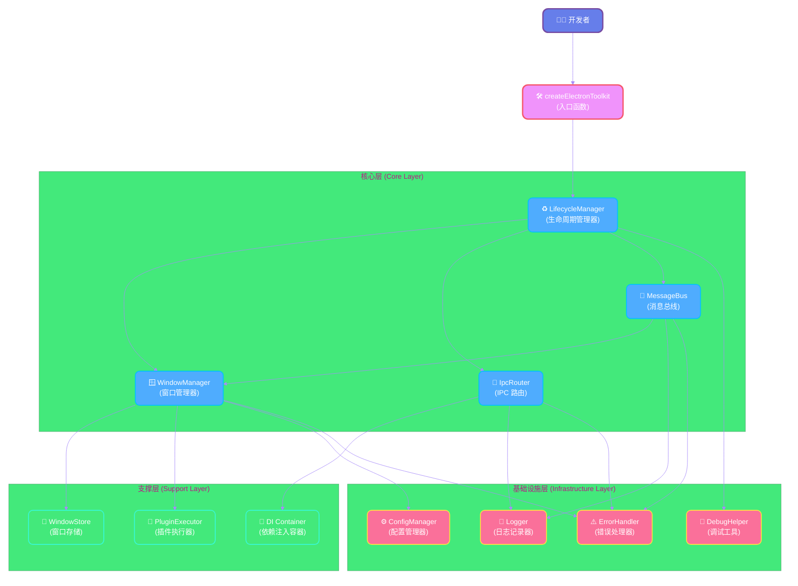

# 项目介绍

欢迎使用 Electron Infra Kit！这是一个为 Electron 应用打造的综合基础设施工具包，旨在简化复杂 Electron 应用的开发，提供开箱即用的窗口管理、进程间通信和状态同步能力。


## 项目背景

### 为什么需要 Electron Infra Kit？

在开发复杂的 Electron 应用时，开发者经常面临以下挑战：

**窗口管理的复杂性**

当应用需要管理多个窗口时，手动跟踪窗口的创建、销毁、状态保存和恢复会变得非常繁琐。你需要：
- 维护窗口实例的引用
- 处理窗口关闭时的清理工作
- 保存和恢复窗口的位置、大小等状态
- 管理窗口之间的父子关系

**进程间通信的痛点**

Electron 的 IPC 机制虽然强大，但在大型项目中使用时存在一些问题：
- 缺乏类型安全，容易出现运行时错误
- 通道名称管理混乱，难以维护
- 参数验证需要手动实现
- 缺少统一的错误处理机制

**跨窗口状态同步的困难**

在多窗口应用中，保持不同窗口之间的状态同步是一个常见需求，但实现起来并不简单：
- 需要手动实现发布-订阅模式
- 状态更新的性能优化困难
- 容易出现状态不一致的问题
- 缺少权限控制机制

### Electron Infra Kit 解决的问题

Electron Infra Kit 通过提供一套完整的基础设施解决方案，帮助开发者应对这些挑战：

1. **简化窗口管理** - 提供统一的窗口生命周期管理 API，自动处理状态持久化和窗口清理
2. **类型安全的 IPC** - 基于 TypeScript 和 Zod 的类型安全通信机制，减少运行时错误
3. **高效的状态同步** - 基于 MessageChannel 的跨窗口状态同步，性能优异且易于使用
4. **开箱即用** - 提供合理的默认配置，同时保持高度可定制性
5. **生产就绪** - 经过实际项目验证，包含完整的错误处理和调试工具


## 核心特性

### 🪟 窗口管理器 (Window Manager)

窗口管理器提供了完整的窗口生命周期管理能力，让你可以专注于业务逻辑而不是底层的窗口操作。

**主要功能：**

- **统一的窗口创建 API** - 通过简单的配置对象创建窗口，支持丰富的配置选项
- **自动状态持久化** - 窗口的位置、大小、最大化状态等会自动保存和恢复
- **生命周期钩子** - 在窗口创建、显示、关闭等关键时刻执行自定义逻辑
- **插件系统** - 通过插件扩展窗口管理器的功能，实现自定义行为
- **窗口查找和管理** - 通过名称、ID 或自定义条件快速查找和管理窗口

**使用示例：**

```typescript
// 创建窗口
const windowId = await windowManager.create({
  name: 'editor',
  title: '代码编辑器',
  width: 1200,
  height: 800,
  // 状态会自动保存和恢复
  saveState: true,
});

// 查找窗口
const window = windowManager.get(windowId);
const editorWindow = windowManager.findByName('editor');

// 关闭窗口（自动清理资源）
windowManager.close(windowId);
```

### 🔌 IPC 路由 (IPC Router)

IPC 路由提供了类型安全的进程间通信机制，让主进程和渲染进程之间的通信更加可靠和易于维护。

**主要功能：**

- **类型安全** - 基于 TypeScript 的完整类型推导，编译时就能发现错误
- **参数验证** - 集成 Zod 进行运行时参数验证，确保数据的正确性
- **依赖注入** - 内置 DI 容器，方便在处理器中注入所需的服务和 API
- **统一错误处理** - 自动捕获和处理错误，提供一致的错误响应格式
- **路由管理** - 通过命名空间组织 IPC 处理器，避免通道名称冲突

**使用示例：**

```typescript
// 主进程：定义处理器
import { IpcHandler } from 'electron-infra-kit';
import { z } from 'zod';

const getUserHandler = new IpcHandler(
  'getUser',
  'user',
  async (context, payload: { id: string }) => {
    // 可以访问注入的 API
    const db = context.api.database;
    return await db.users.findById(payload.id);
  },
  // Zod 验证
  z.object({ id: z.string() })
);

ipcRouter.addHandler(getUserHandler);

// 渲染进程：调用处理器
const user = await window.electron.ipc.invoke('user:getUser', { id: '123' });
```

### 🌉 消息总线 (Message Bus)

消息总线基于 MessageChannel 实现高效的跨窗口状态同步，让多个窗口之间的数据共享变得简单。

**主要功能：**

- **实时同步** - 数据变化会立即同步到所有订阅的窗口
- **高性能** - 基于 MessageChannel 的通信机制，避免了序列化开销
- **响应式更新** - 支持监听数据变化，实现响应式的 UI 更新
- **权限控制** - 可以配置数据的读写权限，保护敏感数据
- **本地缓存** - 每个窗口维护本地缓存，减少跨进程通信

**使用示例：**

```typescript
// 主进程：设置数据
messageBus.setData('theme', 'dark');
messageBus.setData('user', { name: '张三', role: 'admin' });

// 渲染进程：获取和监听数据
// 获取当前值
const theme = await window.electron.messageBus.getData('theme');

// 监听变化
const unsubscribe = window.electron.messageBus.watch('theme', (newTheme) => {
  console.log('主题已更改:', newTheme);
  // 更新 UI
  document.body.className = newTheme;
});

// 取消订阅
unsubscribe();
```

### ⚙️ 配置管理器 (Config Manager)

配置管理器提供了类型安全的配置持久化能力，支持 Zod 验证和默认值。

**主要功能：**

- **类型安全** - 完整的 TypeScript 类型支持
- **数据验证** - 使用 Zod 验证配置数据的正确性
- **持久化存储** - 配置自动保存到本地文件
- **默认值** - 支持配置默认值，简化初始化
- **热更新** - 配置变化时自动通知订阅者

### 🐛 调试工具 (Debug Tools)

内置的调试工具帮助开发者快速定位和解决问题，提高开发效率。

**主要功能：**

- **性能监控** - 监控窗口创建、IPC 调用等操作的性能
- **日志记录** - 结构化的日志输出，支持不同的日志级别
- **开发模式** - 开发环境下自动启用额外的调试信息
- **错误追踪** - 详细的错误堆栈和上下文信息

### 📋 类型安全

Electron Infra Kit 从设计之初就将类型安全作为首要目标。

**特点：**

- **完整的 TypeScript 支持** - 所有 API 都有完整的类型定义
- **运行时验证** - 使用 Zod 进行运行时类型验证
- **类型推导** - 充分利用 TypeScript 的类型推导能力
- **泛型支持** - 支持泛型，提供更灵活的类型定义


## 整体架构

Electron Infra Kit 采用模块化的架构设计，各个模块职责清晰，相互协作。

### 架构图



### 模块关系说明

**入口层**
- `createElectronToolkit` 是整个工具包的入口函数，负责初始化所有模块并返回核心 API

**核心层 (Core Layer)**
- `WindowManager` - 管理窗口的创建、销毁和状态
- `IpcRouter` - 处理进程间通信的路由和分发
- `MessageBus` - 实现跨窗口的状态同步
- `LifecycleManager` - 协调各个模块的生命周期

**支撑层 (Support Layer)**
- `WindowStore` - 存储和管理窗口实例
- `PluginExecutor` - 执行窗口生命周期插件
- `DI Container` - 管理依赖注入

**基础设施层 (Infrastructure Layer)**
- `ConfigManager` - 管理应用配置
- `Logger` - 提供日志记录功能
- `DebugHelper` - 提供调试和性能监控
- `ErrorHandler` - 统一的错误处理

### 数据流

1. **窗口创建流程**
   ```
   开发者调用 windowManager.create()
   → WindowManager 验证配置
   → WindowStore 创建并存储窗口实例
   → PluginExecutor 执行生命周期插件
   → 返回窗口 ID
   ```

2. **IPC 通信流程**
   ```
   渲染进程调用 ipc.invoke()
   → IpcRouter 接收请求
   → 验证参数 (Zod)
   → DI Container 注入依赖
   → 执行处理器
   → 返回结果
   ```

3. **状态同步流程**
   ```
   主进程调用 messageBus.setData()
   → MessageBus 更新数据存储
   → 通过 MessageChannel 广播到所有窗口
   → 渲染进程接收更新
   → 触发 watch 回调
   ```


## 设计理念

Electron Infra Kit 的设计遵循以下核心原则，确保代码的质量、可维护性和可扩展性。

### 🎯 关注点分离 (Separation of Concerns)

每个模块都有明确的职责边界，避免功能耦合。

**实践方式：**

- **模块化设计** - 将窗口管理、IPC 通信、状态同步等功能分离到独立的模块
- **单一职责** - 每个类和函数只负责一个明确的功能
- **接口隔离** - 通过接口定义模块之间的交互，降低耦合度
- **分层架构** - 核心层、支撑层、基础设施层各司其职

**好处：**

- 代码更容易理解和维护
- 可以独立测试每个模块
- 方便替换或升级某个模块
- 团队协作更加高效

### 🔒 类型安全优先 (Type Safety First)

充分利用 TypeScript 的类型系统，在编译时就发现潜在问题。

**实践方式：**

- **完整的类型定义** - 所有公开 API 都有详细的类型定义
- **泛型支持** - 使用泛型提供灵活且类型安全的 API
- **运行时验证** - 使用 Zod 进行运行时类型验证，双重保障
- **类型推导** - 充分利用 TypeScript 的类型推导，减少手动类型标注

**好处：**

- 编译时就能发现大部分错误
- IDE 提供更好的代码提示和自动完成
- 重构更加安全和容易
- 代码更加自文档化

**示例：**

```typescript
// 类型安全的 IPC 调用
interface GetUserPayload {
  id: string;
}

interface User {
  id: string;
  name: string;
  email: string;
}

// 编译时类型检查
const user: User = await ipc.invoke<User>('user:getUser', { id: '123' });

// 运行时验证
const schema = z.object({
  id: z.string(),
});
```

### ⚡ 性能优化 (Performance Optimization)

在保证功能完整的前提下，追求最佳性能。

**实践方式：**

- **MessageChannel 通信** - 使用 MessageChannel 实现高效的跨窗口通信，避免序列化开销
- **本地缓存** - 在渲染进程维护本地缓存，减少跨进程通信次数
- **懒加载** - 按需加载模块和资源，减少启动时间
- **事件节流** - 对高频事件进行节流处理，避免性能问题
- **内存管理** - 及时清理不再使用的资源，避免内存泄漏

**好处：**

- 应用启动更快
- 运行更流畅
- 资源占用更少
- 用户体验更好

**性能监控：**

```typescript
// 开发模式下自动启用性能监控
const { windowManager } = createElectronToolkit({
  isDevelopment: true, // 启用调试工具
});

// 查看性能指标
debugHelper.getMetrics();
```

### 🔌 可扩展性 (Extensibility)

提供灵活的扩展机制，满足不同项目的定制需求。

**实践方式：**

- **插件系统** - 窗口管理器支持插件，可以在生命周期的各个阶段注入自定义逻辑
- **依赖注入** - IPC 路由支持依赖注入，方便集成第三方服务
- **配置化** - 通过配置对象控制模块行为，无需修改源码
- **事件系统** - 提供丰富的事件钩子，监听和响应各种状态变化

**好处：**

- 可以根据项目需求定制功能
- 不需要修改核心代码
- 方便集成第三方库和服务
- 支持渐进式增强

**插件示例：**

```typescript
// 自定义窗口插件
const analyticsPlugin: WindowPlugin = {
  name: 'analytics',
  onCreate: async (window, config) => {
    // 窗口创建时发送分析事件
    analytics.track('window_created', {
      name: config.name,
      timestamp: Date.now(),
    });
  },
  onClose: async (window) => {
    // 窗口关闭时发送分析事件
    analytics.track('window_closed', {
      id: window.id,
      timestamp: Date.now(),
    });
  },
};

// 注册插件
windowManager.registerPlugin(analyticsPlugin);
```

### 🛡️ 安全优先 (Security First)

遵循 Electron 的安全最佳实践，保护应用和用户数据。

**实践方式：**

- **上下文隔离** - 默认启用上下文隔离 (contextIsolation)
- **预加载脚本** - 通过预加载脚本安全地暴露 API
- **权限控制** - MessageBus 支持数据权限配置
- **输入验证** - 所有外部输入都经过验证
- **最小权限** - 只暴露必要的 API 给渲染进程

**好处：**

- 防止 XSS 攻击
- 保护敏感数据
- 符合安全规范
- 增强用户信任

### 📚 开发者友好 (Developer Friendly)

提供良好的开发体验，降低学习和使用成本。

**实践方式：**

- **清晰的 API 设计** - API 命名直观，参数合理
- **完善的文档** - 提供详细的文档和示例
- **友好的错误提示** - 错误信息清晰，包含解决建议
- **调试工具** - 内置调试工具，方便问题定位
- **TypeScript 支持** - 完整的类型定义和 IDE 支持

**好处：**

- 降低学习曲线
- 提高开发效率
- 减少调试时间
- 提升开发体验


## 适用场景

Electron Infra Kit 特别适合以下类型的应用开发，可以显著提高开发效率和代码质量。

### 💻 多窗口 IDE 和代码编辑器

**场景描述：**

代码编辑器通常需要管理多个窗口，如主编辑器窗口、终端窗口、调试窗口、设置窗口等。这些窗口之间需要共享状态（如项目配置、主题设置）并进行通信（如调试命令、文件操作）。

**Electron Infra Kit 的优势：**

- **窗口管理** - 轻松管理多个编辑器窗口，自动保存和恢复窗口布局
- **状态同步** - 主题、设置等配置在所有窗口间实时同步
- **IPC 通信** - 类型安全的命令调用，如文件操作、调试控制
- **性能优化** - 高效的跨窗口通信，不影响编辑器性能

**典型功能实现：**

```typescript
// 创建主编辑器窗口
const mainWindow = await windowManager.create({
  name: 'main-editor',
  title: 'Code Editor',
  width: 1400,
  height: 900,
  saveState: true,
});

// 创建终端窗口
const terminalWindow = await windowManager.create({
  name: 'terminal',
  title: 'Terminal',
  width: 800,
  height: 400,
  parent: mainWindow,
});

// 同步主题设置
messageBus.setData('theme', 'dark');
messageBus.setData('fontSize', 14);

// 执行文件操作命令
ipcRouter.addHandler(new IpcHandler(
  'openFile',
  'file',
  async (context, { path }) => {
    return await fs.readFile(path, 'utf-8');
  }
));
```

### 🎨 设计工具和创意应用

**场景描述：**

设计工具通常包含多个独立的窗口或面板，如画布窗口、属性面板、图层面板、工具栏等。这些窗口需要实时同步选中的对象、工具状态、画布缩放等信息。

**Electron Infra Kit 的优势：**

- **灵活的窗口布局** - 支持浮动窗口、停靠窗口等多种布局方式
- **实时状态同步** - 选中对象、工具状态等在所有面板间实时更新
- **高性能通信** - MessageChannel 确保频繁的状态更新不影响性能
- **撤销/重做支持** - 通过状态管理实现全局的撤销/重做

**典型功能实现：**

```typescript
// 创建画布窗口
const canvasWindow = await windowManager.create({
  name: 'canvas',
  title: 'Canvas',
  width: 1200,
  height: 800,
});

// 创建属性面板
const propertiesWindow = await windowManager.create({
  name: 'properties',
  title: 'Properties',
  width: 300,
  height: 600,
  parent: canvasWindow,
});

// 同步选中对象
messageBus.watch('selectedObject', (object) => {
  // 更新属性面板显示
  updatePropertiesPanel(object);
});

// 同步工具状态
messageBus.setData('currentTool', 'pen');
messageBus.setData('brushSize', 10);
```

### 👥 协作应用和实时通信工具

**场景描述：**

协作应用需要在多个窗口间同步用户状态、消息、文档编辑等信息。例如，聊天应用可能有主窗口、多个聊天窗口、通知窗口等。

**Electron Infra Kit 的优势：**

- **实时状态同步** - 用户在线状态、未读消息等实时更新
- **多窗口消息分发** - 新消息自动分发到相关窗口
- **权限控制** - 控制不同窗口对数据的访问权限
- **离线支持** - 本地缓存确保离线时也能访问数据

**典型功能实现：**

```typescript
// 创建主窗口
const mainWindow = await windowManager.create({
  name: 'main',
  title: 'Chat App',
  width: 1000,
  height: 700,
});

// 创建聊天窗口
const chatWindow = await windowManager.create({
  name: 'chat-room-1',
  title: 'Chat Room',
  width: 600,
  height: 500,
});

// 同步用户在线状态
messageBus.setData('onlineUsers', ['user1', 'user2', 'user3']);

// 分发新消息
messageBus.watch('newMessage', (message) => {
  // 所有聊天窗口都会收到新消息
  displayMessage(message);
  showNotification(message);
});

// 权限控制
messageBus.setData('privateData', sensitiveData, {
  readOnly: ['main'], // 只有主窗口可以读取
});
```

### 🏢 企业应用和管理系统

**场景描述：**

企业应用通常功能复杂，包含多个模块和窗口，如仪表板、数据管理、报表生成、系统设置等。需要统一的状态管理和模块间通信。

**Electron Infra Kit 的优势：**

- **模块化架构** - 每个功能模块可以独立开发和维护
- **统一的状态管理** - 全局状态在所有模块间共享
- **类型安全的 API** - 减少模块间集成的错误
- **权限和安全** - 内置的权限控制和安全机制

**典型功能实现：**

```typescript
// 创建仪表板窗口
const dashboardWindow = await windowManager.create({
  name: 'dashboard',
  title: 'Dashboard',
  width: 1400,
  height: 900,
});

// 创建数据管理窗口
const dataWindow = await windowManager.create({
  name: 'data-management',
  title: 'Data Management',
  width: 1200,
  height: 800,
});

// 同步用户权限
messageBus.setData('userPermissions', {
  canEdit: true,
  canDelete: false,
  canExport: true,
});

// 定义业务 API
ipcRouter.addHandler(new IpcHandler(
  'fetchData',
  'data',
  async (context, { query }) => {
    const db = context.api.database;
    return await db.query(query);
  },
  z.object({ query: z.string() })
));

// 同步数据更新
messageBus.watch('dataUpdated', (data) => {
  // 刷新所有相关窗口的数据显示
  refreshDataDisplay(data);
});
```

### 🎮 游戏和娱乐应用

**场景描述：**

游戏应用可能需要多个窗口，如游戏主窗口、设置窗口、好友列表、聊天窗口等。需要高性能的状态同步和通信。

**Electron Infra Kit 的优势：**

- **高性能通信** - MessageChannel 提供低延迟的跨窗口通信
- **状态同步** - 游戏状态、用户数据等实时同步
- **窗口管理** - 灵活管理游戏窗口和辅助窗口
- **性能监控** - 内置的性能监控工具

### 📊 数据分析和可视化工具

**场景描述：**

数据分析工具通常需要多个视图窗口，如数据表格、图表、过滤器、统计面板等。这些窗口需要响应数据的变化并实时更新。

**Electron Infra Kit 的优势：**

- **响应式更新** - 数据变化时自动更新所有相关视图
- **高性能渲染** - 优化的通信机制不影响图表渲染性能
- **模块化视图** - 每个视图可以独立开发和优化
- **数据缓存** - 本地缓存减少重复计算

## 下一步

现在你已经了解了 Electron Infra Kit 的核心概念和适用场景，可以：

- 📖 阅读[快速开始指南](/guide/getting-started)，5 分钟上手
- 🔍 深入学习[核心概念](/guide/core-concepts/window-manager)
- 💡 查看[示例代码](/examples/)，了解实际应用
- 📚 浏览 [API 参考](/api/)，查找具体接口

如果遇到问题，欢迎：

- 🐛 [提交 Issue](https://github.com/chunhaofen/electron-infra-kit/issues)
- 💬 [参与讨论](https://github.com/chunhaofen/electron-infra-kit/discussions)
- ⭐ [给项目点个 Star](https://github.com/chunhaofen/electron-infra-kit)
